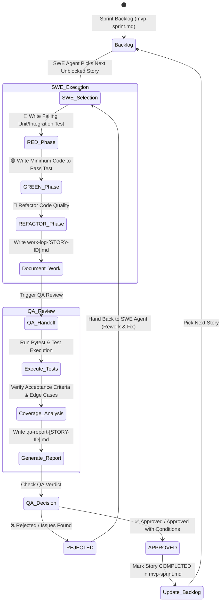

# TDD Story Execution & Test-Driven QA Review Workflow Specification

**Document Version:** 1.0 — Execution Protocol Specification  
**Status:** Approved / Active Process Standard  
**Classification:** Internal — Operational Workflow  
**Target Repository:** `/home/zackchow/coding/rckg`  
**Output Location:** `docs/03-mvp/workflow-swe-qa-loop.md`  
**Governing Backlog:** [mvp-sprint.md](file:///home/zackchow/coding/rckg/docs/03-mvp/mvp-sprint.md)  

---

## 1. Overview & Operational State Machine

This specification establishes the official **SWE ↔ QA Execution Loop Workflow** for delivering story tickets from the Master Sprint Plan ([mvp-sprint.md](file:///home/zackchow/coding/rckg/docs/03-mvp/mvp-sprint.md)).

The workflow enforces strict **Test-Driven Development (TDD)** for software engineering implementation and **Test-Driven Quality Assurance (TDQA)** for verification. Every story ticket passes through a closed-loop review cycle before being marked as `COMPLETED`.



---

## 2. Agent Roles & Responsibilities

| Role | Agent / Skill Reference | Primary Responsibilities | Output Artifact |
|---|---|---|---|
| **Software Engineer (SWE Agent)** | `swe-agent` ([swe-agent.md](file:///home/zackchow/coding/rckg/.agent/agents/swe-agent.md)) / [software-engineer skill](file:///home/zackchow/coding/rckg/.agent/skills/software-engineer/SKILL.md) | Select story ticket, execute TDD (Red-Green-Refactor), pass tests, document implementation details. | `docs/03-mvp/work-log-<STORY-ID>.md` |
| **QA Engineer (QA Agent)** | `qa-agent` ([qa-agent.md](file:///home/zackchow/coding/rckg/.agent/agents/qa-agent.md)) / [qa-engineer skill](file:///home/zackchow/coding/rckg/.agent/skills/qa-engineer/SKILL.md) | Execute test suite independently, verify acceptance criteria & edge cases, render verdict (`APPROVED` / `REJECTED`). | `docs/03-mvp/qa-report-<STORY-ID>.md` |
| **Scrum Master (Orchestrator)** | `scrum-master` ([scrum-master.md](file:///home/zackchow/coding/rckg/.agent/agents/scrum-master.md)) / [scrum skill](file:///home/zackchow/coding/rckg/.agent/skills/scrum/SKILL.md) | Maintain backlog state in `mvp-sprint.md`, unblock dependencies, orchestrate SWE ↔ QA transitions. | Updated `mvp-sprint.md` |

---

## 3. Step-by-Step Execution Protocol

### Step 1: Story Selection (SWE Agent)
1. The **SWE Agent** inspects [mvp-sprint.md](file:///home/zackchow/coding/rckg/docs/03-mvp/mvp-sprint.md) and identifies the highest-priority story ticket in the current sprint whose dependencies are fully met (status `READY_FOR_DEV`).
2. The SWE Agent updates the story state in `mvp-sprint.md` to `IN_DEVELOPMENT`.

---

### Step 2: Test-Driven Implementation (SWE Agent)
The SWE Agent executes the **Red $\rightarrow$ Green $\rightarrow$ Refactor** cycle for every acceptance criterion in the target story ticket:

1. 🔴 **RED Phase:** Write unit/integration tests in `backend/tests/` that capture an acceptance criterion. Execute `pytest` via terminal command to confirm the test fails for the expected reason.
2. 🟢 **GREEN Phase:** Implement the minimal code in `backend/app/` to pass the failing test. Re-run `pytest` to confirm all tests pass cleanly.
3. 🔵 **REFACTOR Phase:** Clean up code structure, type hints, and naming without changing behavior. Re-run `pytest` to verify no regressions.

---

### Step 3: Work Log Documentation (SWE Agent)
Upon completing implementation and passing all local unit tests, the SWE Agent creates a Markdown work log file at:  
`docs/03-mvp/work-log-<STORY-ID>.md`

#### Work Log Document Template (`work-log-<STORY-ID>.md`)
```markdown
# Work Log: [<STORY-ID>] <Story Title>

**Developer:** SWE Agent  
**Date:** <YYYY-MM-DD>  
**Status:** READY_FOR_QA  
**Target Story:** [<STORY-ID>](file:///home/zackchow/coding/rckg/docs/03-mvp/mvp-sprint.md#<story-id-lowercase>)  

---

## 1. Executive Summary & Work Accomplished
Brief summary of the technical implementation and design decisions.

## 2. Files Modified & Created
| File Path | Change Type | Purpose |
|---|---|---|
| `backend/app/services/example.py` | [NEW] | Core service implementation |
| `backend/tests/test_example.py` | [NEW] | TDD Unit tests |

## 3. TDD Cycle Summary
### 🔴 RED Phase
- **Test File:** `backend/tests/test_example.py`
- **Initial Failure Reason:** Method `example_function()` not implemented.

### 🟢 GREEN Phase
- **Implementation File:** `backend/app/services/example.py`
- **Passing Verification:** `pytest backend/tests/test_example.py` passed with 100% success.

### 🔵 REFACTOR Phase
- **Refactoring Applied:** Extracted helper method `_validate_input()`, added static type annotations.

## 4. Test Execution Evidence
```bash
$ pytest backend/tests/test_example.py -v
========================== 5 passed in 0.42s ==========================
```

## 5. Notes for QA Reviewer
- Pay specific attention to boundary handling on empty inputs in `test_example.py:line_45`.
```
```

---

### Step 4: Test-Driven QA Review (QA Agent)
Upon receiving notification that `work-log-<STORY-ID>.md` is ready, the **QA Agent** performs an independent, adversarial quality evaluation using the `qa-engineer` skill:

1. **Independent Test Execution:** The QA Agent runs `pytest` on the test suite using `run_command`.
2. **Acceptance Criteria Verification:** The QA Agent cross-checks each acceptance criterion from the story ticket against the test cases and codebase.
3. **Adversarial Edge Case Testing:** The QA Agent writes or executes additional boundary/edge case tests to verify robustness (e.g. empty strings, null inputs, exception paths, concurrent access).
4. **Code Quality & Security Audit:** The QA Agent audits the implementation for security vulnerabilities (e.g., raw SQL/Cypher injection, unhandled exceptions) and adherence to governance rules.

---

### Step 5: QA Sign-Off Report (QA Agent)
The QA Agent documents the review results in a dedicated Markdown report file at:  
`docs/03-mvp/qa-report-<STORY-ID>.md`

#### QA Sign-Off Report Template (`qa-report-<STORY-ID>.md`)
```markdown
# QA Review & Sign-Off Report: [<STORY-ID>] <Story Title>

**QA Reviewer:** QA Agent  
**Review Date:** <YYYY-MM-DD>  
**Story Ticket:** [<STORY-ID>](file:///home/zackchow/coding/rckg/docs/03-mvp/mvp-sprint.md#<story-id-lowercase>)  
**Work Log Reference:** [work-log-<STORY-ID>.md](file:///home/zackchow/coding/rckg/docs/03-mvp/work-log-<STORY-ID>.md)  
**Final Status:** **[ APPROVED | APPROVED_WITH_CONDITIONS | REJECTED ]**  

---

## 1. Acceptance Criteria Evaluation Matrix

| Criterion ID | Criterion Description | Test File Location | Status | QA Notes |
|---|---|---|---|---|
| AC-1 | Given context, when action, then expected result | `backend/tests/test_example.py::test_ac1` | ✅ PASSED | Covered by unit test |
| AC-2 | Given context, when action, then expected result | `backend/tests/test_example.py::test_ac2` | ✅ PASSED | Verified boundary handling |

## 2. Test Execution Verification
```bash
$ pytest backend/tests/test_example.py -v
========================== 5 passed in 0.42s ==========================
```

## 3. Findings & Defects Summary

### ❌ Critical Blockers (Required for Re-submission if REJECTED)
- *None (or list specific failing tests / acceptance criteria gaps)*

### ⚠️ Non-Blocking Minor Recommendations
- *Suggested code cleanup or minor test improvement*

## 4. Final Verdict & Next Actions
- **Verdict:** **[ APPROVED | REJECTED ]**
- **Next Action:** 
  - If **APPROVED**: Story marked `COMPLETED` in `mvp-sprint.md`. SWE Agent proceeds to next unblocked story.
  - If **REJECTED**: Story returned to SWE Agent for rework addressing Critical Blockers.
```

---

### Step 6: Feedback & Loop Resolution

#### Branch A: Verdict is `APPROVED` ✅
1. The story status in `mvp-sprint.md` is updated to `COMPLETED` with timestamp and QA report link.
2. The SWE Agent picks the next available unblocked story from the sprint backlog in `mvp-sprint.md` and repeats Step 1.

#### Branch B: Verdict is `REJECTED` ❌
1. The story status in `mvp-sprint.md` is updated to `REWORK_REQUIRED`.
2. The **SWE Agent** receives `qa-report-<STORY-ID>.md`, inspects the listed Critical Blockers, and enters a targeted Red-Green-Refactor loop to fix the defects.
3. The SWE Agent updates `work-log-<STORY-ID>.md` with a **Revision History** section detailing the fixes.
4. The story is handed back to the **QA Agent**, who re-executes Step 4 & Step 5 until an `APPROVED` verdict is achieved.

---

## 4. Backlog Tracking & Execution Rules

1. **Strict Hand-off Documentation:** No story may move to QA without a published `work-log-<STORY-ID>.md`. No story may move to `COMPLETED` without a published `qa-report-<STORY-ID>.md` marked `APPROVED`.
2. **Deterministic File Naming Conventions:**
   - Work Logs: `docs/03-mvp/swe-worklog/work-log-<STORY-ID>.md` (e.g. `docs/03-mvp/work-log-RCKG-100.md`)
   - QA Reports: `docs/03-mvp/qa-worklog/qa-report-<STORY-ID>.md` (e.g. `docs/03-mvp/qa-report-RCKG-100.md`)
3. **No Skipping Steps:** SWE Agents must never perform self-QA signoff; QA Agents must never edit feature implementation code directly.