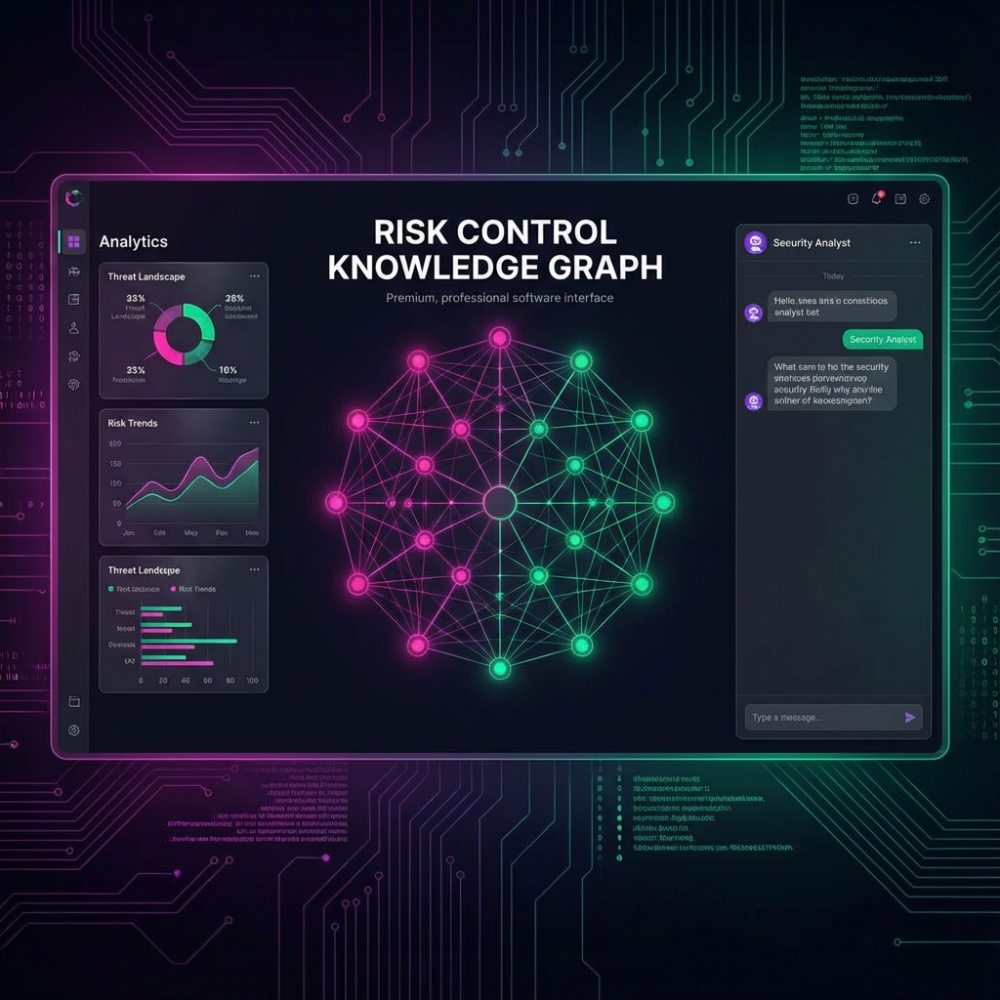

<div align="center">

# Risk Control Knowledge Graph (RCKG)


**A Next-Generation Compliance & Risk Management Platform powered by GraphRAG and Local LLMs.**

[Getting Started](#getting-started-rocket) • [Features](#key-features-sparkles) • [Tech Stack](#tech-stack-hammer_and_wrench) • [Contributing](#contributing-handshake)

---



</div>

## Overview 🔎

**RCKG** transforms static compliance documents (PDF, Excel, OSCAL) into a dynamic **Knowledge Graph**. By leveraging **GraphRAG** (Retrieval Augmented Generation on Graphs) and **Local LLMs** (Ollama), it enables security professionals to:

- **Visualize** complex relationships between frameworks (NIST, ISO, SOC2).
- **Chat** with their compliance data with full citation tracking.
- **Discover** hidden gaps and redundant controls automatically.
- **Trace** every AI decision using integrated **Langfuse** observability.

## Key Features :sparkles:

| Feature | Description |
| :--- | :--- |
| **🕸️ Interactive Graph** | Visualize Nodes (Controls) and Edges (Relationships) in a high-performance Cytoscape engine. |
| **🤖 Local Intelligence** | Built-in **Ollama** integration running `qwen2.5` or `phi4` for privacy-first AI reasoning. |
| **📄 Multi-Format Ingest** | Drag & drop support for **OSCAL JSON**, **NIST CSV**, **Excel**, and **PDF** policies. |
| **🔍 GraphRAG Chat** | Ask questions like *"How does AC-2 relate to GDPR?"* and get answers grounded in graph topology. |
| **🔗 Linkage Discovery** | AI agents proactively scan for and suggest mappings between different frameworks. |
| **🔭 Full Observability** | OpenTelemetry-based tracing with **Langfuse** to debug and optimize LLM prompts. |

## Tech Stack :hammer_and_wrench:

- **Frontend**: React, Vite, Cytoscape.js, TailwindCSS (Glassmorphism UI).
- **Backend**: FastAPI, LangChain (Concepts), Pydantic.
- **Database**: Neo4j (Graph), ChromaDB (Vector - Optional), SQLite (Audit).
- **AI/LLM**: Ollama (Local Inference), Langfuse (Tracing).
- **Infrastructure**: Docker Compose (Full stack orchestration).

## Getting Started :rocket:

### Prerequisites
- Docker & Docker Compose
- 8GB+ RAM (16GB Recommended for 7B models)

### Quick Run

```bash
# 1. Clone the repository
git clone https://github.com/celestialcrusader/risk-control-kg.git
cd risk-control-kg

# 2. Start the Stack (App + AI + Database)
docker compose -f docker-compose.yml -f docker-compose.langfuse.yml up -d

# 3. Pull the AI Brain (One time setup)
docker exec -it rckg-ollama-1 ollama pull qwen2.5:7b
```

### Access Points

- **Frontend UI**: [http://localhost:5173](http://localhost:5173)
- **API Documentation**: [http://localhost:8000/docs](http://localhost:8000/docs)
- **Neo4j Browser**: [http://localhost:7474](http://localhost:7474) (User: `neo4j` / Pass: `password`)
- **Langfuse Tracing**: [http://localhost:3010](http://localhost:3010)

## Security & Privacy :shield:

RCKG is designed for **Air-Gapped** environments.
- **No Data Leakage**: All LLM processing is done *locally* via Ollama. No data is sent to OpenAI/Anthropic.
- **Secret Management**: `.env` files are excluded from git.
- **Audit Logs**: All write operations are cryptographically logged.

See [SECURITY.md](SECURITY.md) for details.

## Contributing :handshake:

We welcome contributions! Please see [CONTRIBUTING.md](CONTRIBUTING.md) for guidelines on how to submit PRs, set up dev environments, and run tests.

## License :balance_scale:

Distributed under the MIT License. See [LICENSE](LICENSE) for more information.

---

<div align="center">
  <sub>Built with ❤️ by the RCKG Team.</sub>
</div>
