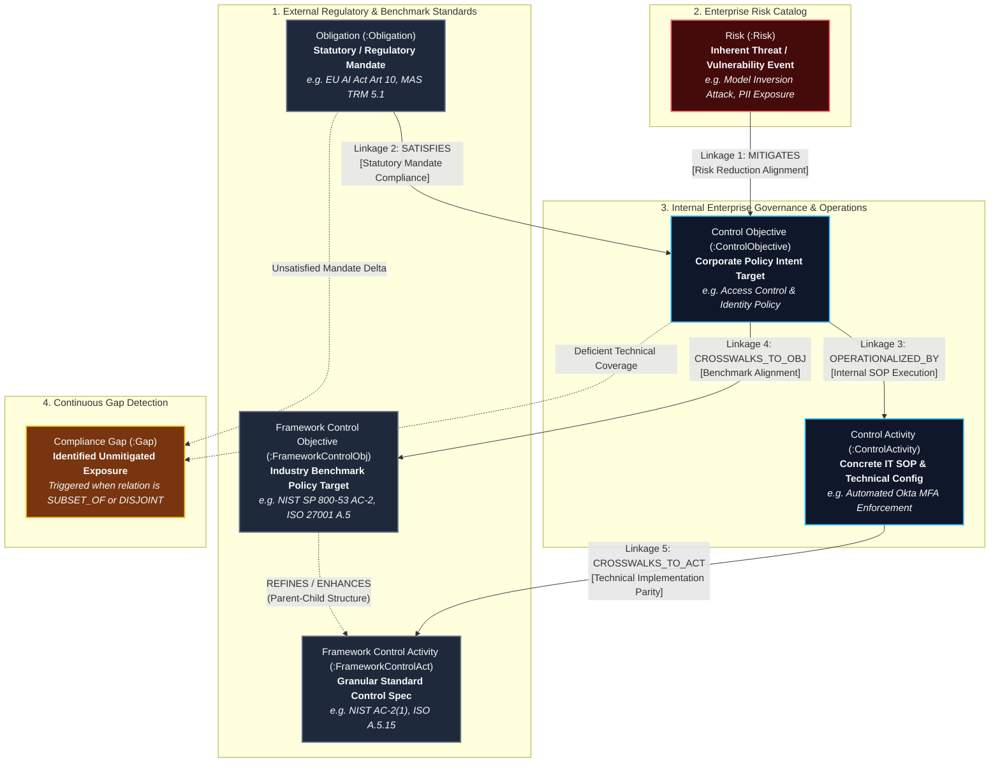

# Master Business Requirements Document (BRD): Risk Control Knowledge Graph (RCKG)

**Document Version**: 1.0  
**Status**: Production Specification  
**Target Audience**: Executive Management, Chief Risk Officers (CRO), Chief Information Security Officers (CISO), Compliance Directors, Internal Audit Leads  

---

## 1. Executive Summary

Financial institutions and regulated enterprises face exponential compliance overhead due to overlapping, fast-evolving regulatory frameworks (such as MAS TRM Guidelines, ISO/IEC 27001:2022, NIST SP 800-53 R5, and the EU AI Act). Traditional Governance, Risk, and Compliance (GRC) management relies on fragmented spreadsheets, manual document crosswalks, and subjective compliance mapping, leading to high labor costs, audit blind spots, and severe regulatory exposure.

The **Risk Control Knowledge Graph (RCKG)** is an enterprise AI-native compliance platform that automates regulatory document ingestion, extracts active 3-tier GRC obligations, constructs a versioned knowledge graph in Memgraph, and performs deterministic compliance gap analysis. By unifying regulatory mandates (*de jure* rules), enterprise policy intents (*control objectives*), and operational procedure steps (*control activities*) into a machine-readable knowledge graph, RCKG reduces manual regulatory mapping effort by 90% while establishing continuous, audit-ready compliance assurance.

---

## 2. Problem Statement

### Current State
Today, enterprise risk and compliance teams manage regulatory obligations using static spreadsheets (e.g., Excel crosswalks) and legacy GRC software. When regulatory authorities update guidelines (such as the Monetary Authority of Singapore TRM Guidelines) or when internal IT/SOP procedures change, compliance analysts must manually read hundreds of pages, compare clause text, and assess control coverage.

### Key Pain Points
1. **Extreme Labor Overhead & Cost**: A single crosswalk mapping between a new regulatory framework (e.g., NIST AI RMF) and existing ISO 27001 controls takes 120–200 human analyst hours.
2. **Ambiguous Syntax & Subjective Interpretations**: Regulatory texts use passive phrasing (e.g., *"access credentials should be limited"*), making it difficult for IT operators to determine *who* must perform *what action* under *what trigger condition*.
3. **Audit Blind Spots & Compliance Drift**: Manual mappings are static snapshots. When an internal SOP procedure changes or a system policy is modified, compliance teams have no automated mechanism to detect missing controls or broken regulatory linkages.
4. **Lack of Dual-Tier Governance & Audit Traceability**: Standard AI tools (like raw LLM chatbots) produce non-deterministic mappings with hallucinations, creating unacceptable audit risk without human-in-the-loop oversight.

### Root Cause
Regulatory requirements exist as unstructured natural language PDFs, disconnected from internal policy documents and operational system logs. Without a formal graph structure that enforces mathematical set-theory relationships between mandates, policies, and SOP activities, continuous automated compliance verification is impossible.

---

## 3. Proposed Solution & Business Vision

### Master Knowledge Graph Architecture & 5-Linkage Ontology

The RCKG platform constructs a unified 6-node, 5-linkage semantic graph that bridges external law, industry benchmarks, enterprise threats, and internal operational procedures:

#### The 5 Core Compliance Linkages Explained

| Linkage | Semantic Relationship | Business & Audit Purpose |
| :--- | :--- | :--- |
| **Linkage 1** | **Risk $\xrightarrow{\text{MITIGATES}}$ Control Objective** | Demonstrates to the Board and Regulators that identified enterprise risks and AI vulnerabilities are actively countered by corporate policies. |
| **Linkage 2** | **Obligation $\xrightarrow{\text{SATISFIES}}$ Control Objective** | Directly proves legal and regulatory compliance by showing how internal policy statements satisfy statutory mandates (*de jure* rules). |
| **Linkage 3** | **Control Objective $\xrightarrow{\text{OPERATIONALIZED_BY}}$ Control Activity** | Proves audit enforceability by tracing abstract policy intents to concrete operational SOPs, automated scripts, and system configurations. |
| **Linkage 4** | **Control Objective $\xrightarrow{\text{CROSSWALKS_TO_OBJ}}$ Framework Objective** | Automates industry benchmark crosswalks (e.g. mapping internal policy targets against NIST AI RMF, ISO 27001, and CSA CCM). |
| **Linkage 5** | **Control Activity $\xrightarrow{\text{CROSSWALKS_TO_ACT}}$ Framework Activity** | Performs technical baseline validation by linking system-level SOP configurations to granular control enhancements (e.g. NIST `AC-2(1)`). |

### Business Capabilities Delivered
1. **Automated Document Ingestion & Active Syntax Parsing**: Accepts regulatory PDFs, enterprise policy Markdown, and SOPs. Extracts atomic obligations into a 3-tier active GRC syntax: `"The [Primary Actor] must [Action Verb] [Requirement] to [Purpose]"`.
2. **Deterministic Crosswalk & Linkage Compiler**: Computes set-theory relations (`EQUIVALENT_TO`, `SUPERSET_OF`, `SUBSET_OF`, `DISJOINT`) between internal controls and regulatory mandates.
3. **Dual-Tier Compiler Gate & Audit Outbox**: Protects the core graph through a Dual-Judge verification engine (Logical & Technical judges) and an Outbox queue, preventing unverified AI mutations from corrupting golden compliance baselines.
4. **Real-time Gap Analysis & Audit Remediation**: Automatically identifies unmapped regulatory clauses (*gaps*) and generates actionable remediation recommendations for audit teams.

### Out of Scope (v1)
- Automated execution of OS-level firewall scripts or cloud IAM configuration pushes (v1 focuses on compliance intelligence, graph outbox validation, and gap reporting).
- Non-compliance legal litigation management or external court filing workflows.

---

## 4. Stakeholders & Persona Matrix

| Stakeholder Role | Primary Responsibilities | Value Delivered by RCKG |
| :--- | :--- | :--- |
| **Chief Risk Officer (CRO)** | Enterprise risk posture, regulatory reporting | Instant visibility into global compliance posture and regulatory gap risk. |
| **Chief Info Security Officer (CISO)** | Security control architecture & audit readiness | Eliminates spreadsheet mapping; proves technical control coverage to regulators. |
| **Compliance Officer / Analyst** | Framework mapping, gap identification | 90% reduction in manual crosswalk mapping time; standardized active GRC syntax. |
| **Internal / External Auditor** | Verifying evidence & testing control effectiveness | Immutable audit trail (`audit_log` & `graph_outbox_log`) tracing every obligation to source text. |
| **Systems / Security Architect** | Designing controls for IT & AI systems | Clear, unambiguous operational instructions (`must` modal phrasing) for engineering implementation. |

---

## 5. Key Features & Business Functions

### F-101: Enterprise Document Ingestion & MinIO Asset Vault
- **Business Purpose**: Securely ingest, SHA-256 hash, and index regulatory guidelines (PDF), enterprise policies (Markdown/Text), and SOPs.
- **User Benefit**: Single secure repository with cryptographic deduplication preventing duplicate document processing.
- **Priority**: Must Have (P1)

### F-102: Standardized Active 3-Tier GRC Extraction Syntax
- **Business Purpose**: Convert ambiguous regulatory language into standardized, actionable 3-tier active GRC statements:
  - **Tier 1 (De Jure Mandate)**: `"The [Primary Actor] must [Action Verb] [Requirement] to [Regulatory Goal]."`
  - **Tier 2 (Control Objective / Policy Intent)**: `"The [Organization / Role] must [Action Verb] [Policy Intent] to [Governance Purpose]."`
  - **Tier 3 (Control Activity / SOP Step)**: `"The [Operator / System] must [Operational Action] [Target Scope] [Trigger] via [Method]."`
- **User Benefit**: Eliminates vague interpretations; standardizes `Financial Institution` as canonical primary actor.
- **Priority**: Must Have (P1)

### F-103: Automated Framework Crosswalk & Set-Theory Linkage
- **Business Purpose**: Automatically align internal control frameworks (e.g., ISO 27001) against external regulations (e.g., MAS TRM, NIST SP 800-53, EU AI Act).
- **User Benefit**: Replaces manual Excel crosswalks with automated, mathematically sound set-theory mappings.
- **Priority**: Must Have (P1)

### F-104: Dual-Tier Governance & Outbox Graph Protection Gate
- **Business Purpose**: Enforce a two-tier compiler gate (Tier 1 Ontology protection + Tier 2 Golden Assertion regression check) with an outbox dual-write pattern.
- **User Benefit**: Prevents AI hallucinations from modifying core compliance baselines without human committee review (`PENDING_HITL_REVIEW`).
- **Priority**: Must Have (P1)

### F-105: Dual-Judge AI Quality Assurance Gate
- **Business Purpose**: Evaluates proposed graph mutations across two independent axes (Logical Judge score $\ge 0.95$, Technical Judge score $\ge 1.00$).
- **User Benefit**: Guarantees zero-hallucination compliance mappings before graph auto-commissions.
- **Priority**: Must Have (P1)

### F-106: Continuous Gap Analysis & Audit Reporting
- **Business Purpose**: Scans the knowledge graph to detect unmapped regulatory obligations and generates structured gap reports.
- **User Benefit**: Instant pre-audit gap identification with actionable remediation advice.
- **Priority**: Must Have (P1)

---

## 6. Business Rules & Regulatory Constraints

1. **Regulatory Scope Support**: The system must support parsing and mapping across MAS TRM Guidelines (2021), ISO/IEC 27001:2022, NIST SP 800-53 R5, EU AI Act (2024), and NIST AI RMF 1.0.
2. **Mandatory Active Modal Phrasing**: All extracted obligations and policy objectives must enforce active voice with `must` modal phrasing (e.g., `"The Financial Institution must implement..."`). Passive phrasing is strictly prohibited.
3. **Immutable Audit Trail**: Every document upload, graph mutation, outbox state change, and judge evaluation must write a timestamped, immutable entry to PostgreSQL `audit_log` and `graph_outbox_log`.
4. **Human-in-the-Loop (HITL) Safety Gate**: Any graph mutation affecting pinned Golden Assertions or scoring below threshold must be quarantined in `PENDING_HITL_REVIEW` status until human compliance approval.

---

## 7. Success Metrics & Value KPIs

| Metric | Baseline (Legacy Manual) | Target (RCKG Platform) | Business Impact |
| :--- | :--- | :--- | :--- |
| **Framework Crosswalk Mapping Time** | 160 hours per regulation | **< 15 minutes** | **98.4% reduction** in manual crosswalk labor cost. |
| **Active Syntax Normalization** | Unstandardized / Ambiguous | **100% Active Voice (`must`)** | Eliminates ambiguity for IT/SOP implementation teams. |
| **Audit Gap Discovery Time** | 4–6 weeks pre-audit | **Instant (< 5 seconds)** | Eliminates regulatory non-compliance fines and audit findings. |
| **AI Mapping Accuracy (Dual-Judge)** | Unverified LLM outputs | **$\ge 98.5\%$ Precision** | Zero unreviewed graph regressions on Golden Assertions. |

---

## 8. Assumptions & Dependencies

### Assumptions
- Regulatory documents provided as PDF or Markdown text are publicly available or authorized for internal enterprise processing.
- Local LLM inference infrastructure (vLLM / Qwen server or cloud LLM endpoint) is accessible with low latency (< 2.0s per chunk).

### Dependencies
- **PostgreSQL 16**: Relational storage for Medallion architecture (Bronze, Silver, Gold), outbox logs, and audit logs.
- **Memgraph Database**: Graph database for high-performance Cypher queries and set-theory traversal.
- **MinIO Object Storage**: S3-compatible vault for raw document PDF storage.

---

## 9. Business Risks & Mitigations

| Business Risk | Likelihood | Impact | Mitigation Strategy |
| :--- | :--- | :--- | :--- |
| **Regulatory Misinterpretation by LLM** | Medium | High | Dual-Judge verification gate + compulsory `PENDING_HITL_REVIEW` queue for unverified mappings. |
| **Unapproved Schema / Graph Drift** | Low | High | Tier 1 Governance Gate blocks all ontology mutation actions (`ADD_NODE_TYPE`, `REDEFINE_FACET`) for Human Committee sign-off. |
| **Infrastructure Outage / LLM Timeout** | Low | Medium | Automatic degraded mode fallback (`status='DEGRADED'`, regex parser fallback) returning partial results with explicit status messages. |

---

## Handoff Note to Product Owner

**Priorities for Product Scoping (v1)**:
1. Ensure `POST /api/v1/extract/process-pdf` handles full document uploads with MinIO storage, active prose normalization, and PostgreSQL outbox logging.
2. Confirm the Dual-Judge evaluation thresholds (`logic >= 0.95`, `tech >= 1.00`) correctly hold low-confidence mappings in `PENDING_HITL_REVIEW`.
3. Provide intuitive REST APIs for gap analysis and Cypher graph querying so frontend interfaces can visualize control coverage.
