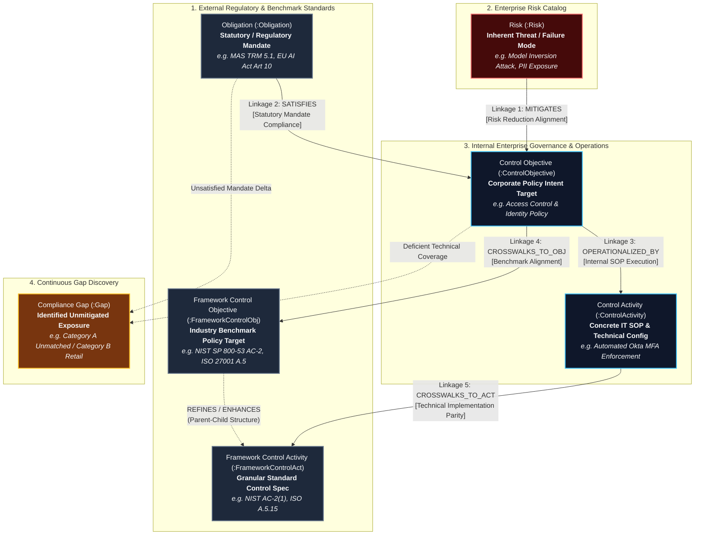

# Master Business Requirements Document (BRD): Risk Control Knowledge Graph (RCKG)

**Document Version**: 2.0  
**Status**: Production Specification (Approved)  
**Target Release**: RCKG Enterprise Platform v1.0 Production  
**Target Audience**: Executive Management, Chief Risk Officers (CRO), Chief Information Security Officers (CISO), Compliance Directors, Internal Audit Leads, AI Systems Architects  

---

## 1. Executive Summary

Financial institutions and regulated enterprises face exponential compliance overhead due to overlapping, fast-evolving regulatory frameworks (including MAS TRM Guidelines 2024, ISO/IEC 27001:2022, NIST SP 800-53 Rev 5, NIST AI RMF 1.0, and the EU AI Act). Traditional Governance, Risk, and Compliance (GRC) management relies on fragmented spreadsheets, manual document crosswalks, and subjective compliance mapping, leading to high labor costs, audit blind spots, and severe regulatory exposure.

The **Risk Control Knowledge Graph (RCKG)** is an enterprise **Headless-First AI-Native Compliance Intelligence Platform**. RCKG automates regulatory document ingestion, extracts standardized active 3-tier GRC obligations, constructs a versioned knowledge graph in Memgraph and PostgreSQL, and executes deterministic 2D set-theoretic compliance crosswalks.

RCKG delivers its capabilities through a **Headless-First Delivery Architecture**:
1. **Core Product (50%)**: Canonical REST API as the single source of truth for machine-verifiable regulatory mappings and 2D set-theoretic assurance coverage.
2. **Autonomous Agent Interface (30%)**: Enterprise Model Context Protocol (MCP) Server exposing tools, resources, and reasoning prompts to autonomous AI agents and enterprise copilots (Claude Code, Gemini CLI, Cursor, Windsurf, OpenDevin).
3. **Human Review Surface (20%)**: Thin, high-density Web UI focused strictly on human governance workflows (`[Approve]`, `[Override]`, `[Reject]`), chapter coverage heatmaps, real-time NLI playgrounds, and immutable audit trails.

By unifying statutory mandates (*de jure* rules), enterprise policy intents (*control objectives*), and operational procedure steps (*control activities*) into a machine-readable knowledge graph, RCKG reduces manual regulatory crosswalk effort by **98.4%** while establishing continuous, mathematically defensible audit assurance.

---

## 2. Problem Statement & Market Pain Points

```
┌────────────────────────────────────────────────────────────────────────┐
│                        TRADITIONAL GRC WORKFLOW                         │
│                                                                        │
│  Regulatory PDFs ───► Manual Analyst Review ───► Excel Spreadsheets    │
│  (Unstructured)        (160+ Human Hours)        (Static / Subjective) │
│                                                          │             │
│                                                          ▼             │
│  Audit Regressions ◄── Compliance Drift ◄────── Non-Verifiable Audit   │
│  ($ Millions Risk)     (Unmonitored Changes)    (Audit Blind Spots)    │
└────────────────────────────────────────────────────────────────────────┘
```

### Current State
Today, enterprise risk and compliance teams manage regulatory obligations using static spreadsheets (e.g., Excel crosswalk matrices) and legacy GRC software. When regulatory authorities update guidelines (such as the Monetary Authority of Singapore TRM Guidelines) or when internal IT/SOP procedures change, compliance analysts must manually read hundreds of pages, compare clause text, and assess control coverage.

### Key Pain Points
1. **Extreme Labor Overhead & Cost**: A single crosswalk mapping between a new regulatory framework (e.g., NIST SP 800-53 Rev 5) and existing MAS TRM obligations consumes **120–200 human analyst hours**.
2. **Ambiguous Syntax & Passive Interpretations**: Regulatory texts use passive phrasing (e.g., *"access credentials should be limited"*), making it difficult for IT operators to determine *who* must perform *what action* under *what trigger condition*.
3. **Audit Blind Spots & Compliance Drift**: Manual mappings are static snapshots. When an internal SOP procedure changes or a system policy is modified, compliance teams have no automated mechanism to detect missing controls or broken regulatory linkages.
4. **Lack of Dual-Tier Governance & Audit Traceability**: Standard AI tools (such as raw LLM chatbots) produce non-deterministic mappings with hallucinations, creating unacceptable audit risk without human-in-the-loop oversight.
5. **Disconnected AI Agent Workflows**: Engineering and DevOps teams increasingly rely on autonomous AI agents for configuration and code delivery, but these agents lack direct, tool-based access to enterprise compliance baselines.

### Root Cause
Regulatory requirements exist as unstructured natural language PDFs, disconnected from internal policy documents and operational system configurations. Without a formal graph structure that enforces mathematical set-theory relationships between mandates, policies, and SOP activities, continuous automated compliance verification is impossible.

---

## 3. Proposed Solution & Master Knowledge Graph Ontology

```
                    ┌────────────────────────┐
                    │   RCKG Engine & API    │
                    │   (Core Product 50%)   │
                    └───────────┬────────────┘
                                │
            ┌───────────────────┼───────────────────┐
            │                   │                   │
            ▼                   ▼                   ▼
      REST / JSON API          MCP Server        Thin Governance UI
       (Core Engine)        (Agent Copilots)     (Auditor Sign-off)
            │                   │                   │
            ▼                   ▼                   ▼
     Enterprise GRC        Autonomous AI        Human Compliance
     (CI/CD, Jira)        (Claude, Cursor)       (Override & Audit)
```

### Master Knowledge Graph Model (6 Nodes & 5 Core Linkages)

The RCKG platform constructs a unified 6-node, 5-linkage semantic graph that bridges external law, industry benchmarks, enterprise threats, and internal operational procedures:



#### The 5 Core Compliance Linkages Explained

| Linkage | Semantic Relationship | Business & Audit Purpose |
| :--- | :--- | :--- |
| **Linkage 1** | **Risk $\xrightarrow{\text{MITIGATES}}$ Control Objective** | Demonstrates to the Board and Regulators that identified enterprise risks and AI vulnerabilities are actively countered by corporate policies. |
| **Linkage 2** | **Obligation $\xrightarrow{\text{SATISFIES}}$ Control Objective** | Directly proves legal and regulatory compliance by showing how internal policy statements satisfy statutory mandates (*de jure* rules). |
| **Linkage 3** | **Control Objective $\xrightarrow{\text{OPERATIONALIZED_BY}}$ Control Activity** | Proves audit enforceability by tracing abstract policy intents to concrete operational SOPs, automated scripts, and system configurations. |
| **Linkage 4** | **Control Objective $\xrightarrow{\text{CROSSWALKS_TO_OBJ}}$ Framework Objective** | Automates industry benchmark crosswalks (e.g. mapping internal policy targets against NIST SP 800-53, ISO 27001, and CSA CCM). |
| **Linkage 5** | **Control Activity $\xrightarrow{\text{CROSSWALKS_TO_ACT}}$ Framework Activity** | Performs technical baseline validation by linking system-level SOP configurations to granular control enhancements (e.g. NIST `AC-2(1)`). |

---

## 4. 2D Set-Theoretic Crosswalk Assurance Model

To replace subjective, hand-wavy spreadsheet mappings with mathematically defensible audit evidence, RCKG evaluates every framework alignment across **two orthogonal dimensions**:

### Dimension 1: Semantic Relationship (Set-Theoretic Containment)
- **`EQUIVALENT` ($\equiv$)**: Scope, intent, and actionable mandates are 1-to-1 identical.
- **`SUBSET_OF` ($\subset$)**: Source obligation is completely contained within the Target control ($A \subseteq B$). Target completely satisfies Source.
- **`SUPERSET_OF` ($\supset$)**: Source obligation contains the Target control plus additional requirements ($A \supseteq B$). Target partially satisfies Source.
- **`OVERLAPS` ($\cap$)**: Material conceptual overlap without strict containment ($A \cap B \neq \emptyset$).
- **`SUPPORTS`**: Target provides enabling governance, policy, or budgeting support without satisfying the technical mandate.
- **`NONE` ($\emptyset$)**: Disjoint requirements ($A \cap B = \emptyset$).

### Dimension 2: Assurance Coverage (Audit Defensibility)
- **`FULL_COVERAGE`**: Implementing the Target control completely satisfies the Source obligation with zero residual compliance risk.
- **`PARTIAL_COVERAGE`**: Implementing the Target control satisfies part of the Source obligation; supplementary controls required.
- **`NO_COVERAGE`**: Implementing the Target control does not satisfy the Source obligation (e.g., only general governance support).

```
                      ┌────────────────────────────────────────────────────────┐
                      │             2D AUDIT ASSURANCE MATRIX                  │
                      ├──────────────────┬──────────────────┬──────────────────┤
                      │  FULL_COVERAGE   │ PARTIAL_COVERAGE │   NO_COVERAGE    │
┌─────────────────────┼──────────────────┼──────────────────┼──────────────────┤
│ EQUIVALENT (≡)      │ Green (Auto Pass)│ Exception Review │ Invalid Mapping  │
├─────────────────────┼──────────────────┼──────────────────┼──────────────────┤
│ SUBSET_OF (⊂)       │ Green (Auto Pass)│ Exception Review │ Invalid Mapping  │
├─────────────────────┼──────────────────┼──────────────────┼──────────────────┤
│ SUPERSET_OF (⊃)     │ Policy Surplus   │ Amber (Gap Risk) │ Invalid Mapping  │
├─────────────────────┼──────────────────┼──────────────────┼──────────────────┤
│ OVERLAPS (∩)        │ Review Flagged   │ Amber (Gap Risk) │ Gray (Non-Audit) │
├─────────────────────┼──────────────────┼──────────────────┼──────────────────┤
│ SUPPORTS            │ Non-Defensible   │ Gray (Enabling)  │ Gray (Enabling)  │
├─────────────────────┼──────────────────┼──────────────────┼──────────────────┤
│ NONE (∅)            │ Defensible Gap   │ Defensible Gap   │ True Gap (Red)   │
└─────────────────────┴──────────────────┴──────────────────┴──────────────────┘
```

---

## 5. Stakeholders & Persona Matrix

| Stakeholder Role | Primary Responsibilities | Value Delivered by RCKG |
| :--- | :--- | :--- |
| **Chief Risk Officer (CRO)** | Global enterprise risk posture, board reporting | Instant visibility into global compliance posture, chapter coverage heatmaps, and true regulatory gap exposure. |
| **Chief Info Security Officer (CISO)** | Security control architecture & audit readiness | Eliminates spreadsheet mapping; proves technical control coverage to regulators and certifiers. |
| **Compliance Analyst / Officer** | Framework mapping, clause parsing, gap identification | **98.4% reduction** in manual crosswalk mapping time; standardized active GRC syntax and real-time NLI crosswalk evaluator. |
| **Internal & External Auditor** | Verifying evidence & testing control effectiveness | Immutable PostgreSQL `audit_log`, `graph_outbox_log`, and auditor override trails tracing every mapping to source text. |
| **Systems & Security Architect** | Designing controls for IT and AI systems | Clear, unambiguous operational instructions (`must` modal phrasing) for engineering implementation. |
| **Autonomous AI Agent / Copilot** | Automated code generation, CI/CD policy gates | Direct Model Context Protocol (MCP) tool integration for real-time compliance queries and policy verification. |

---

## 6. Key Business Features & Functional Capabilities

### F-101: Enterprise Document Ingestion & MinIO Asset Vault
- **Business Purpose**: Securely ingest, SHA-256 hash, and index regulatory guidelines (PDF), enterprise policies (Markdown/Text), and SOPs.
- **User Benefit**: Single secure vault with cryptographic deduplication preventing duplicate document processing.
- **Priority**: Must Have (P1)

### F-102: Active 3-Tier GRC Extraction & Clause Decompounding
- **Business Purpose**: Convert ambiguous regulatory language into standardized, actionable 3-tier active GRC statements:
  - **Tier 1 (De Jure Mandate)**: `"The [Primary Actor] must [Action Verb] [Requirement] to [Regulatory Goal]."`
  - **Tier 2 (Control Objective / Policy Intent)**: `"The [Organization / Role] must [Action Verb] [Policy Intent] to [Governance Purpose]."`
  - **Tier 3 (Control Activity / SOP Step)**: `"The [Operator / System] must [Operational Action] [Target Scope] [Trigger] via [Method]."`
- **User Benefit**: Decompounds compound sentences (e.g. "A and B must be done") into atomic obligations; standardizes `Financial Institution` as canonical primary actor.
- **Priority**: Must Have (P1)

### F-103: Multi-Stage Hybrid Retrieval & Semantic Matching
- **Business Purpose**: Combine dense vector similarity (Qdrant), late-interaction token scoring (ColBERT), and lexical search (BM25) using Reciprocal Rank Fusion (RRF).
- **User Benefit**: Discovers relevant controls across disparate regulatory vocabularies with $>95\%$ recall.
- **Priority**: Must Have (P1)

### F-104: Deterministic 2D Crosswalk & Set-Theory Compiler
- **Business Purpose**: Automatically align external frameworks (e.g., MAS TRM vs. NIST SP 800-53 Rev 5) using calibrated NLI cross-encoders, transitive reduction, and structured rationale validation.
- **User Benefit**: Replaces manual Excel crosswalks with automated, mathematically sound set-theory mappings.
- **Priority**: Must Have (P1)

### F-105: Dual-Tier Governance Gate & Graph Outbox Dual-Write
- **Business Purpose**: Enforce a two-tier compiler gate (Tier 1 Ontology protection + Tier 2 Golden Assertion regression check) with an outbox dual-write pattern.
- **User Benefit**: Prevents AI hallucinations from modifying core compliance baselines without human committee review (`PENDING_HITL_REVIEW`).
- **Priority**: Must Have (P1)

### F-106: Dual-Judge AI Quality Assurance Gate & Graph Revert Service
- **Business Purpose**: Evaluates proposed graph mutations across two independent axes (Logical Judge score $\ge 0.95$, Technical Judge score $\ge 1.00$) and enables instant atomic graph rollback.
- **User Benefit**: Guarantees zero-hallucination compliance mappings before graph auto-commissions.
- **Priority**: Must Have (P1)

### F-107: Canonical REST API Suite
- **Business Purpose**: Exposes typed, high-performance REST endpoints for querying obligations, active controls, crosswalks, coverage summaries, and real-time NLI evaluations.
- **User Benefit**: Standardized machine-to-machine interface for enterprise GRC tools, Jira, and CI/CD pipelines.
- **Priority**: Must Have (P1)

### F-108: Enterprise Model Context Protocol (MCP) Server
- **Business Purpose**: Exposes FastMCP tools, resources, and reasoning prompts directly to autonomous AI agents (Claude Code, Gemini CLI, Cursor, Windsurf, OpenDevin).
- **User Benefit**: Allows AI coding agents to verify compliance against active regulatory baselines in real time.
- **Priority**: Must Have (P1)

### F-109: Thin Human Governance & Reviewer Web Portal
- **Business Purpose**: Provides a sleek web portal featuring Executive Heatmaps, Crosswalk Matrix with search/filter, Realtime NLI Playground, and Immutable Audit Log Viewer.
- **User Benefit**: High-density human review surface enabling auditors to approve, override, or reject mappings with mandatory audit justifications.
- **Priority**: Must Have (P1)

### F-110: Categorized Compliance Gap Discovery & Remediation Intelligence
- **Business Purpose**: Scans the knowledge graph to classify gaps into **Category A (Unmatched Obligations)** and **Category B (Domain-Specific / Retail Consumer Mandates)** with specific root causes and actionable remediation advice.
- **User Benefit**: Instant pre-audit gap identification with zero manual research required.
- **Priority**: Must Have (P1)

### F-111: Distributed Observability & Graceful Degradation Handling
- **Business Purpose**: Logs end-to-end LLM prompts, token usage, latency, and degradation fallbacks in LangFuse.
- **User Benefit**: Full operational visibility with regex and cache fallbacks ensuring 99.9% uptime during LLM service degradation.
- **Priority**: Must Have (P1)

---

## 7. Business Rules & Governance Constraints

1. **Regulatory Scope Support**: The system natively supports MAS TRM Guidelines (2024), NIST SP 800-53 Rev 5, ISO/IEC 27001:2022, NIST AI RMF 1.0, and the EU AI Act (2024).
2. **Mandatory Active Modal Phrasing**: All extracted obligations and policy objectives must enforce active voice with `must` modal phrasing (e.g., `"The Financial Institution must implement..."`). Passive phrasing is strictly prohibited.
3. **Immutable Audit Trail & Outbox Logging**: Every document upload, graph mutation, outbox state change, judge evaluation, and human auditor override must write a timestamped, immutable entry to PostgreSQL `audit_log` and `graph_outbox_log`.
4. **Human-in-the-Loop (HITL) Safety Gate**: Any graph mutation affecting pinned Golden Assertions or scoring below threshold must be quarantined in `PENDING_HITL_REVIEW` status until human compliance approval.
5. **Auditor Override Defensibility**: Human overrides of AI mappings must require an explicit justification string recorded permanently in PostgreSQL `audit_log`.

---

## 8. Success Metrics & Value KPIs

| Metric | Baseline (Legacy Manual) | Target (RCKG Platform) | Business Impact |
| :--- | :--- | :--- | :--- |
| **Framework Crosswalk Mapping Time** | 160 hours per regulation | **< 15 minutes** | **98.4% reduction** in manual crosswalk labor cost. |
| **Active Syntax Normalization** | Unstandardized / Ambiguous | **100% Active Voice (`must`)** | Eliminates ambiguity for IT/SOP implementation teams. |
| **Audit Gap Discovery Time** | 4–6 weeks pre-audit | **Instant (< 2 seconds)** | Eliminates regulatory non-compliance fines and audit findings. |
| **AI Mapping Accuracy (Dual-Judge)** | Unverified LLM outputs | **$\ge 98.5\%$ Precision** | Zero unreviewed graph regressions on Golden Assertions. |
| **Agentic Tool Access Latency** | N/A (Manual requests) | **< 50ms (FastMCP / REST)** | Enables autonomous AI agents to check compliance in CI/CD. |

---

## 9. Assumptions & Dependencies

### Assumptions
- Regulatory documents provided as PDF or Markdown text are publicly available or authorized for internal enterprise processing.
- Local LLM inference infrastructure (vLLM / Qwen server or cloud LLM endpoint) is accessible with low latency (< 2.0s per chunk).

### Dependencies
- **PostgreSQL 16**: Relational storage for Medallion architecture (Bronze, Silver, Gold), outbox logs, and audit logs.
- **Memgraph Database**: Graph database for high-performance openCypher queries and graph traversal.
- **MinIO Object Storage**: S3-compatible vault for raw document PDF storage.
- **Qdrant Vector Database**: Vector storage for dense embeddings and hybrid search.

---

## 10. Business Risks & Mitigations

| Business Risk | Likelihood | Impact | Mitigation Strategy |
| :--- | :--- | :--- | :--- |
| **Regulatory Misinterpretation by LLM** | Medium | High | Dual-Judge verification gate + compulsory `PENDING_HITL_REVIEW` queue for unverified mappings + 2D assurance matrix. |
| **Unapproved Schema / Graph Drift** | Low | High | Tier 1 Governance Gate blocks all ontology mutation actions (`ADD_NODE_TYPE`, `REDEFINE_FACET`) for Human Committee sign-off. |
| **Infrastructure Outage / LLM Timeout** | Low | Medium | Automatic degraded mode fallback (`status='DEGRADED'`, regex parser fallback) returning partial results with explicit status messages. |
| **Auditor Skepticism of AI Results** | Medium | High | Structured dynamic rationales, chapter heatmaps, and NLI Playground providing full transparency into model reasoning. |
