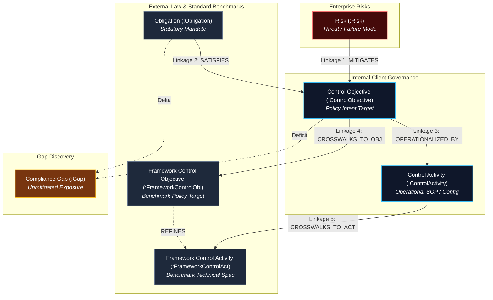
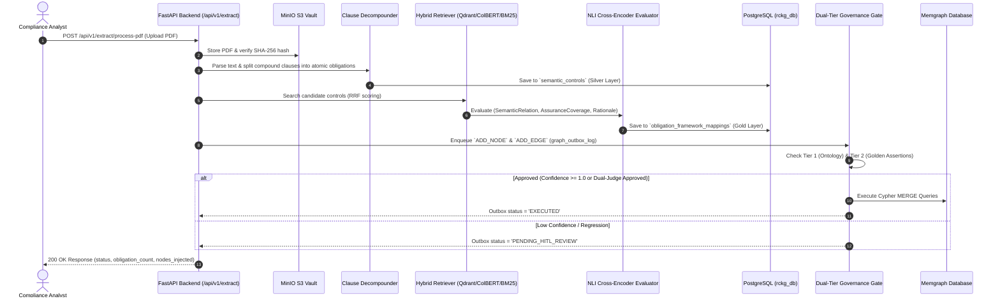
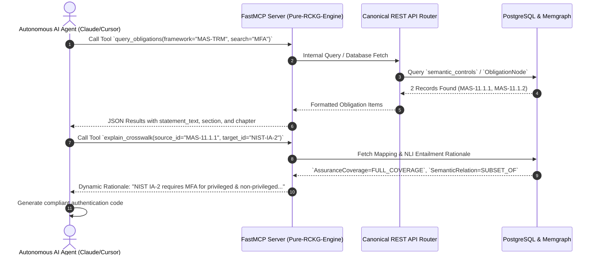

# Master Product Requirements Document (PRD): Risk Control Knowledge Graph (RCKG)

**Document Version**: 2.0  
**Status**: Production Specification (Approved)  
**Target Release**: RCKG Enterprise Platform v1.0 Production  
**Target Audience**: Product Managers, Engineering Leads, AI Systems Architects, QA Engineers, DevOps Engineers  

---

## 1. BRD Alignment & Architectural Scope

This Product Requirements Document (PRD) translates the Master Business Requirements Document ([`01-business-requirement-doc.md`](docs/00-master/01-business-requirement-doc.md)) into concrete product features, user personas, end-to-end operational workflows, and testable acceptance criteria.

### Scope & Architectural Delivery Model (Headless-First)

```
                          ┌──────────────────────┐
                          │   RCKG Engine & API   │
                          │   (Core Product 50%) │
                          └──────────┬───────────┘
                                     │
                 ┌───────────────────┼───────────────────┐
                 │                   │                   │
                 ▼                   ▼                   ▼
           REST / JSON API          MCP Server        Thin Governance UI
            (Core Engine)        (Agent Copilots)     (Auditor Sign-off)
                 │                   │                   │
                 ▼                   ▼                   ▼
          Enterprise GRC        Autonomous AI        Human Compliance
          (CI/CD, Jira)        (Claude, Cursor)       (Override & Audit)
```

1. **Core Product (50%)**: Canonical REST API as the single source of truth for machine-verifiable regulatory mappings and 2D set-theoretic assurance coverage.
2. **Autonomous Agent Interface (30%)**: Model Context Protocol (MCP) Server exposing tools, resources, and reasoning prompts to autonomous AI agents and enterprise copilots.
3. **Human Review Surface (20%)**: Thin, high-density Web UI focused strictly on human governance workflows (`[Approve]`, `[Override]`, `[Reject]`), coverage heatmaps, graph inspection, and immutable audit trails.

---

## 2. Product Overview

- **Product Name**: Risk Control Knowledge Graph (RCKG) Enterprise Platform
- **One-line Description**: An enterprise AI-native compliance platform that ingests regulatory PDFs, extracts standardized 3-tier active GRC obligations, compiles deterministic 2D crosswalks, manages graph outbox mutations, and exposes tools to autonomous AI agents and human auditors.
- **Core Problem Solved**: Eliminates manual, error-prone spreadsheet crosswalks and replaces ambiguous regulatory language with machine-readable, audit-ready graph relationships.

### Master Knowledge Graph Model (6 Nodes & 5 Linkages)



---

## 3. User Personas

| Persona Name | Role & Context | Core Goal | Frustration / Pain Point | How RCKG Delivers Value |
| :--- | :--- | :--- | :--- | :--- |
| **The Compliance Analyst (Claire)** | Senior Risk & Compliance Specialist | Map new regulations to internal policies and benchmarks in minutes | Spending weeks in Excel crosswalks comparing passive clause texts | 98% faster framework mapping with standardized active GRC syntax and real-time NLI evaluator |
| **The Enterprise Risk Manager (Marcus)** | Director of Operational Risk | Identify unmapped regulatory gaps and report compliance posture to CRO | Lack of real-time visibility into missing controls across framework updates | Instant compliance gap discovery, chapter heatmaps, and automated remediation intelligence |
| **The Security & Systems Architect (Alex)** | Senior IT / AI Systems Architect | Implement technical security controls that satisfy regulatory mandates | Ambiguous, passive legal text (*"access should be controlled"*) | Direct, active operational instructions (*"The FI must enforce MFA..."*) |
| **The Security Auditor (Sarah)** | Lead Internal / External Auditor | Validate control coverage and trace evidence to source regulations | Absence of verifiable audit trails for AI-assisted compliance decisions | Immutable PostgreSQL `audit_log` and `graph_outbox_log` with human override justifications |
| **The Autonomous AI Agent (Atlas)** | Coding / DevOps Copilot (Claude, Cursor, Windsurf) | Retrieve approved security controls and verify code compliance | Blocked by inaccessible or outdated static PDF compliance docs | FastMCP tools for real-time obligation queries, crosswalk evaluations, and gap lookups |

---

## 4. End-to-End User Journeys

### 4.1 Ingestion & Crosswalk Compilation Journey



### 4.2 Autonomous AI Agent MCP Interaction Journey



---

## 5. Structured Product Features

### F-101: Enterprise PDF Ingestion & MinIO Storage
- **Description**: Securely uploads regulatory PDFs to MinIO `source-regulations` bucket, computes SHA-256 content hashes, and writes audit records to `audit_log`.
- **User Personas**: Compliance Analyst, Security Auditor
- **Acceptance Criteria**:
  - `[AC-101.1]` Uploading a valid PDF returns a unique `document_id` and writes an audit event `document.uploaded` to PostgreSQL `audit_log`.
  - `[AC-101.2]` Re-uploading an identical PDF (matching SHA-256 hash) returns `status: "duplicate"` without duplicating storage.

### F-102: Active 3-Tier GRC Extraction & Clause Decompounding
- **Description**: Normalizes extracted prose into active voice with `must` modal phrasing across 3 tiers and decomposes complex compound sentences into atomic single-intent obligations.
- **User Personas**: Compliance Analyst, Systems Architect
- **Acceptance Criteria**:
  - `[AC-102.1]` All extracted obligations enforce `"The [Primary Actor] must [Action Verb] [Requirement] to [Purpose]"`.
  - `[AC-102.2]` Vague subject nouns (e.g. `FI`, `the FI`, `institutions`) are automatically normalized to `Financial Institution`.
  - `[AC-102.3]` Compound regulatory clauses containing multiple distinct mandates (e.g. "conduct vulnerability scanning and perform penetration testing") are decompounded into separate atomic obligations.

### F-103: Multi-Stage Hybrid Retrieval (Qdrant + ColBERT + BM25)
- **Description**: Employs dense vector embeddings, late-interaction token scoring (ColBERT), and BM25 lexical search combined via Reciprocal Rank Fusion (RRF) to retrieve top candidate controls.
- **User Personas**: Compliance Analyst, AI Systems Architect
- **Acceptance Criteria**:
  - `[AC-103.1]` Hybrid retriever returns top-10 candidate controls in $< 50\text{ms}$ per obligation.
  - `[AC-103.2]` Retrieval recall exceeds $95\%$ across cross-framework terminology variations.

### F-104: Deterministic 2D Crosswalk & Set-Theory Compiler
- **Description**: Classifies control alignments along two orthogonal axes: `SemanticRelation` (6 states) and `AssuranceCoverage` (3 states), accompanied by structured rationale generation and transitive reduction.
- **User Personas**: Compliance Analyst, Security Auditor
- **Acceptance Criteria**:
  - `[AC-104.1]` Generates crosswalk entries with `SemanticRelation` (`EQUIVALENT`, `SUBSET_OF`, `SUPERSET_OF`, `OVERLAPS`, `SUPPORTS`, `NONE`) and `AssuranceCoverage` (`FULL_COVERAGE`, `PARTIAL_COVERAGE`, `NO_COVERAGE`).
  - `[AC-104.2]` Produces clear, human-readable structured rationales explaining the exact set-theoretic containment and missing coverage delta.
  - `[AC-104.3]` Applies transitive reduction to eliminate redundant indirect graph edges.

### F-105: Dual-Tier Governance Gate & Graph Outbox Dual-Write
- **Description**: Intercepts all graph mutations in PostgreSQL `graph_outbox_log` and validates Tier 1 (Ontology protection) and Tier 2 (Golden Assertion regression check).
- **User Personas**: Enterprise Risk Manager, Security Auditor
- **Acceptance Criteria**:
  - `[AC-105.1]` Every graph mutation creates an entry in PostgreSQL `graph_outbox_log`.
  - `[AC-105.2]` Unapproved ontology mutations (`ADD_NODE_TYPE`, `REDEFINE_FACET`) are blocked with status `NEEDS_HUMAN_GOVERNANCE_SIGN_OFF`.
  - `[AC-105.3]` Any mutation that contradicts a human-attested Golden Assertion raises a `GraphRegressionError` and halts execution.

### F-106: Dual-Judge AI Quality Assurance Gate & Graph Revert Service
- **Description**: Evaluates proposed graph linkages across Logical Judge ($\ge 0.95$) and Technical Judge ($\ge 1.00$) axes, with instant single-call graph revert capabilities.
- **User Personas**: Enterprise Risk Manager, Systems Architect
- **Acceptance Criteria**:
  - `[AC-106.1]` Mappings with confidence score $\ge 1.0$ or passing Dual-Judge thresholds auto-commit into Memgraph with status `EXECUTED`.
  - `[AC-106.2]` Mappings failing thresholds are quarantined in status `PENDING_HITL_REVIEW`.
  - `[AC-106.3]` Calling the graph revert service cleanly deletes injected nodes and edges and rolls back outbox status without leaving orphan entities.

### F-107: Canonical REST API Suite
- **Description**: Exposes typed, high-performance REST endpoints for querying obligations, active controls, crosswalks, coverage summaries, and real-time NLI evaluations.
- **User Personas**: Compliance Analyst, Integration Engineer
- **Acceptance Criteria**:
  - `[AC-107.1]` `GET /api/v1/obligations` returns paginated obligations with chapter and framework filtering.
  - `[AC-107.2]` `GET /api/v1/controls` returns active NIST controls, strictly excluding the 30 withdrawn NIST SP 800-53 Rev 5 controls.
  - `[AC-107.3]` `GET /api/v1/crosswalk` returns full 2D crosswalk edges with confidence, rationale, and override metadata.
  - `[AC-107.4]` `POST /api/v1/mappings/{id}/override` allows human compliance officers to override AI mappings with mandatory audit justification logging.

### F-108: Enterprise Model Context Protocol (MCP) Server
- **Description**: Exposes FastMCP tools, resources, and reasoning prompts directly to autonomous AI agents.
- **User Personas**: Autonomous AI Agent, Software Engineer
- **Acceptance Criteria**:
  - `[AC-108.1]` MCP server registers tools: `query_obligations`, `query_controls`, `query_crosswalk`, `get_defensible_gaps`, `evaluate_crosswalk_realtime`, `record_auditor_override`, `explain_crosswalk`.
  - `[AC-108.2]` AI agents can invoke MCP tools over standard STDIO or SSE transport and receive structured JSON responses within $< 100\text{ms}$.

### F-109: Thin Human Governance & Reviewer Web Portal
- **Description**: Sleek web portal featuring Executive Heatmaps, Crosswalk Matrix with search/filter, Realtime NLI Playground, and Immutable Audit Log Viewer.
- **User Personas**: Compliance Officer, Security Auditor, CRO
- **Acceptance Criteria**:
  - `[AC-109.1]` Executive Dashboard displays total counts, chapter coverage heatmap, and defensible gap tables.
  - `[AC-109.2]` Crosswalk Matrix allows instant searching, filtering by assurance coverage, and one-click auditor override modal.
  - `[AC-109.3]` Realtime NLI Playground enables live crosswalk testing between arbitrary obligation and control text snippets.

### F-110: Categorized Compliance Gap Discovery & Remediation Intelligence
- **Description**: Scans the knowledge graph to classify gaps into **Category A (Unmatched Obligations)** and **Category B (Retail Consumer Mandates)** with specific root causes and remediation advice.
- **User Personas**: Enterprise Risk Manager, CISO
- **Acceptance Criteria**:
  - `[AC-110.1]` Correctly identifies and categorizes MAS TRM Chapter 14 consumer notification and fraud advisories (`MAS-14.3.3.a`, `MAS-14.3.3.b`, `MAS-14.4.2`, `MAS-14.4.3`) as Category B True Gaps against NIST SP 800-53 Rev 5.
  - `[AC-110.2]` Returns tailored remediation strategies and root causes for each identified gap.

### F-111: Distributed Observability & Graceful Degradation Handling
- **Description**: Instruments all LLM prompts, token consumption, and latencies in LangFuse, and guarantees system resilience under LLM degradation.
- **User Personas**: Systems Architect, DevOps Engineer
- **Acceptance Criteria**:
  - `[AC-111.1]` If vLLM endpoint times out, regex fallback extracts basic clause text without throwing 500 Server Errors.
  - `[AC-111.2]` API response explicitly sets `status: "DEGRADED"` and includes diagnostic error details in `message`.
  - `[AC-111.3]` 100% of LLM calls log distributed trace spans to LangFuse.

---

## 6. Non-Functional Requirements (NFR)

- **Performance**:
  - Ingestion of 1-page PDF must complete in $< 3.0\text{s}$.
  - Ingestion of full 57-page MAS TRM Guidelines PDF must complete in $< 10\text{ minutes}$.
  - REST query response times for `/obligations`, `/controls`, and `/crosswalk` must be $< 50\text{ms}$ at 100 concurrent requests.
  - Real-time NLI crosswalk evaluation must execute in $< 500\text{ms}$.
- **Scalability**: PostgreSQL connection pool size 10 with max overflow 20. Memgraph connection handles up to 50 concurrent openCypher sessions.
- **Security & Privacy**:
  - All API endpoints validate locality and verify server-side credentials.
  - Private compliance texts are processed locally on private subnets (`127.0.0.1`, `10.x.x.x`, `172.16-31.x.x`, `192.168.x.x`), preventing unauthorized exfiltration.
- **Availability & Reliability**: 99.9% uptime requirement; automatic retry logic for database connection pre-pings (`pool_pre_ping=True`).
- **Audit Defensibility**: 100% of graph mutations, PDF uploads, and auditor overrides produce timestamped, immutable audit records in PostgreSQL.

---

## 7. Release Criteria

Before v1.0 Production release, the system must meet the following binary conditions:
1. `pytest` backend test suite passes **100%** across all 60+ unit, integration, and E2E pipeline tests.
2. MAS TRM Guidelines (85 obligations) crosswalked against NIST SP 800-53 Rev 5 (294 active controls) achieves $\ge 95\%$ full/partial coverage with zero unhandled exceptions.
3. FastMCP server runs without error and successfully handles agent tool calls for all 7 registered tools.
4. Thin Governance Web UI loads in $< 1.0\text{s}$ and serves all dashboards, heatmaps, matrices, and NLI playgrounds correctly.
