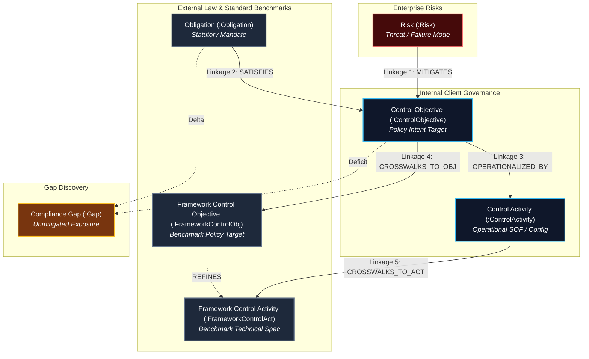
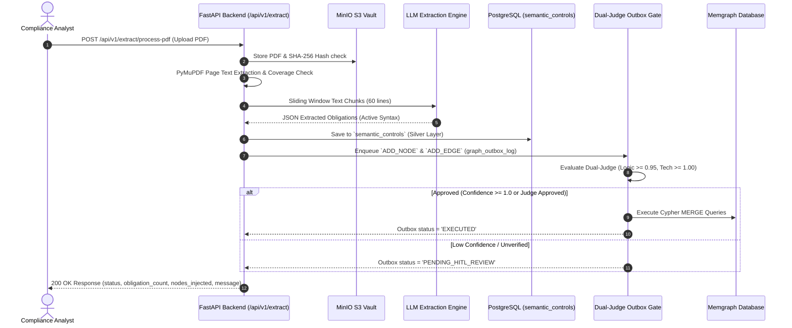

# Master Product Requirements Document (PRD): Risk Control Knowledge Graph (RCKG)

**Document Version**: 1.0  
**Status**: Production Specification  
**Target Release**: MVP v1.0 Production  
**Target Audience**: Product Managers, Engineering Leads, AI Systems Architects, QA Engineers  

---

## 1. BRD Review & Alignment

This Product Requirements Document (PRD) translates the Business Requirements Document ([`01-business-requirement-doc.md`](file:///home/zackchow/coding/rckg/docs/00-master/01-business-requirement-doc.md)) into concrete product features, user personas, end-to-end operational workflows, and testable acceptance criteria.

### Gaps & Scope Alignments Resolved
- **Standardized GRC Syntax**: Enforces active voice modal phrasing (`must`) across 3 tiers (De Jure Rule, Policy Intent, SOP Activity), standardizing `Financial Institution` as the default primary actor.
- **Production API Pipeline**: `POST /api/v1/extract/process-pdf` handles full document ingestion end-to-end, eliminating the need for single-use custom ingestion scripts.
- **Dual-Judge Governance Gate**: Enforces two-tier validation with outbox logging to prevent unverified AI graph mutations from reaching Memgraph.

---

## 2. Product Overview

- **Product Name**: Risk Control Knowledge Graph (RCKG) Platform
- **One-line Description**: An enterprise AI-native compliance platform that ingests regulatory PDFs, extracts standardized 3-tier active GRC obligations, manages graph outbox mutations, and performs real-time gap analysis.
- **Core Problem Solved**: Eliminates manual, error-prone spreadsheet crosswalks and replaces ambiguous regulatory language with machine-readable, audit-ready graph relationships.

### Master Knowledge Graph Model (6 Nodes & 5 Linkages)

---

## 3. User Personas

| Persona Name | Role & Context | Core Goal | Frustration / Pain Point | How RCKG Delivers Value |
| :--- | :--- | :--- | :--- | :--- |
| **The Compliance Analyst (Claire)** | Senior Risk & Compliance Specialist | Map new regulations to internal policies in minutes | Spending weeks in Excel crosswalks comparing passive clause texts | 98% faster framework mapping with standardized active GRC syntax |
| **The Enterprise Risk Manager (Marcus)** | Director of Operational Risk | Identify unmapped regulatory gaps and report compliance posture to CRO | Lack of real-time visibility into missing controls across framework updates | Instant compliance gap discovery & automated remediation guidance |
| **The Security & Systems Architect (Alex)** | Senior IT / AI Systems Architect | Implement technical security controls that satisfy regulatory mandates | Ambiguous, passive legal text (*"access should be controlled"*) | Direct, active operational instructions (*"The FI must enforce MFA..."*) |
| **The Security Auditor (Sarah)** | Lead Internal / External Auditor | Validate control coverage and trace evidence to source regulations | Absence of verifiable audit trails for AI-assisted compliance decisions | Immutable PostgreSQL `audit_log` and `graph_outbox_log` traceability |

---

## 4. End-to-End User Journey / Workflow

---

## 5. Structured Product Features

### F-101: Enterprise PDF Ingestion & MinIO Storage
- **Description**: Uploads regulatory PDFs to MinIO `source-regulations` bucket, computes SHA-256 content hashes, and writes audit records to `audit_log`.
- **User Persona**: Compliance Analyst, Security Auditor
- **BRD Ref**: F-101
- **Acceptance Criteria**:
  - `[AC-101.1]` Uploading a valid PDF returns a unique `document_id` and writes an audit event `document.uploaded` to PostgreSQL `audit_log`.
  - `[AC-101.2]` Re-uploading an identical PDF (matching SHA-256 hash) returns `status: "duplicate"` without duplicating storage.

### F-102: Active 3-Tier GRC Syntax Standardization
- **Description**: Converts extracted prose into standardized active voice with `must` modal phrasing across 3 tiers (De Jure Mandate, Policy Intent, SOP Activity).
- **User Persona**: Compliance Analyst, Security Architect
- **BRD Ref**: F-102
- **Acceptance Criteria**:
  - `[AC-102.1]` All extracted obligations enforce `"The [Primary Actor] must [Action Verb] [Requirement] to [Purpose]"`.
  - `[AC-102.2]` Vague subject nouns (e.g. `FI`, `the FI`) are automatically normalized to `Financial Institution`.

### F-103: Sliding Window Text Chunking & Coverage Evaluation
- **Description**: Extracts page text using PyMuPDF and breaks long documents into 60-line sliding window chunks with 10-line overlap.
- **User Persona**: Compliance Analyst
- **BRD Ref**: F-101
- **Acceptance Criteria**:
  - `[AC-103.1]` Text extraction handles 50+ page PDFs (e.g., MAS TRM Guidelines) under 30 seconds.
  - `[AC-103.2]` If LLM extraction fails for a chunk, the system records `degraded_chunks` and returns status `DEGRADED` with message `"used regex fallback"`.

### F-104: Dual-Tier Governance Gate & Graph Outbox Dual-Write
- **Description**: Routes all graph mutations through an outbox table (`graph_outbox_log`) and checks Tier 1 (Ontology protection) and Tier 2 (Golden Assertion regression check).
- **User Persona**: Enterprise Risk Manager, Security Auditor
- **BRD Ref**: F-104
- **Acceptance Criteria**:
  - `[AC-104.1]` Every graph mutation creates an entry in PostgreSQL `graph_outbox_log`.
  - `[AC-104.2]` Unapproved ontology mutations (`ADD_NODE_TYPE`, `REDEFINE_FACET`) are blocked with status `NEEDS_HUMAN_GOVERNANCE_SIGN_OFF`.

### F-105: Dual-Judge Quality Assurance Evaluation Gate
- **Description**: Evaluates proposed graph linkages across Logical Judge ($\ge 0.95$) and Technical Judge ($\ge 1.00$) axes.
- **User Persona**: Enterprise Risk Manager
- **BRD Ref**: F-105
- **Acceptance Criteria**:
  - `[AC-105.1]` Structural ingestion mutations with `confidence_score >= 1.0` auto-approve and execute Cypher MERGE queries into Memgraph with status `EXECUTED`.
  - `[AC-105.2]` Mappings scoring below threshold are held in status `PENDING_HITL_REVIEW`.

### F-106: Cypher Graph Query & Crosswalk Alignment API
- **Description**: Exposes REST endpoints to query nodes, relationships, and crosswalk alignments in Memgraph via Cypher builder.
- **User Persona**: Compliance Analyst, Systems Architect
- **BRD Ref**: F-103
- **Acceptance Criteria**:
  - `[AC-106.1]` `GET /api/v1/extract/graph/nodes` returns list of nodes (`StatutoryRequirement`, `Clause`, `ControlObjective`).
  - `[AC-106.2]` Cypher queries use parameterized inputs to prevent Cypher injection vulnerabilities.

### F-107: Automated Compliance Gap Analysis
- **Description**: Scans the knowledge graph to detect unmapped regulatory clauses (*gaps*) and stores gap records in PostgreSQL `gaps` table.
- **User Persona**: Enterprise Risk Manager, Security Auditor
- **BRD Ref**: F-106
- **Acceptance Criteria**:
  - `[AC-107.1]` `GET /api/v1/gaps` returns unmapped clauses with severity score, compliance status, and remediation advice.
  - `[AC-107.2]` Gap discovery executes in `< 2.0` seconds across 1,000+ graph nodes.

### F-108: Degraded Mode & Graceful Degradation Handling
- **Description**: Guarantees system resilience when LLM service is offline or degraded.
- **User Persona**: Systems Architect
- **BRD Ref**: F-101, F-102
- **Acceptance Criteria**:
  - `[AC-108.1]` If vLLM endpoint times out, regex fallback extracts basic clause text without throwing 500 Server Errors.
  - `[AC-108.2]` API response explicitly sets `status: "DEGRADED"` and includes diagnostic error details in `message`.

---

## 6. Non-Functional Requirements (NFR)

- **Performance**: API response for processing a 1-page PDF must be `< 3.0s`. 50-page PDF sliding window ingestion must complete in `< 10 minutes`.
- **Scalability**: PostgreSQL connection pool size 10 with max overflow 20. Memgraph connection handles up to 50 concurrent Cypher sessions.
- **Security**: All API endpoints run server-side key validation. Database passwords and MinIO secrets must be loaded via environment variables (`DATABASE_URL`, `MINIO_SECRET_KEY`).
- **Availability**: 99.9% uptime requirement for backend API; automatic retry logic for database connection pre-pings (`pool_pre_ping=True`).
- **Audit Traceability**: 100% of graph mutations and PDF uploads must produce immutable audit records in PostgreSQL.

---

## 7. Out of Scope (v1)

- Automatic push of firewall rules or cloud IAM policies to AWS/Azure/GCP (v1 scope is graph knowledge governance and audit reporting).
- Natural language chat UI (v1 provides comprehensive REST APIs; chat agent interfaces are scoped for v2).

---

## 8. Release Criteria

Before v1.0 release, the system must meet the following binary conditions:
1. `pytest` backend test suite passes **100%** across all unit, integration, and E2E pipeline tests.
2. Full 57-page MAS TRM Guidelines PDF ingests successfully via `POST /api/v1/extract/process-pdf` with zero unhandled exceptions.
3. 100% of extracted obligations in `semantic_controls` enforce active voice `must` modal phrasing.
4. Memgraph outbox dual-write mechanism correctly executes structural graph mutations (`ADD_NODE`, `ADD_EDGE`) into Memgraph.

---

## Handoff Note to Technical Architect

**Architectural Directives**:
1. Use **FastAPI** for API routing (`backend/app/api/extract.py`).
2. Maintain **PostgreSQL** as the primary relational store for Medallion architecture (Bronze, Silver, Gold), outbox logs (`graph_outbox_log`), and audit logs (`audit_log`).
3. Maintain **Memgraph** (`bolt://localhost:7687`) as the graph database using Cypher `MERGE` statements via [`RCKGCypherBuilder`](file:///home/zackchow/coding/rckg/backend/app/graph/rckg_queries.py).
4. Implement the Dual-Judge QA engine (`dual_judge_async.py`) and Governance Compiler Gate (`governance_engine.py`) to protect graph integrity.
