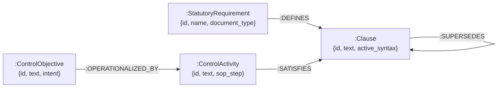
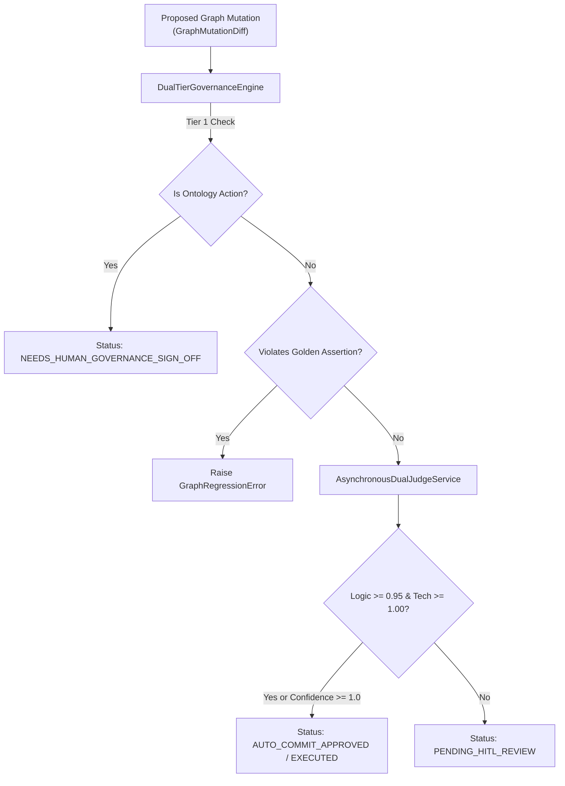

# Master Technical Requirements Document (TRD): Risk Control Knowledge Graph (RCKG)

**Document Version**: 1.0  
**Status**: Production Architecture Blueprint & System Rebuild Specification  
**Target Audience**: Senior AI Systems Architects, Senior Software Engineers, DevOps Engineers, Security Engineers  

---

## 1. Executive Summary & PRD Technical Review

This Technical Requirements Document (TRD) provides an exhaustive, production-grade technical blueprint for the **Risk Control Knowledge Graph (RCKG)** platform. A senior software engineer or AI systems architect can completely rebuild, deploy, and maintain the system using this specification.

### Key Architectural Choices & AI Pattern Fit
- **Medallion Data Lakehouse Pattern**: Multi-tiered data lifecycle in PostgreSQL:
  - **Bronze Layer**: Raw document text & metadata (`raw_documents`, `audit_log`).
  - **Silver Layer**: Extracted atomic GRC obligations & active 3-tier prose normalization (`semantic_controls`).
  - **Gold Layer**: Verified framework crosswalk alignments & gap assessments (`gaps`, `control_objective_framework_mappings`).
- **Graph Outbox Dual-Write Pattern**: All graph mutations are transactionalized in PostgreSQL `graph_outbox_log` before being executed asynchronously or synchronously into Memgraph using Cypher `MERGE` statements.
- **Dual-Tier Compiler Governance Gate**:
  - *Tier 1 (Ontology Protection)*: Quarantines unapproved schema mutations (`ADD_NODE_TYPE`, `REDEFINE_FACET`).
  - *Tier 2 (Golden Assertion Check)*: Prevents AI regressions on human-attested golden assertions (`GraphRegressionError`).
- **Dual-Judge QA Engine**: Evaluates proposed graph mutations across two independent axes (Logical Judge score $\ge 0.95$, Technical Judge score $\ge 1.00$).

---

## 2. Technology Stack & Component Justifications

| Layer | Technology | Version | Purpose & Justification |
| :--- | :--- | :--- | :--- |
| **API Framework** | **FastAPI** | `0.115+` | High-performance, async Python web framework with OpenAPI / Pydantic validation. |
| **Relational Database** | **PostgreSQL** | `16.0` | Primary store for Medallion data architecture, outbox logs, audit logs, and gap tables. |
| **ORM / Database Driver** | **SQLAlchemy** | `2.0+` | Type-safe ORM with connection pooling (`pool_pre_ping=True`, `pool_size=10`). |
| **Graph Database** | **Memgraph** | `2.18+` | In-memory, high-performance graph database supporting openCypher query language. |
| **Graph Connection Driver** | **Neo4j Python Driver** | `5.20+` | Neo4j Bolt driver (`bolt://localhost:7687`) for executing parameterized Cypher queries. |
| **Object Storage (Asset Vault)** | **MinIO** | `RELEASE.2024+` | S3-compatible object vault storing raw PDF files in bucket `source-regulations`. |
| **PDF Extraction Engine** | **PyMuPDF (`fitz`)** | `1.24+` | Fast, high-fidelity PDF text parsing with stream decoding fallbacks. |
| **LLM Inference Engine** | **vLLM / Qwen Server** | `vLLM 0.6+` | High-throughput local LLM server serving `Qwen/Qwen3.6-35B-A3B` / OpenAI-compatible API (`http://localhost:8000/v1`). |
| **Vector Search (Semantic Engine)** | **Qdrant / Sentence-Transformers** | `1.9+` | Dense vector similarity search for NLI crosswalk matching and embeddings. |
| **AI Observability & Tracing** | **LangFuse** | `2.0+` | Distributed tracing logging LLM prompts, token usage, latency, and degradation events. |
| **Testing & QA Harness** | **Pytest** | `8.0+` | Unit, integration, degradation, and end-to-end test suite execution. |

---

## 3. High-Level Architecture & Component Interactions

```mermaid
graph TD
    subgraph Client Layer
        CLIENT["REST Client / Frontend UI"]
    end

    subgraph API Gateway Layer (FastAPI)
        EP1["POST /api/v1/extract/process-pdf"]
        EP2["GET /api/v1/extract/graph/nodes"]
        EP3["GET /api/v1/gaps"]
    end

    subgraph Core Processing Pipeline
        UPLOAD["Document Upload Service<br/>(MinIO Vault & Audit Log)"]
        PARSE["PyMuPDF Engine & Coverage Check<br/>(Sliding Window 60 lines)"]
        PROMPTER["Active Prose Normalizer<br/>(_clean_dict & 'must' Modal)"]
        LLM["vLLM / Qwen LLM Endpoint<br/>(http://localhost:8000/v1)"]
    end

    subgraph Data & Governance Layer
        PG_BRONZE["PostgreSQL: audit_log & raw_documents"]
        PG_SILVER["PostgreSQL: semantic_controls"]
        GOV["Dual-Tier Governance Gate<br/>(DualTierGovernanceEngine)"]
        JUDGE["Dual-Judge QA Engine<br/>(AsynchronousDualJudgeService)"]
        OUTBOX["PostgreSQL: graph_outbox_log"]
        MEMGRAPH[("Memgraph Database<br/>bolt://localhost:7687")]
    end

    CLIENT -->|Upload PDF| EP1
    EP1 --> UPLOAD
    UPLOAD -->|Store File & SHA-256| PG_BRONZE
    UPLOAD --> PARSE
    PARSE --> PROMPTER
    PROMPTER --> LLM
    LLM -- Obligations JSON --> PG_SILVER
    PG_SILVER --> GOV
    GOV --> JUDGE
    JUDGE --> OUTBOX
    OUTBOX -->|Cypher MERGE| MEMGRAPH
    CLIENT -->|Query Graph| EP2
    EP2 --> MEMGRAPH
    CLIENT -->|Query Gaps| EP3
    EP3 --> PG_SILVER
```

---

## 4. Complete Data Models & Database Schemas

### 4.1 PostgreSQL Database Schema (`rckg_db`)

#### Table: `semantic_controls` (Silver Layer - Extracted Obligations)
```sql
CREATE TABLE semantic_controls (
    id VARCHAR(255) PRIMARY KEY,
    uuid UUID NOT NULL DEFAULT gen_random_uuid(),
    source_document_id VARCHAR(255) NOT NULL,
    statement_text TEXT NOT NULL,
    action_verb VARCHAR(100) NOT NULL,
    subject_noun VARCHAR(255) NOT NULL DEFAULT 'Financial Institution',
    section_reference VARCHAR(100),
    control_id VARCHAR(100),
    control_name VARCHAR(255),
    objective_text TEXT,
    framework_name VARCHAR(100) DEFAULT 'REGULATORY_GUIDELINE',
    framework_version VARCHAR(50) DEFAULT '2021',
    extraction_confidence FLOAT DEFAULT 1.0,
    status VARCHAR(50) DEFAULT 'ACTIVE',
    created_at TIMESTAMP WITH TIME ZONE DEFAULT CURRENT_TIMESTAMP,
    updated_at TIMESTAMP WITH TIME ZONE DEFAULT CURRENT_TIMESTAMP
);
```

#### Table: `graph_outbox_log` (Dual-Write Outbox Queue)
```sql
CREATE TABLE graph_outbox_log (
    id UUID PRIMARY KEY DEFAULT gen_random_uuid(),
    primitive VARCHAR(100) NOT NULL, -- ADD_NODE, ADD_EDGE, SUPERSEDE_NODE, CREATE_GAP
    payload JSONB NOT NULL,
    status VARCHAR(50) NOT NULL DEFAULT 'PENDING', -- PENDING, AUTO_COMMIT_APPROVED, PENDING_HITL_REVIEW, EXECUTED, GOVERNANCE_BLOCKED
    judge_logic_score FLOAT,
    judge_technical_score FLOAT,
    error_message TEXT,
    created_at TIMESTAMP WITH TIME ZONE DEFAULT CURRENT_TIMESTAMP,
    processed_at TIMESTAMP WITH TIME ZONE
);
```

#### Table: `audit_log` (Immutable Audit Trail)
```sql
CREATE TABLE audit_log (
    id UUID PRIMARY KEY DEFAULT gen_random_uuid(),
    event_type VARCHAR(100) NOT NULL, -- document.uploaded, extraction.completed, graph.mutated
    document_id VARCHAR(255),
    filename VARCHAR(255),
    file_hash VARCHAR(64), -- SHA-256 digest
    details JSONB,
    created_at TIMESTAMP WITH TIME ZONE DEFAULT CURRENT_TIMESTAMP
);
```

#### Table: `gaps` (Compliance Gap Assessments)
```sql
CREATE TABLE gaps (
    id VARCHAR(255) PRIMARY KEY,
    source_clause_id VARCHAR(255) NOT NULL,
    target_framework VARCHAR(100) NOT NULL,
    gap_severity VARCHAR(50) NOT NULL, -- CRITICAL, HIGH, MEDIUM, LOW
    compliance_status VARCHAR(50) NOT NULL, -- UNMAPPED, PARTIAL, NON_COMPLIANT
    remediation_advice TEXT,
    created_at TIMESTAMP WITH TIME ZONE DEFAULT CURRENT_TIMESTAMP
);
```

---

### 4.2 Memgraph Graph Database Schema (`bolt://localhost:7687`)



#### Node Labels & Properties
- **`:StatutoryRequirement`**: `{id: String, name: String, document_type: String}`
- **`:Clause`**: `{id: String, text: String, action_verb: String, subject_noun: String, section_ref: String}`
- **`:ControlObjective`**: `{id: String, text: String, policy_intent: String}`
- **`:ControlActivity`**: `{id: String, text: String, SOP_method: String}`
- **`:GapNode`**: `{id: String, severity: String, status: String}`

#### Relationship Types & Set-Theory Semantics
- **`[:DEFINES]`**: Connects `:StatutoryRequirement` to its extracted `:Clause` nodes (`SUPERSET_OF`).
- **`[:OPERATIONALIZED_BY]`**: Connects `:ControlObjective` to its operational `:ControlActivity` nodes.
- **`[:SATISFIES]`**: Connects `:ControlActivity` or `:ControlObjective` to regulatory `:Clause` nodes (`EQUIVALENT_TO` / `SUBSET_OF`).
- **`[:SUPERSEDES]`**: Connects updated regulatory clauses to deprecated clauses.

---

## 5. API Endpoint Specifications

All endpoints are hosted under router prefix `/api/v1/extract` in [`backend/app/api/extract.py`](file:///home/zackchow/coding/rckg/backend/app/api/extract.py).

### 5.1 `POST /api/v1/extract/process-pdf`
- **Description**: Production End-to-End PDF Ingestion & Extraction Endpoint.
- **Request**: Multipart Form Data (`file: UploadFile`, `document_type: str = "REGULATORY_GUIDELINE"`).
- **Response Model (`ProcessPdfResponse`)**:
```json
{
  "status": "SUCCESS",
  "document_id": "3c795594-c8b5-4927-973d-1e01f8ae3ef7",
  "obligation_count": 85,
  "nodes_injected": 171,
  "edges_injected": 85,
  "degraded_chunks": 0,
  "filename": "TRM Guidelines 18 January 2021.pdf",
  "message": "Extraction completed successfully."
}
```
- **Error Behavior**: If LLM fails for all chunks, returns HTTP 200 with `status: "DEGRADED"`, `degraded_chunks > 0`, and `message: "Extraction completed (used regex fallback)"`.

### 5.2 `GET /api/v1/extract/graph/nodes`
- **Description**: Retrieves all nodes and labels from Memgraph.
- **Response**: `[{"id": "OBL-3.1.1", "label": "Clause", "text": "The Financial Institution must..."}]`

### 5.3 `GET /api/v1/gaps`
- **Description**: Retrieves compliance gap assessments.
- **Response**: `[{"id": "GAP-001", "source_clause_id": "OBL-9.1.5", "gap_severity": "HIGH", "remediation_advice": "Implement MFA..."}]`

---

## 6. AI Ingestion & Processing Pipeline Architecture

### 6.1 Sliding Window Text Chunking
Long documents (e.g. 57-page PDFs) are parsed into line arrays via PyMuPDF. Chunks are computed using a sliding window algorithm:
- **Chunk Size**: 60 lines (~600–800 tokens).
- **Overlap**: 10 lines (~100 tokens).
- **Formula**: `start_idx += (chunk_size - overlap)`

### 6.2 Active Prose Normalization (`_clean_dict`)
Extracted JSON from the LLM is passed through `_clean_dict()` in [`backend/app/services/extraction.py`](file:///home/zackchow/coding/rckg/backend/app/services/extraction.py#L228-L251):
1. **Primary Actor Normalization**: Maps vague subject nouns (`FI`, `the FI`, `financial institutions`) to canonical `"Financial Institution"`.
2. **Active Phrasing Enforcement**: Prepends `"The [Actor] must "` if the extracted prose does not begin with an active subject, guaranteeing standard modal phrasing across all database records.

---

## 7. Dual-Judge & Governance Compiler Gate



---

## 8. Development Standards & Rebuild Guide

To completely rebuild and run the RCKG platform from scratch:

### 1. Environment Setup & Container Services
```bash
# Clone repository and enter directory
cd /home/zackchow/coding/rckg

# Spin up PostgreSQL (port 5432), Memgraph (port 7687), and MinIO (port 9000)
docker-compose up -d postgres memgraph minio
```

### 2. Python Virtual Environment & Dependencies
```bash
python3 -m venv venv
source venv/bin/activate
pip install -r backend/requirements.txt
```

### 3. Run Automated Database Migrations & Seed Schema
```bash
python3 scripts/seed_database.py
```

### 4. Execute Full Test Suite
```bash
pytest backend/tests/test_cfix_302_e2e_process_pdf.py \
       backend/tests/test_process_pdf_service_routing.py \
       backend/tests/test_cfix_106_process_pdf_degradation.py \
       backend/tests/test_cfix_201_outbox_edges.py -v
```

### 5. Start Production API Server
```bash
uvicorn app.main:app --host 0.0.0.0 --port 8000 --reload --app-dir backend
```

---

## Handoff Note to Engineering Lead

- **Primary Entrypoint**: Ingestion logic is entry-pointed at [`backend/app/api/extract.py`](file:///home/zackchow/coding/rckg/backend/app/api/extract.py).
- **Outbox Integrity**: Always route graph edits through [`MemgraphService.enqueue_and_execute()`](file:///home/zackchow/coding/rckg/backend/app/services/memgraph_service.py) to preserve PostgreSQL outbox logs and Dual-Judge governance verification.
- **Active Syntax Rule**: Never bypass `_clean_dict()` prose normalizer in `extraction.py`.
