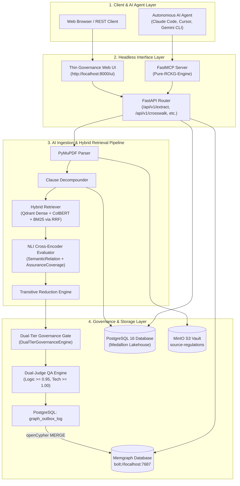
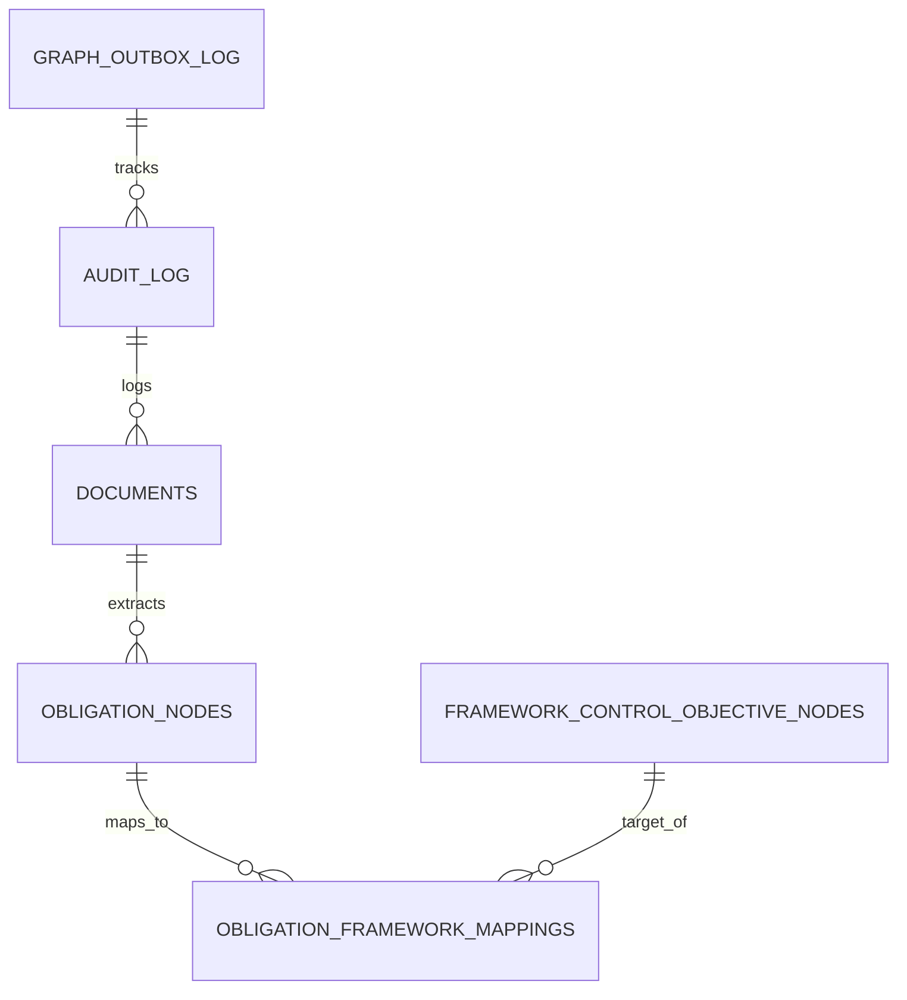
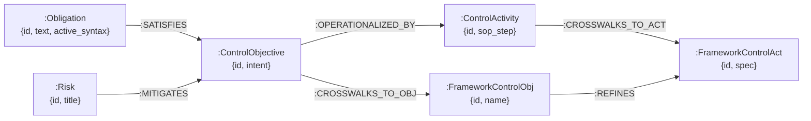
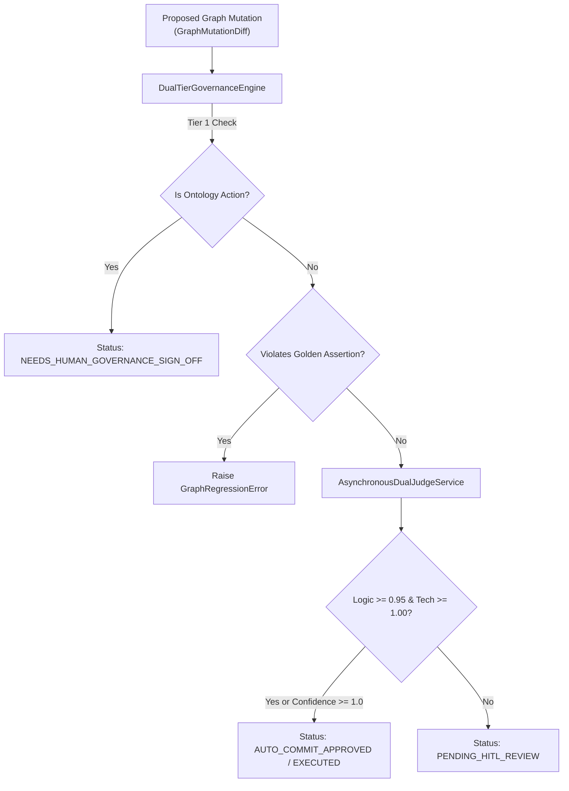

# Master Technical Requirements Document (TRD): Risk Control Knowledge Graph (RCKG)

**Document Version**: 2.0  
**Status**: Production Architecture Blueprint & System Rebuild Specification  
**Target Release**: RCKG Enterprise Platform v1.0 Production  
**Target Audience**: Senior AI Systems Architects, Senior Software Engineers, DevOps Engineers, Security Engineers  

---

## 1. Executive Summary & Architectural Blueprint

This Technical Requirements Document (TRD) provides an exhaustive, production-grade technical blueprint for the **Risk Control Knowledge Graph (RCKG)** platform. A senior software engineer or AI systems architect can completely rebuild, deploy, maintain, and extend the system using this specification.

### Headless-First Architecture Design

```
                          ┌──────────────────────┐
                          │   RCKG Engine & API   │
                          │   (Core Product 50%) │
                          └──────────┬───────────┘
                                     │
                 ┌───────────────────┼───────────────────┐
                 │                   │                   │
                 ▼                   ▼                   ▼
           REST / JSON API          MCP Server        Thin Governance UI
            (Core Engine)        (Agent Copilots)     (Auditor Sign-off)
                 │                   │                   │
                 ▼                   ▼                   ▼
          Enterprise GRC        Autonomous AI        Human Compliance
          (CI/CD, Jira)        (Claude, Cursor)       (Override & Audit)
```

The system implements a **Headless-First Delivery Architecture**:
1. **Core Product Layer (50%)**: Canonical FastAPI backend serving typed REST APIs, Medallion storage pipelines (Bronze, Silver, Gold), dual-tier governance gates, and 2D set-theoretic crosswalk compilers.
2. **Autonomous Agent Layer (30%)**: Enterprise FastMCP Server exposing tools, dynamic resources, and structured reasoning prompts to autonomous AI coding agents (Claude Code, Gemini CLI, Cursor, Windsurf, OpenDevin).
3. **Human Governance Layer (20%)**: Thin Web Reviewer UI (Vanilla JS/CSS, HTML5) providing high-density executive dashboards, chapter coverage heatmaps, interactive crosswalk matrices, real-time NLI playgrounds, and immutable audit logs.

---

## 2. Technology Stack & Component Justifications

| Layer | Technology | Version | Purpose & Justification |
| :--- | :--- | :--- | :--- |
| **API Framework** | **FastAPI** | `0.115+` | Async Python web framework with OpenAPI / Pydantic v2 validation. |
| **Relational Database** | **PostgreSQL** | `16.0` | Primary store for Medallion data architecture, outbox logs, audit logs, and crosswalk tables. |
| **ORM / Driver** | **SQLAlchemy** | `2.0+` | Type-safe ORM with connection pooling (`pool_pre_ping=True`, `pool_size=10`, `max_overflow=20`). |
| **Graph Database** | **Memgraph** | `2.18+` | In-memory, high-performance graph database supporting openCypher query language. |
| **Graph Connection Driver** | **Neo4j Python Driver** | `5.20+` | Neo4j Bolt driver (`bolt://localhost:7687`) for executing parameterized openCypher queries. |
| **Object Storage (Asset Vault)** | **MinIO** | `RELEASE.2024+` | S3-compatible object vault storing raw PDF files in bucket `source-regulations`. |
| **PDF Extraction Engine** | **PyMuPDF (`fitz`)** | `1.24+` | Fast, high-fidelity PDF text parsing with stream decoding fallbacks. |
| **Dense Vector Database** | **Qdrant** | `1.9+` | Vector similarity engine for semantic embeddings (`text-embedding-3-small` / BAAI BGE). |
| **Late-Interaction Neural Search** | **ColBERT / FastEmbed** | `0.3+` | Token-level late-interaction multi-vector scoring for high-precision GRC clause retrieval. |
| **NLI Cross-Encoder Engine** | **HuggingFace / PyTorch** | `2.4+` | Natural Language Inference models (`cross-encoder/nli-deberta-v3-large`) for semantic entailment. |
| **Agent Interface (MCP)** | **FastMCP** | `0.1+` | Official Python Model Context Protocol implementation for AI agent tool calling and reasoning prompts. |
| **AI Observability & Tracing** | **LangFuse** | `2.0+` | Distributed tracing logging LLM prompts, token usage, latency, and degradation events. |
| **Testing & QA Harness** | **Pytest** | `8.0+` | Unit, integration, degradation, and end-to-end test suite execution. |

---

## 3. High-Level Architecture & Component Interactions



---

## 4. Complete Data Models & Database Schemas

### 4.1 PostgreSQL Database Schema (`rckg_db`)



#### Table: `obligation_nodes` (Silver Layer - Standardized Obligations)
```sql
CREATE TABLE obligation_nodes (
    id UUID PRIMARY KEY DEFAULT gen_random_uuid(),
    obligation_id VARCHAR(100) UNIQUE NOT NULL, -- e.g. MAS-7.6.1
    statement_text TEXT NOT NULL,
    action_verb VARCHAR(100) NOT NULL,
    subject_noun VARCHAR(255) NOT NULL DEFAULT 'Financial Institution',
    framework_name VARCHAR(100) NOT NULL DEFAULT 'MAS-TRM',
    framework_version VARCHAR(50) DEFAULT '2024',
    section_identifier VARCHAR(100),
    chapter VARCHAR(100),
    is_active BOOLEAN DEFAULT TRUE,
    created_at TIMESTAMP WITH TIME ZONE DEFAULT CURRENT_TIMESTAMP,
    updated_at TIMESTAMP WITH TIME ZONE DEFAULT CURRENT_TIMESTAMP
);
CREATE INDEX idx_obl_framework ON obligation_nodes(framework_name);
CREATE INDEX idx_obl_id ON obligation_nodes(obligation_id);
```

#### Table: `framework_control_objective_nodes` (Industry Benchmark Controls)
```sql
CREATE TABLE framework_control_objective_nodes (
    id UUID PRIMARY KEY DEFAULT gen_random_uuid(),
    framework_obj_id VARCHAR(100) UNIQUE NOT NULL, -- e.g. NIST-AC-2
    objective_name VARCHAR(255) NOT NULL,
    objective_text TEXT NOT NULL,
    framework_name VARCHAR(100) NOT NULL DEFAULT 'NIST-SP-800-53',
    framework_version VARCHAR(50) DEFAULT 'Rev 5',
    family VARCHAR(100),
    is_active BOOLEAN DEFAULT TRUE,
    created_at TIMESTAMP WITH TIME ZONE DEFAULT CURRENT_TIMESTAMP,
    updated_at TIMESTAMP WITH TIME ZONE DEFAULT CURRENT_TIMESTAMP
);
CREATE INDEX idx_fco_framework ON framework_control_objective_nodes(framework_name);
CREATE INDEX idx_fco_id ON framework_control_objective_nodes(framework_obj_id);
```

#### Table: `obligation_framework_mappings` (Gold Layer - 2D Crosswalks)
```sql
CREATE TYPE semantic_relation_enum AS ENUM (
    'EQUIVALENT', 'SUBSET_OF', 'SUPERSET_OF', 'OVERLAPS', 'SUPPORTS', 'NONE'
);

CREATE TYPE assurance_coverage_enum AS ENUM (
    'FULL_COVERAGE', 'PARTIAL_COVERAGE', 'NO_COVERAGE'
);

CREATE TABLE obligation_framework_mappings (
    id UUID PRIMARY KEY DEFAULT gen_random_uuid(),
    obligation_id UUID NOT NULL REFERENCES obligation_nodes(id) ON DELETE CASCADE,
    framework_control_obj_id UUID NOT NULL REFERENCES framework_control_objective_nodes(id) ON DELETE CASCADE,
    semantic_relation semantic_relation_enum NOT NULL,
    assurance_coverage assurance_coverage_enum NOT NULL,
    confidence_score FLOAT NOT NULL DEFAULT 0.0,
    rationale TEXT NOT NULL,
    human_approved BOOLEAN DEFAULT FALSE,
    override_reason TEXT,
    created_at TIMESTAMP WITH TIME ZONE DEFAULT CURRENT_TIMESTAMP,
    updated_at TIMESTAMP WITH TIME ZONE DEFAULT CURRENT_TIMESTAMP,
    CONSTRAINT uq_obl_framework_mapping UNIQUE(obligation_id, framework_control_obj_id)
);
CREATE INDEX idx_mapping_relation ON obligation_framework_mappings(semantic_relation);
CREATE INDEX idx_mapping_coverage ON obligation_framework_mappings(assurance_coverage);
```

#### Table: `graph_outbox_log` (Dual-Write Outbox Queue)
```sql
CREATE TABLE graph_outbox_log (
    id UUID PRIMARY KEY DEFAULT gen_random_uuid(),
    primitive VARCHAR(100) NOT NULL, -- ADD_NODE, ADD_EDGE, SUPERSEDE_NODE, CREATE_GAP
    payload JSONB NOT NULL,
    status VARCHAR(50) NOT NULL DEFAULT 'PENDING', -- PENDING, AUTO_COMMIT_APPROVED, PENDING_HITL_REVIEW, EXECUTED, GOVERNANCE_BLOCKED
    judge_logic_score FLOAT,
    judge_technical_score FLOAT,
    error_message TEXT,
    created_at TIMESTAMP WITH TIME ZONE DEFAULT CURRENT_TIMESTAMP,
    processed_at TIMESTAMP WITH TIME ZONE
);
CREATE INDEX idx_outbox_status ON graph_outbox_log(status);
```

#### Table: `audit_log` (Immutable Audit Trail)
```sql
CREATE TABLE audit_log (
    id UUID PRIMARY KEY DEFAULT gen_random_uuid(),
    event_type VARCHAR(100) NOT NULL, -- document.uploaded, extraction.completed, graph.mutated, auditor.override
    document_id VARCHAR(255),
    filename VARCHAR(255),
    file_hash VARCHAR(64), -- SHA-256 digest
    details JSONB,
    created_at TIMESTAMP WITH TIME ZONE DEFAULT CURRENT_TIMESTAMP
);
CREATE INDEX idx_audit_event_type ON audit_log(event_type);
```

---

### 4.2 Memgraph Graph Database Schema (`bolt://localhost:7687`)



#### Relationship Types & openCypher Properties
- **`[:SATISFIES]`**: `{semantic_relation: String, assurance_coverage: String, confidence: Float, rationale: String}`
- **`[:OPERATIONALIZED_BY]`**: `{method: String, trigger: String}`
- **`[:CROSSWALKS_TO_OBJ]`**: `{semantic_relation: String, assurance_coverage: String, confidence: Float}`
- **`[:CROSSWALKS_TO_ACT]`**: `{parity_score: Float, method: String}`
- **`[:MITIGATES]`**: `{residual_risk: String, coverage: String}`

---

## 5. API Endpoint Specifications

All endpoints are hosted under router prefixes `/api/v1` and `/api/v1/extract`.

### 5.1 `GET /api/v1/obligations`
- **Description**: Query regulatory obligations with keyword search, chapter filtering, and pagination.
- **Parameters**: `framework: str = "MAS-TRM"`, `search: Optional[str]`, `limit: int = 50`, `offset: int = 0`.
- **Response Model**: `ObligationListResponse`
```json
{
  "total": 85,
  "limit": 50,
  "offset": 0,
  "items": [
    {
      "id": "c7a8...",
      "obligation_id": "MAS-7.6.1",
      "statement_text": "The Financial Institution must implement multi-factor authentication for administrative access.",
      "framework_name": "MAS-TRM",
      "chapter": "Chapter 7",
      "section": "7.6.1"
    }
  ]
}
```

### 5.2 `GET /api/v1/controls`
- **Description**: Query active security controls, excluding purged/withdrawn controls.
- **Parameters**: `framework: str = "NIST-SP-800-53"`, `active_only: bool = true`, `search: Optional[str]`, `limit: int = 50`, `offset: int = 0`.
- **Response Model**: `ControlListResponse`

### 5.3 `GET /api/v1/crosswalk`
- **Description**: Query 2D set-theoretic crosswalk mappings.
- **Parameters**: `source_id: Optional[str]`, `target_id: Optional[str]`, `min_confidence: float = 0.0`, `assurance_coverage: Optional[str]`, `limit: int = 50`.
- **Response Model**: `CrosswalkListResponse`

### 5.4 `GET /api/v1/gaps`
- **Description**: Retrieve categorized compliance gaps (Category A Unmatched, Category B Retail Mandates).
- **Response Model**: `CategorizedGapsResponse`

### 5.5 `GET /api/v1/coverage/summary`
- **Description**: Retrieve chapter coverage heatmaps and breakdown rates.
- **Response Model**: `CoverageSummaryResponse`

### 5.6 `POST /api/v1/evaluation/realtime`
- **Description**: Live NLI crosswalk evaluation between arbitrary obligation and control text.
- **Request Model**: `RealtimeEvaluationRequest`
- **Response Model**: `RealtimeEvaluationResponse`

### 5.7 `POST /api/v1/mappings/{id}/override`
- **Description**: Record an auditor manual override of an AI crosswalk mapping with mandatory audit reasoning.
- **Request Model**: `AuditorOverrideRequest`
- **Response Model**: `AuditorOverrideResponse`

---

## 6. Enterprise FastMCP Server Reference

The FastMCP Server (`backend/app/mcp_server/server.py`) provides 7 official tools for AI agents:

| Tool Name | Parameters | Purpose |
| :--- | :--- | :--- |
| `query_obligations` | `framework, search, limit, offset` | Retrieve structured regulatory obligations. |
| `query_controls` | `framework, active_only, search, limit, offset` | Retrieve active framework security controls. |
| `query_crosswalk` | `source_id, target_id, min_confidence, assurance_coverage` | Search 2D crosswalk linkages with rationales. |
| `get_defensible_gaps` | `framework` | Discover Category A & Category B true gaps. |
| `evaluate_crosswalk_realtime`| `obligation_text, control_text` | Run real-time NLI cross-encoder evaluation. |
| `record_auditor_override` | `mapping_id, new_relation, new_coverage, override_reason` | Record auditor sign-off or correction. |
| `explain_crosswalk` | `source_id, target_id` | Generate detailed audit explanation for a mapping. |

---

## 7. Dual-Judge & Governance Compiler Gate



---

## 8. Complete System Rebuild & Runbook Guide

To completely rebuild and run the RCKG platform from scratch:

### 1. Environment Setup & Container Services
```bash
# Clone repository and enter directory
cd .

# Spin up PostgreSQL (port 5432), Memgraph (port 7687), and MinIO (port 9000)
docker-compose up -d postgres memgraph minio
```

### 2. Python Virtual Environment & Dependencies
```bash
python3 -m venv venv
source venv/bin/activate
pip install -r backend/requirements.txt
```

### 3. Run Automated Database Migrations & Seed Baseline Data
```bash
# Initialize PostgreSQL tables, seed MAS TRM obligations & NIST controls
python3 backend/app/services/seed_ingestion.py
```

### 4. Execute Full Test Suite
```bash
pytest backend/tests -v
```

### 5. Start Production API Server & Thin Governance UI
```bash
uvicorn app.main:app --host 0.0.0.0 --port 8000 --reload --app-dir backend
```
- Open Web UI: `http://localhost:8000/ui`
- Open Swagger Docs: `http://localhost:8000/docs`

### 6. Start FastMCP Server for Autonomous AI Agents
```bash
python3 backend/app/mcp_server/server.py
```
