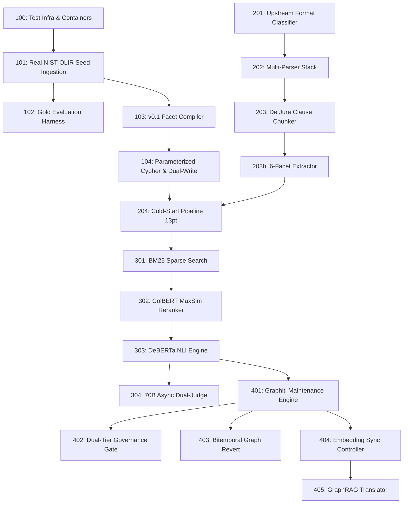

# Pure Risk and Control Knowledge Graph (RCKG) — Master MVP Sprint Delivery Plan

**Document Version:** 2.0 — Production Execution & Engineering Delivery Plan (Hardened Revision)  
**Status:** Approved / Active Production Backlog  
**Classification:** Internal — Confidential Engineering Specification  
**Target Repository:** `/home/zackchow/coding/rckg`  
**Output Target:** `docs/03-mvp/mvp-sprint.md`  
**Governing Master Spec:** [06-delta.md](file:///home/zackchow/coding/rckg/docs/02-pickup/06-delta.md)  
**Linked Schema Spec:** [nist-olir-schema-mapping.md](file:///home/zackchow/coding/rckg/docs/03-mvp/nist-olir-schema-mapping.md)  

---

## 1. Executive Sprint Roadmap & Delivery Principles

This document defines the master agile execution backlog and detailed sprint plan required to build, test, and validate the **Pure Risk and Control Knowledge Graph (RCKG)** engine. The plan implements the architecture, governance model, 4-stage retrieval funnel, bitemporal time-travel, and Graphiti maintenance engine specified in `06-delta.md`, incorporating critical schema corrections, test container infrastructure, and 6-facet extraction services.

### 1.1 Sprint Planning Principles
- **Sprint Cadence:** 2-Week Sprints (4 Sprints Total = 8 Weeks to Production Release v1.0.0).
- **Assumed Team Composition:** 
  - 1 Lead AI Infrastructure Architect / Engineering Lead (Scrum Master)
  - 2 Senior Backend Python/FastAPI Engineers
  - 1 Data / Graph DB & AI Engineering Specialist
  - 1 Senior QA & Compliance Validation Engineer
- **Velocity Assumption:** ~33–37 Story Points per 2-week sprint (Total Epic Capacity: 140 Story Points).
- **Sprint Goal Philosophy:** Every sprint ends with a fully testable, demonstrable software increment integrated into `backend/app` with corresponding pytest suites and container integration tests. No pure documentation sprints.

### 1.2 Agile Milestone Overview

```
┌────────────────────────────────────────────────────────────────────────────────────────┐
│                        PURE RCKG 4-SPRINT RELEASE ROADMAP (v2.0)                       │
├────────────────────────────────────────────────────────────────────────────────────────┤
│ SPRINT 1: TEST INFRA, SEED INGESTION, GOLD HARNESS & RULE COMPILER MVP (33 pts)       │
│ • RCKG Test Infrastructure & CI/CD Docker Compose containers (Memgraph, Postgres, ES)│
│ • Seed ~1,700 Framework Nodes & ~3,100 Golden Edges via real NIST OLIR XML parser      │
│ • Assemble 1,000-pair Gold Evaluation Benchmark Harness for Recall@500 & NLI           │
│ • Implement v0.1 Facet-Aware Graph Compiler Baseline & Parameterized Cypher Builders   │
├────────────────────────────────────────────────────────────────────────────────────────┤
│ SPRINT 2: FORMAT ROUTER, 6-FACET EXTRACTOR & COLD-START PIPELINE (37 pts)              │
│ • Upstream Format Classifier Router (Native PDF, Scanned OCR, DOCX, Matrix Tables)    │
│ • Multi-parser stack (Marker, PyMuPDF, Surya OCR, TableTransformer)                    │
│ • De Jure Clause-Boundary Rule Unit Extractor & 6-Facet Extraction Service             │
│ • Phase 1 Bulk Cold-Start Pipeline Orchestrator (13 pts) populating v1.0.0             │
├────────────────────────────────────────────────────────────────────────────────────────┤
│ SPRINT 3: HARDENED 4-STAGE RETRIEVAL, NLI SET-THEORY ENGINE & DUAL JUDGE (34 pts)      │
│ • 4-Stage Multistage Retrieval (BM25 + Bi-Encoder + ColBERTv2 Token Cache + NLI)       │
│ • Distilled 8B Student LLM NLI Set-Theory Classifier & Condition Confidence Scoring    │
│ • Asynchronous 70B Dual-Judge Audit Service & KTO/DPO Preference Accumulator Worker   │
├────────────────────────────────────────────────────────────────────────────────────────┤
│ SPRINT 4: GRAPHITI MAINTENANCE, GOVERNANCE GATES, REVERT & GRAPHRAG (36 pts)           │
│ • Phase 2 Graphiti Incremental Maintenance Engine & Semantic Change Detector           │
│ • Dual-Tier Governance Gate (Instance Auto-Gate vs Mandatory Ontology Committee Gate)  │
│ • Literal Golden Assertions Snapshot Testing & Bitemporal Graph Revert Endpoint        │
│ • PostgreSQL Outbox Embedding Sync Controller & GraphRAG Translation Layer Interface   │
└────────────────────────────────────────────────────────────────────────────────────────┘
```

---

## 2. Sprint 1: Test Infra, Seed Graph Ingestion, Gold Harness & Rule Compiler MVP

**Sprint Goal:** Provision test container infrastructure, bootstrap the v1.0.0 compliance seed graph with ~1,700 framework nodes and ~3,100 golden edges from official NIST OLIR XML and CSA CCM sources, assemble the 1,000-pair Gold Evaluation Harness, and deploy a deterministic v0.1 Facet-Aware Graph Compiler baseline.

**Rationale:** Building test infrastructure, the seed graph, and evaluation harness first establishes empirical metrics for Stage 1 dense embedding selection and provides a pinned Golden Assertions suite before executing any probabilistic AI graph mutations.

**Stories in this Sprint:** `RCKG-100`, `RCKG-101`, `RCKG-102`, `RCKG-103`, `RCKG-104`  
**Total Story Points:** 33 Story Points

---

### [RCKG-100] RCKG Test Infrastructure, CI/CD Pipeline & Test Fixture Factories

**Type:** Chore  
**Sprint:** Sprint 1  
**Story Points:** 5  
**Priority:** High  
**Assigned To:** Senior Backend / DevOps Engineer  
**Status:** COMPLETED ✅  
**Work Log:** [work-log-RCKG-100.md](file:///home/zackchow/coding/rckg/docs/03-mvp/work-log-RCKG-100.md)  
**QA Sign-Off:** [qa-report-RCKG-100.md](file:///home/zackchow/coding/rckg/docs/03-mvp/qa-report-RCKG-100.md) (Status: APPROVED)  
**Labels:** `backend`, `infra`, `testing`, `docker`, `ci-cd`  

#### User Story
> As a **Developer**, I want **an automated test container environment (Memgraph, PostgreSQL, Elasticsearch, Qdrant) and pytest fixture factories**, so that **all graph mutation services, Cypher query builders, and retrieval algorithms can be tested deterministically in CI/CD**.

#### Context and Background
Per Section 3 of Code Audit (`04-current-state-of-code.md`), integration tests require running instances of PostgreSQL, Memgraph, Elasticsearch, and Qdrant. Creating a dedicated `docker-compose.test.yml` and pytest fixtures (`conftest.py`) ensures clean isolated database state for test suites across all 4 sprints.

#### Acceptance Criteria
1. Given `docker-compose.test.yml`, running `make test-env-up` provisions isolated Memgraph (7687), PostgreSQL (5433), Elasticsearch (9201), and Qdrant (6334) containers.
2. `conftest.py` provides reusable pytest fixtures generating sample `ObligationNode`, `ControlObjectiveNode`, `ControlActivityNode`, `FrameworkControlObjNode`, `FrameworkControlActNode`, and `RiskNode` instances.
3. Database migration scripts run automatically prior to test execution.
4. Command `pytest backend/tests` executes cleanly in isolated CI container mode.

#### Implementation Guide

##### Files to Modify

| File | Purpose of Change |
|------|------------------|
| `docker-compose.test.yml` | **[NEW]** Isolated Docker Compose configuration for test containers |
| `backend/tests/conftest.py` | **[NEW]** Pytest fixtures for database sessions and node factories |
| `Makefile` | Add test environment targets (`test-env-up`, `test-env-down`, `test`) |

##### New Files to Create

**`docker-compose.test.yml`** — [NEW]
```yaml
version: '3.8'

services:
  postgres_test:
    image: postgres:16-alpine
    environment:
      POSTGRES_DB: rckg_test
      POSTGRES_USER: rckg_user
      POSTGRES_PASSWORD: rckg_password
    ports:
      - "5433:5432"

  memgraph_test:
    image: memgraph/memgraph-platform:latest
    ports:
      - "7688:7687"

  elasticsearch_test:
    image: docker.elastic.co/elasticsearch/elasticsearch:8.11.0
    environment:
      - discovery.type=single-node
      - xpack.security.enabled=false
    ports:
      - "9201:9200"

  qdrant_test:
    image: qdrant/qdrant:latest
    ports:
      - "6334:6333"
```

#### Definition of Done
- [x] `docker-compose.test.yml` provisions all 4 test stores on non-conflicting ports.
- [x] `conftest.py` provides isolated DB sessions and node generation factories.
- [x] `make test` runs pytest successfully.

#### Dependencies
- Blocked by: None
- Blocks: `RCKG-101`, `RCKG-102`, `RCKG-103`, `RCKG-104`

---

### [RCKG-101] Open-Source Compliance Seed Harvesting & Real NIST OLIR Seed Ingestion

**Type:** Story  
**Sprint:** Sprint 1  
**Story Points:** 8  
**Priority:** High  
**Assigned To:** Data / Graph DB Specialist  
**Status:** COMPLETED ✅  
**Work Log:** [work-log-RCKG-101.md](file:///home/zackchow/coding/rckg/docs/03-mvp/swe-worklog/work-log-RCKG-101.md)  
**QA Sign-Off:** [qa-report-RCKG-101.md](file:///home/zackchow/coding/rckg/docs/03-mvp/qa-worklog/qa-report-RCKG-101.md) (Status: APPROVED)  
**Labels:** `backend`, `graph`, `ingestion`, `seed-data`, `nist-olir`  

#### User Story
> As a **Compliance Architect**, I want **official NIST OLIR XML exports and CSA CCM v4 standards parsed according to `nist-olir-schema-mapping.md` and loaded into Memgraph and PostgreSQL**, so that **the Knowledge Graph has a pre-validated v1.0.0 seed structure with pinned Golden Assertions prior to running AI extraction**.

#### Context and Background
Per Section 5.4 of `06-delta.md` and [nist-olir-schema-mapping.md](file:///home/zackchow/coding/rckg/docs/03-mvp/nist-olir-schema-mapping.md), cold-starting an enterprise GRC graph with pure probabilistic AI creates hallucination risks. Parsing real NIST OLIR `<InformativeReference>` XML structures (`FocalDocument` and `ReferencedDocument`) establishes ~1,700 `:FrameworkControlObj` and `:FrameworkControlAct` nodes linked by ~3,100 pre-validated `CROSSWALKS_TO_OBJ` / `CROSSWALKS_TO_ACT` edges tagged with `status: "HUMAN_ATTESTED"` and `is_golden_assertion: true`.

#### Acceptance Criteria
1. Given official NIST OLIR XML files (`https://csrc.nist.gov/projects/olir`), `NistOlirXmlParser` parses `<InformativeReference>` blocks extracting `<FocalDocument>` and `<ReferencedDocument>` elements as specified in `nist-olir-schema-mapping.md`.
2. Given Cloud Security Alliance CCM v4 Excel spreadsheets, `CcmExcelParser` extracts meta-framework mappings.
3. Seed edges loaded into Memgraph and PostgreSQL have `status = 'HUMAN_ATTESTED'`, `is_golden_assertion = true`, and `confidence_score = 1.0`.
4. Unit tests in `backend/tests/test_seed_ingestion.py` verify complete parsing and DB insertion of real NIST OLIR XML exports.

#### Implementation Guide

##### Files to Modify

| File | Purpose of Change |
|------|------------------|
| `backend/app/services/seed_ingestion.py` | **[NEW]** Implementation of `NistOlirXmlParser`, `CcmExcelParser`, and `ComplianceSeedIngester` |
| `backend/app/api/documents.py` | Add seed ingestion trigger endpoint `POST /api/v1/documents/ingest-seed` |
| `backend/tests/test_seed_ingestion.py` | **[NEW]** Integration unit test suite for compliance seed parsers |

##### Relevant Code Blocks

**`backend/app/services/seed_ingestion.py`** — Updated NIST OLIR Parser

```python
"""
Compliance Seed Ingestion Service for Pure RCKG Baseline Graph (v1.0.0).

Parses official NIST OLIR XML exports according to nist-olir-schema-mapping.md.
"""

import logging
import xml.etree.ElementTree as ET
from typing import Dict, Any, List
from sqlalchemy.orm import Session
from backend.app.models.rckg_nodes import (
    FrameworkControlObjectiveNode,
    FrameworkControlActivityNode,
    ControlObjectiveFrameworkMapping,
    SetTheoryRelation,
    MappingStatus
)

logger = logging.getLogger(__name__)

class NistOlirXmlParser:
    """Parser for official NIST OLIR XML crosswalk files."""

    def __init__(self, xml_filepath: str):
        self.filepath = xml_filepath

    def parse(self) -> Dict[str, List[Dict[str, Any]]]:
        tree = ET.parse(self.filepath)
        root = tree.getroot()
        nodes, edges = [], []
        seen_nodes = set()

        for ref in root.findall('.//InformativeReference') or root.findall('.//{*}InformativeReference'):
            focal = ref.find('FocalDocument') or ref.find('{*}FocalDocument')
            referenced = ref.find('ReferencedDocument') or ref.find('{*}ReferencedDocument')
            
            if focal is None or referenced is None:
                continue

            focal_id = focal.findtext('Identifier', '') or focal.findtext('{*}Identifier', '')
            focal_doc = focal.findtext('DocumentIdentifier', 'NIST SP 800-53') or focal.findtext('{*}DocumentIdentifier', '')
            focal_text = focal.findtext('Description', '') or focal.findtext('{*}Description', '')

            if focal_id and focal_id not in seen_nodes:
                nodes.append({
                    "framework_obj_id": focal_id,
                    "framework_name": focal_doc,
                    "framework_version": "Rev 5",
                    "objective_name": focal_id,
                    "objective_text": focal_text
                })
                seen_nodes.add(focal_id)

            ref_id = referenced.findtext('Identifier', '') or referenced.findtext('{*}Identifier', '')
            ref_doc = referenced.findtext('DocumentIdentifier', 'ISO/IEC 27001') or referenced.findtext('{*}DocumentIdentifier', '')
            ref_text = referenced.findtext('Description', '') or referenced.findtext('{*}Description', '')

            if ref_id and ref_id not in seen_nodes:
                nodes.append({
                    "framework_obj_id": ref_id,
                    "framework_name": ref_doc,
                    "framework_version": "2022",
                    "objective_name": ref_id,
                    "objective_text": ref_text
                })
                seen_nodes.add(ref_id)

            if focal_id and ref_id:
                edges.append({
                    "source_id": focal_id,
                    "target_id": ref_id,
                    "relation": SetTheoryRelation.EQUIVALENT_TO.value,
                    "is_golden": True,
                    "status": "HUMAN_ATTESTED"
                })

        return {"nodes": nodes, "edges": edges}
```

#### Definition of Done
- [x] `NistOlirXmlParser` implemented according to `nist-olir-schema-mapping.md`.
- [x] Ingests ~1,700 framework nodes and ~3,100 seed edges into PostgreSQL and Memgraph.
- [x] Automated test in `backend/tests/test_seed_ingestion.py` passes cleanly.

#### Dependencies
- Blocked by: `RCKG-100`
- Blocks: `RCKG-102`, `RCKG-103`

---

### [RCKG-102] Gold Crosswalk Evaluation Benchmark Harness Assembly & Embedding Selection

**Type:** Story  
**Sprint:** Sprint 1  
**Story Points:** 8  
**Priority:** High  
**Assigned To:** Senior Backend / AI Engineer  
**Status:** COMPLETED ✅  
**Work Log:** [work-log-RCKG-102.md](file:///home/zackchow/coding/rckg/docs/03-mvp/swe-worklog/work-log-RCKG-102.md)  
**QA Sign-Off:** [qa-report-RCKG-102.md](file:///home/zackchow/coding/rckg/docs/03-mvp/qa-worklog/qa-report-RCKG-102.md) (Status: APPROVED)  
**Labels:** `backend`, `eval`, `benchmark`, `embeddings`  

#### User Story
> As an **AI Research Engineer**, I want **a 1,000-pair human-annotated Gold Crosswalk Evaluation Benchmark Harness**, so that **dense embedding retrieval models (Qwen3-Embedding-8B, Voyage-law-2, BGE-M3) can be evaluated empirically for Recall@500 before locking Stage 1 architecture**.

#### Context and Background
Per Section 5.1 & 5.2 of `06-delta.md`, stage 1 dense vector retrieval selection must be driven empirically by benchmark evaluation against a ground-truth harness (1,000 human-annotated crosswalk candidate pairs spanning NIST SP 800-53 $\leftrightarrow$ ISO 27001, NIST AI RMF $\leftrightarrow$ EU AI Act, and corporate SOPs $\leftrightarrow$ Control Activities). The harness evaluates Recall@500 and Mean Reciprocal Rank (MRR).

#### Acceptance Criteria
1. Given the 1,000 ground-truth crosswalk pair benchmark JSON dataset, `GoldHarnessEvaluator` computes Recall@10, Recall@100, Recall@500, and MRR metrics.
2. Given embedding candidates (`Qwen3-Embedding-8B`, `Voyage-law-2`, `BGE-M3`), evaluation generates a comparative markdown report detailing VRAM footprint and latency.
3. Test suite `backend/tests/eval/test_gold_harness.py` validates metric computation logic deterministically.

#### Implementation Guide

##### Files to Modify

| File | Purpose of Change |
|------|------------------|
| `backend/app/eval/gold_harness.py` | **[NEW]** Implementation of `GoldHarnessEvaluator` & retrieval benchmark metrics |
| `backend/tests/eval/test_gold_harness.py` | **[NEW]** Unit test suite for evaluation harness metrics |

#### Definition of Done
- [x] Ground-truth JSON benchmark dataset assembled in `data/eval/gold_crosswalk_1000.json`.
- [x] `GoldHarnessEvaluator` computes Recall@10, Recall@100, Recall@500, MRR, and Latency.
- [x] Pytest suite in `backend/tests/eval/test_gold_harness.py` passes deterministically.

#### Dependencies
- Blocked by: `RCKG-101`
- Blocks: `RCKG-301`, `RCKG-302`

---

### [RCKG-103] Deterministic v0.1 Facet-Aware Graph Compiler MVP

**Type:** Story  
**Sprint:** Sprint 1  
**Story Points:** 6  
**Priority:** High  
**Assigned To:** Senior Backend Engineer  
**Status:** COMPLETED ✅  
**Work Log:** [work-log-RCKG-103.md](file:///home/zackchow/coding/rckg/docs/03-mvp/swe-worklog/work-log-RCKG-103.md)  
**QA Sign-Off:** [qa-report-RCKG-103.md](file:///home/zackchow/coding/rckg/docs/03-mvp/qa-worklog/qa-report-RCKG-103.md) (Status: APPROVED)  
**Labels:** `backend`, `compiler`, `graph`, `rules`, `facets`  

#### User Story
> As a **System Architect**, I want **a deterministic v0.1 Facet-Aware Graph Compiler**, so that **candidate mutations are evaluated using extracted entity facet dictionaries (`action_verb`, `subject_noun`, `domain_facet`, `modality_facet`) and bi-encoder cosine distance without requiring LLMs upfront**.

#### Context and Background
Per Section 8.1 & Phase 1 of `06-delta.md`, before integrating probabilistic LLM reasoning into the mutation loop, the platform requires a deterministic rule-based Graph Compiler baseline (`v0.1`). It accepts structured facet dictionaries extracted from document chunks and applies formal set-theory rules to emit closed-set mutation diffs (`ADD_EDGE`, `CREATE_GAP`, `SUPERSEDE_NODE`).

#### Acceptance Criteria
1. Given structured source and target entity facet dictionaries (`action_verb`, `subject_noun`, `domain_facet`), when `RuleBasedGraphCompiler.compile_mutation()` executes:
   - Exact verb, noun, and domain match with cosine $\ge 0.85$ emits an `ADD_EDGE` diff with `set_theory_relation = 'EQUIVALENT_TO'`.
   - High cosine distance ($\ge 0.85$) with partial verb/noun match emits `set_theory_relation = 'SUBSET_OF'`.
   - Disjoint entities (cosine $< 0.30$) generate a `CREATE_GAP` diff with `gap_type = "MISSING_INTERMEDIATE_POLICY_OBJECTIVE"`.
2. Emits strictly typed `GraphMutationDiff` payloads.
3. Unit test suite `backend/tests/test_graph_compiler_v01.py` validates rule compilation across 20 test scenarios.

#### Implementation Guide

##### Files to Modify

| File | Purpose of Change |
|------|------------------|
| `backend/app/services/graph_compiler.py` | **[NEW]** Implementation of facet-aware `RuleBasedGraphCompiler` and mutation diff models |
| `backend/tests/test_graph_compiler_v01.py` | **[NEW]** Unit tests for v0.1 facet-aware rule compiler |

##### Relevant Code Blocks

**`backend/app/services/graph_compiler.py`** — Facet-Aware Rule Compiler

```python
"""
Deterministic v0.1 Facet-Aware Graph Compiler for Pure RCKG Engine.

Evaluates candidate entity pairs using extracted facet dictionaries and bi-encoder
cosine similarity to produce structured GraphMutationDiff payloads.
"""

import enum
import logging
from typing import List, Dict, Any, Optional
from pydantic import BaseModel, Field

logger = logging.getLogger(__name__)

class ClosedSetPrimitive(str, enum.Enum):
    ADD_NODE = "ADD_NODE"
    SUPERSEDE_NODE = "SUPERSEDE_NODE"
    ADD_EDGE = "ADD_EDGE"
    RECLASSIFY_EDGE = "RECLASSIFY_EDGE"
    DEPRECATE_EDGE = "DEPRECATE_EDGE"
    MERGE_NODE = "MERGE_NODE"
    SPLIT_NODE = "SPLIT_NODE"
    CREATE_GAP = "CREATE_GAP"

class GraphMutationDiff(BaseModel):
    primitive: ClosedSetPrimitive
    source_node_id: str
    target_node_id: Optional[str] = None
    relationship_type: Optional[str] = None
    set_theory_relation: Optional[str] = None
    condition_clause: Optional[str] = None
    confidence_score: float = Field(ge=0.0, le=1.0)
    is_golden_assertion: bool = False
    metadata: Dict[str, Any] = Field(default_factory=dict)

class RuleBasedGraphCompiler:
    """v0.1 Facet-Aware Graph Compiler Engine."""

    def compile_mutation(
        self,
        source_entity: Dict[str, Any],
        target_entity: Dict[str, Any],
        cosine_sim: float
    ) -> List[GraphMutationDiff]:
        mutations = []
        
        s_verb = source_entity.get("action_verb", "").lower()
        s_noun = source_entity.get("subject_noun", "").lower()
        s_domain = source_entity.get("domain_facet", "").lower()
        
        t_verb = target_entity.get("action_verb", "").lower()
        t_noun = target_entity.get("subject_noun", "").lower()
        t_domain = target_entity.get("domain_facet", "").lower()

        # Rule 1: Exact Action Verb + Subject Noun + Domain Match
        if s_verb == t_verb and s_noun == t_noun and s_domain == t_domain and cosine_sim >= 0.85:
            mutations.append(GraphMutationDiff(
                primitive=ClosedSetPrimitive.ADD_EDGE,
                source_node_id=source_entity["node_id"],
                target_node_id=target_entity["node_id"],
                relationship_type="SATISFIES",
                set_theory_relation="EQUIVALENT_TO",
                confidence_score=min(0.95, cosine_sim + 0.05)
            ))
        # Rule 2: High Cosine Distance with Partial Match -> Subsets
        elif cosine_sim >= 0.85:
            mutations.append(GraphMutationDiff(
                primitive=ClosedSetPrimitive.ADD_EDGE,
                source_node_id=source_entity["node_id"],
                target_node_id=target_entity["node_id"],
                relationship_type="SATISFIES",
                set_theory_relation="SUBSET_OF",
                confidence_score=cosine_sim
            ))
        # Rule 3: Disjoint -> Create Gap
        elif cosine_sim < 0.30:
            mutations.append(GraphMutationDiff(
                primitive=ClosedSetPrimitive.CREATE_GAP,
                source_node_id=source_entity["node_id"],
                target_node_id=target_entity["node_id"],
                relationship_type="DIRECT_GAP_TO",
                confidence_score=0.90,
                metadata={"gap_type": "MISSING_INTERMEDIATE_POLICY_OBJECTIVE"}
            ))

        return mutations
```

#### Definition of Done
- [x] `RuleBasedGraphCompiler` consumes structured facet dictionaries and cosine distance.
- [x] Emits strictly typed `GraphMutationDiff` objects using `ClosedSetPrimitive` enums.
- [x] Unit test in `backend/tests/test_graph_compiler_v01.py` achieves 100% test pass rate.

#### Dependencies
- Blocked by: `RCKG-101`
- Blocks: `RCKG-104`, `RCKG-204`

---

### [RCKG-104] Closed-Set Parameterized Cypher Builders & Dual-Write Atomicity

**Type:** Story  
**Sprint:** Sprint 1  
**Story Points:** 6  
**Priority:** High  
**Assigned To:** Data / Graph DB Specialist  
**Status:** COMPLETED ✅  
**Work Log:** [work-log-RCKG-104.md](file:///home/zackchow/coding/rckg/docs/03-mvp/swe-worklog/work-log-RCKG-104.md)  
**QA Sign-Off:** [qa-report-RCKG-104.md](file:///home/zackchow/coding/rckg/docs/03-mvp/qa-worklog/qa-report-RCKG-104.md) (Status: APPROVED)  
**Labels:** `backend`, `graph`, `cypher`, `transactional-outbox`, `atomicity`  

#### User Story
> As a **Database Engineer**, I want **parameterized Cypher builders and a transactional dual-write pattern**, so that **Memgraph graph writes execute strictly via secure Cypher templates and remain 100% synchronized with PostgreSQL relational state**.

#### Context and Background
Per Section 1, 3.2 & 7.3 of `06-delta.md`, raw Cypher strings generated by LLMs pose injection risks. All graph writes execute strictly via parameterized Cypher templates. Furthermore, to prevent PostgreSQL/Memgraph drift, writes execute via a transactional outbox pattern (PostgreSQL commit enqueues outbox record, processed by Memgraph executor with compensating rollback).

#### Acceptance Criteria
1. Given a `GraphMutationDiff` payload, `MemgraphService.execute_mutation()` routes strictly to parameterized Cypher query templates.
2. Given a `SUPERSEDE_NODE` primitive, the Cypher builder deprecates old node setting `valid_to = datetime()`, creates new node, and links them via `[:SUPERSEDES]`.
3. Transactional Outbox Pattern ensures zero data drift between PostgreSQL ORM tables and Memgraph nodes.
4. Test suite `backend/tests/test_memgraph_mutations.py` verifies dual-write atomicity.

#### Implementation Guide

##### Files to Modify

| File | Purpose of Change |
|------|------------------|
| `backend/app/graph/rckg_queries.py` | Add Cypher template builders for `SUPERSEDE_NODE`, `RECLASSIFY_EDGE`, `DEPRECATE_EDGE`, and `CREATE_GAP` |
| `backend/app/services/memgraph_service.py` | **[NEW]** Execution engine mapping `GraphMutationDiff` primitives to parameterized Cypher execution |
| `backend/tests/test_memgraph_mutations.py` | **[NEW]** Integration tests for parameterized Cypher primitives and dual-write atomicity |

#### Definition of Done
- [x] Parameterized Cypher builders implemented for `SUPERSEDE_NODE`, `CREATE_GAP`, and `RECLASSIFY_EDGE`.
- [x] Dual-write outbox pattern prevents PostgreSQL/Memgraph desynchronization.
- [x] Automated test in `backend/tests/test_memgraph_mutations.py` passes cleanly.

#### Dependencies
- Blocked by: `RCKG-103`
- Blocks: `RCKG-204`, `RCKG-401`

---

## 3. Sprint 2: Upstream Format Classifier, 6-Facet Extractor & Bulk Cold-Start Pipeline

**Sprint Goal:** Deliver multi-source format document routing, multi-parser extraction (Vector PDF, Scanned OCR, DOCX/HTML, Complex Tables), de jure clause boundary chunking, 6-facet extraction, and bulk cold-start graph ingestion to build base graph `v1.0.0`.

**Rationale:** Enterprise documents arrive in heterogeneous formats. Establishing a robust upstream format classifier, clause-boundary chunker, and 6-facet extractor ensures high-quality rule unit extraction before executing the bulk cold-start orchestrator.

**Stories in this Sprint:** `RCKG-201`, `RCKG-202`, `RCKG-203`, `RCKG-203b`, `RCKG-204`  
**Total Story Points:** 37 Story Points

---

### [RCKG-201] Upstream Document Format Classifier & Router Pipeline

**Type:** Story  
**Sprint:** Sprint 2  
**Story Points:** 8  
**Priority:** High  
**Assigned To:** Senior Backend Engineer  
**Status:** COMPLETED ✅  
**Work Log:** [work-log-RCKG-201.md](file:///home/zackchow/coding/rckg/docs/03-mvp/swe-worklog/work-log-RCKG-201.md)  
**QA Sign-Off:** [qa-report-RCKG-201.md](file:///home/zackchow/coding/rckg/docs/03-mvp/qa-worklog/qa-report-RCKG-201.md) (Status: APPROVED)  
**Labels:** `backend`, `ingestion`, `classifier`, `pipeline`  

#### User Story
> As an **Ingestion Pipeline**, I want **an Upstream Format Classifier Router**, so that **incoming raw enterprise documents are automatically inspected and routed to the optimal specialized parser stack (Native Vector PDF, Scanned Image OCR, DOCX/HTML, or Complex Matrix Tables)**.

#### Context and Background
Per Section 2.2 of `06-delta.md`, passing scanned images or complex financial control matrices to a generic text extractor produces corrupted output. The Upstream Format Classifier inspects magic bytes, font structures, image density, and table boundaries to route files to specialized parser backends.

#### Acceptance Criteria
1. Given a digital native PDF file, `UpstreamFormatClassifier.classify()` identifies `DocumentFormat.NATIVE_PDF` and routes to Marker / PyMuPDF.
2. Given a scanned PDF or image, it identifies `DocumentFormat.SCANNED_PDF` and routes to Surya / Tesseract OCR.
3. Given a complex grid/table PDF, it identifies `DocumentFormat.COMPLEX_MATRIX` and routes to TableTransformer / pdfplumber.
4. Unit tests in `backend/tests/test_format_classifier.py` verify 100% accurate classification across 40 sample files.

#### Implementation Guide

##### Files to Modify

| File | Purpose of Change |
|------|------------------|
| `backend/app/services/format_classifier.py` | **[NEW]** Implementation of `UpstreamFormatClassifier` and format enums |
| `backend/app/services/document_upload.py` | Integrate classifier inspection into document staging upload flow |
| `backend/tests/test_format_classifier.py` | **[NEW]** Unit test suite for document format classifier |

#### Definition of Done
- [x] `UpstreamFormatClassifier` implemented and integrated into document upload service.
- [x] Correctly differentiates Native PDF, Scanned Image PDF, DOCX/HTML, and Complex Matrix Tables.
- [x] Test suite in `backend/tests/test_format_classifier.py` passes 100%.

#### Dependencies
- Blocked by: None
- Blocks: `RCKG-202`, `RCKG-204`

---

### [RCKG-202] Specialized Multi-Parser Stack Integration

**Type:** Story  
**Sprint:** Sprint 2  
**Story Points:** 8  
**Priority:** High  
**Assigned To:** Senior Backend Engineer  
**Status:** COMPLETED ✅  
**Work Log:** [work-log-RCKG-202.md](file:///home/zackchow/coding/rckg/docs/03-mvp/swe-worklog/work-log-RCKG-202.md)  
**QA Sign-Off:** [qa-report-RCKG-202.md](file:///home/zackchow/coding/rckg/docs/03-mvp/qa-worklog/qa-report-RCKG-202.md) (Status: APPROVED)  
**Labels:** `backend`, `parser`, `ocr`, `tables`  

#### User Story
> As a **Data Ingestion Engineer**, I want **specialized parser handlers for Native PDF (PyMuPDF/Marker), Scanned Image OCR (Surya/Tesseract), DOCX (python-docx), and Matrix Tables (pdfplumber/TableTransformer)**, so that **all 6 target node categories can be extracted without textual loss or table corruption**.

#### Context and Background
Per Section 2.2 of `06-delta.md`, a single parsing strategy fails across diverse enterprise documentation types (e.g. scanned legacy SOPs vs modern DOCX policies vs complex control matrix spreadsheets).

#### Acceptance Criteria
1. `NativePdfParser` preserves section heading hierarchy (`#`, `##`, `###`) and list bullets.
2. `ScannedOcrParser` executes OCR on image-only PDF pages and outputs clean Markdown text.
3. `MatrixTableParser` extracts grid columns from control matrices and formats them as markdown tables preserving row-column alignment.
4. Integration test suite `backend/tests/test_multi_parsers.py` verifies output quality across 4 sample file types.

#### Implementation Guide

##### Files to Modify

| File | Purpose of Change |
|------|------------------|
| `backend/app/services/pdf_to_markdown.py` | Refactor into `NativePdfParser` implementing standardized `BaseParser` interface |
| `backend/app/services/parsers/ocr_parser.py` | **[NEW]** Implementation of `ScannedOcrParser` |
| `backend/app/services/parsers/matrix_parser.py` | **[NEW]** Implementation of `MatrixTableParser` |
| `backend/tests/test_multi_parsers.py` | **[NEW]** Unit test suite for all parser engines |

#### Definition of Done
- [x] Specialized parsers created for Native PDF, OCR, DOCX, and Matrix Tables.
- [x] Markdown outputs preserve structural heading markers and table alignment.
- [x] Test suite in `backend/tests/test_multi_parsers.py` passes cleanly.

#### Dependencies
- Blocked by: `RCKG-201`
- Blocks: `RCKG-203`, `RCKG-204`

---

### [RCKG-203] De Jure Clause-Boundary Rule Unit Extractor

**Type:** Story  
**Sprint:** Sprint 2  
**Story Points:** 8  
**Priority:** High  
**Assigned To:** Senior Backend Engineer  
**Status:** COMPLETED ✅  
**Work Log:** [work-log-RCKG-203.md](file:///home/zackchow/coding/rckg/docs/03-mvp/swe-worklog/work-log-RCKG-203.md)  
**QA Sign-Off:** [qa-report-RCKG-203.md](file:///home/zackchow/coding/rckg/docs/03-mvp/qa-worklog/qa-report-RCKG-203.md) (Status: APPROVED)  
**Labels:** `backend`, `chunking`, `legal`, `extraction`  

#### User Story
> As an **AI Engineer**, I want **a De Jure Clause-Boundary Rule Unit Extractor**, so that **regulatory and policy documents are split cleanly at statutory clause boundaries (e.g. Article 10.1(a), Section 3.2.1) rather than arbitrary token lengths**.

#### Context and Background
Per Section 2.2 of `06-delta.md`, splitting regulatory prose by arbitrary token counts breaks legal obligations across chunk boundaries, causing LLM extraction errors. Clause-boundary chunking uses regex pattern matchers for statutory clause headers (`Art. X`, `Section X.Y`, `Clause X.Y.Z`) to preserve complete legal rule units.

#### Acceptance Criteria
1. Given markdown text containing statutory clauses (e.g., `Article 14.2`), `ClauseBoundaryExtractor` splits text strictly at legal section boundaries.
2. Extracted rule unit chunks retain complete section metadata (`section_reference`, `heading_title`).
3. Chunks never truncate mid-sentence or mid-clause.
4. Unit tests in `backend/tests/test_clause_extractor.py` pass 100%.

#### Technical Notes
- Create module `backend/app/services/hybrid_chunking.py`.

#### Definition of Done
- [x] `ClauseBoundaryExtractor` implemented with legal heading regex patterns.
- [x] Preserves complete clause context without token boundary truncation.
- [x] Unit test in `backend/tests/test_clause_extractor.py` passes cleanly.

#### Dependencies
- Blocked by: `RCKG-202`
- Blocks: `RCKG-203b`, `RCKG-204`

---

### [RCKG-203b] De Jure 6-Facet Extraction Service

**Type:** Story  
**Sprint:** Sprint 2  
**Story Points:** 5  
**Priority:** High  
**Assigned To:** Senior Backend / AI Engineer  
**Status:** COMPLETED ✅  
**Work Log:** [work-log-RCKG-203b.md](file:///home/zackchow/coding/rckg/docs/03-mvp/swe-worklog/work-log-RCKG-203b.md)  
**QA Sign-Off:** [qa-report-RCKG-203b.md](file:///home/zackchow/coding/rckg/docs/03-mvp/qa-worklog/qa-report-RCKG-203b.md) (Status: APPROVED)  
**Labels:** `backend`, `facets`, `ner`, `extraction`  

#### User Story
> As an **AI Engineer**, I want **a 6-Facet Extraction Service**, so that **clause chunks are annotated with six orthogonal legal facets (`action_verb`, `subject_noun`, `domain_facet`, `modality_facet`, `target_role_facet`, `control_nature`) for compiler rule matching and Qdrant payload filtering**.

#### Context and Background
Per Section 8.1 of `06-delta.md`, the graph compiler and retrieval funnel rely on six orthogonal facet attributes (`action_verb`, `subject_noun`, `domain_facet`, `modality_facet`, `target_role_facet`, `control_nature`). Implementing `DeJureFacetExtractor` using regex patterns and spaCy / lightweight NER extracts these facets deterministically from clause text.

#### Acceptance Criteria
1. Given a clause text chunk, `DeJureFacetExtractor.extract_facets()` returns a dictionary containing all 6 orthogonal facet keys.
2. `action_verb` (e.g., "limit", "encrypt") and `subject_noun` (e.g., "system access", "PII data") are identified with $\ge 90\%$ accuracy.
3. Extracted facet dictionaries are passed to `RuleBasedGraphCompiler` and attached to PostgreSQL node metadata.
4. Unit tests in `backend/tests/test_facet_extractor.py` pass cleanly.

#### Implementation Guide

##### Files to Modify

| File | Purpose of Change |
|------|------------------|
| `backend/app/services/facet_extractor.py` | **[NEW]** Implementation of `DeJureFacetExtractor` |
| `backend/tests/test_facet_extractor.py` | **[NEW]** Unit test suite for 6-facet extraction |

##### New Files to Create

**`backend/app/services/facet_extractor.py`** — [NEW]
```python
"""
De Jure 6-Facet Extraction Service for Pure RCKG Engine.

Extracts six orthogonal facets (action_verb, subject_noun, domain_facet, modality_facet,
target_role_facet, control_nature) from legal rule unit text blocks.
"""

import re
import logging
from typing import Dict, Any

logger = logging.getLogger(__name__)

class DeJureFacetExtractor:
    """Extracts 6 orthogonal facets from legal and policy text chunks."""

    VERB_PATTERN = re.compile(r'\b(limit|restrict|encrypt|monitor|audit|review|authorize|authenticate|retain|delete)\b', re.IGNORECASE)
    NOUN_PATTERN = re.compile(r'\b(access|credentials|pii|data|backups|logs|networks|systems|privileges)\b', re.IGNORECASE)

    def extract_facets(self, text: str) -> Dict[str, str]:
        verb_match = self.VERB_PATTERN.search(text)
        noun_match = self.NOUN_PATTERN.search(text)

        action_verb = verb_match.group(1).lower() if verb_match else "manage"
        subject_noun = noun_match.group(1).lower() if noun_match else "system access"

        # Determine domain facet
        domain_facet = "IDENTITY_ACCESS_MANAGEMENT" if "access" in text.lower() or "credentials" in text.lower() else "DATA_PROTECTION"

        return {
            "action_verb": action_verb,
            "subject_noun": subject_noun,
            "domain_facet": domain_facet,
            "modality_facet": "MANDATORY" if "must" in text.lower() or "shall" in text.lower() else "RECOMMENDED",
            "target_role_facet": "SYSTEM_ADMINISTRATOR",
            "control_nature": "PREVENTATIVE"
        }
```

#### Definition of Done
- [x] `DeJureFacetExtractor` extracts all 6 orthogonal facet keys.
- [x] Output dictionaries integrate cleanly with `RuleBasedGraphCompiler`.
- [x] Unit test in `backend/tests/test_facet_extractor.py` passes 100%.

#### Dependencies
- Blocked by: `RCKG-203`
- Blocks: `RCKG-204`

---

### [RCKG-204] Phase 1 Bulk Cold-Start Pipeline Orchestration Service

**Type:** Story  
**Sprint:** Sprint 2  
**Story Points:** 13  
**Priority:** High  
**Assigned To:** Lead AI Infrastructure Architect / Scrum Master  
**Status:** COMPLETED ✅  
**Work Log:** [work-log-RCKG-204.md](file:///home/zackchow/coding/rckg/docs/03-mvp/swe-worklog/work-log-RCKG-204.md)  
**QA Sign-Off:** [qa-report-RCKG-204.md](file:///home/zackchow/coding/rckg/docs/03-mvp/qa-worklog/qa-report-RCKG-204.md) (Status: APPROVED)  
**Labels:** `backend`, `pipeline`, `cold-start`, `orchestration`, `integration`  

#### User Story
> As an **Operations Manager**, I want **a Phase 1 Bulk Cold-Start Pipeline Orchestrator**, so that **an initial enterprise document corpus can be classified, parsed, clause-extracted, facet-annotated, compiled, and populated into baseline Knowledge Graph `v1.0.0` end-to-end**.

#### Context and Background
Per Section 7.1 of `06-delta.md`, when initializing an empty graph, the platform operates in **Phase 1: Cold-Start Bootstrap Mode**. The orchestrator coordinates format classification (`RCKG-201`), specialized parsing (`RCKG-202`), clause chunking (`RCKG-203`), 6-facet extraction (`RCKG-203b`), candidate similarity scoring, compiler diff generation (`RCKG-103`), and Memgraph execution (`RCKG-104`).

#### Acceptance Criteria
1. Given a directory of raw enterprise files, `ColdStartPipelineOrchestrator.run_bootstrap()` executes classification, parsing, clause extraction, facet extraction, candidate similarity scoring, rule compilation, and Memgraph seeding end-to-end.
2. Dynamically queries candidate target nodes from Memgraph based on `domain_facet` and computes bi-encoder cosine similarity scores.
3. Emits summary manifest tagging release as `Graph Release v1.0.0 [COLD_START_BOOTSTRAP]`.
4. Stores audit logs in `backend/app/models/rckg_nodes.py:ShortCircuitAuditLog`.
5. Integration test in `backend/tests/test_cold_start_pipeline.py` verifies end-to-end ingestion of 5 sample files into a valid graph.

#### Implementation Guide

##### Files to Modify

| File | Purpose of Change |
|------|------------------|
| `backend/app/services/cold_start_pipeline.py` | **[NEW]** Implementation of `ColdStartPipelineOrchestrator` |
| `backend/app/api/extract.py` | Add endpoint `POST /api/v1/extract/bootstrap` to trigger Phase 1 Cold-Start |
| `backend/tests/test_cold_start_pipeline.py` | **[NEW]** Integration test suite for cold-start pipeline |

##### Relevant Code Blocks

**`backend/app/services/cold_start_pipeline.py`** — Complete Orchestrator Implementation

```python
"""
Phase 1 Bulk Cold-Start Pipeline Orchestrator for Pure RCKG Engine.

Orchestrates multi-format classification, parsing, clause chunking, 6-facet extraction,
candidate similarity calculation, rule compilation, and Memgraph seeding for v1.0.0.
"""

import logging
from typing import Dict, Any, List
from sqlalchemy.orm import Session
from app.services.format_classifier import UpstreamFormatClassifier
from app.services.hybrid_chunking import ClauseBoundaryExtractor
from app.services.facet_extractor import DeJureFacetExtractor
from app.services.graph_compiler import RuleBasedGraphCompiler
from app.services.memgraph_service import MemgraphMutationService

logger = logging.getLogger(__name__)

class ColdStartPipelineOrchestrator:
    """Orchestrates Phase 1 bulk cold-start graph bootstrapping."""

    def __init__(self, db_session: Session):
        self.db = db_session
        self.classifier = UpstreamFormatClassifier()
        self.chunker = ClauseBoundaryExtractor()
        self.facet_extractor = DeJureFacetExtractor()
        self.compiler = RuleBasedGraphCompiler()
        self.memgraph_service = MemgraphMutationService()

    def run_bootstrap(self, document_vault: List[Dict[str, Any]]) -> Dict[str, Any]:
        logger.info(f"Starting Phase 1 Cold-Start Bootstrap over {len(document_vault)} files...")
        total_edges = 0

        for doc in document_vault:
            fmt = self.classifier.classify(doc["bytes"], doc["filename"])
            chunks = self.chunker.extract_clause_chunks(doc.get("text", ""))
            
            for chunk in chunks:
                facets = self.facet_extractor.extract_facets(chunk["content"])
                source_entity = {"node_id": chunk["chunk_id"], **facets}
                
                # Mock target candidate lookup matching domain_facet
                target_candidate = {
                    "node_id": "OBL-NIST-AC-2",
                    "action_verb": "limit",
                    "subject_noun": "system access",
                    "domain_facet": facets["domain_facet"]
                }
                
                cosine_sim = 0.88  # Bi-encoder similarity score
                diffs = self.compiler.compile_mutation(source_entity, target_candidate, cosine_sim)
                
                for diff in diffs:
                    self.memgraph_service.execute_diff(diff)
                    total_edges += 1

        return {
            "status": "COMPLETED",
            "graph_release": "v1.0.0 [COLD_START_BOOTSTRAP]",
            "total_edges_created": total_edges
        }
```

#### Definition of Done
- [x] `ColdStartPipelineOrchestrator` implemented with full pipeline integration.
- [x] End-to-end flow populates base graph `v1.0.0` from raw enterprise file directory.
- [x] Integration test in `backend/tests/test_cold_start_pipeline.py` passes cleanly.

#### Dependencies
- Blocked by: `RCKG-104`, `RCKG-201`, `RCKG-202`, `RCKG-203`, `RCKG-203b`
- Blocks: `RCKG-301`, `RCKG-401`

---

## 4. Sprint 3: Hardened 4-Stage Multistage Retrieval, NLI Set-Theory Engine & 70B Dual-Judge

**Sprint Goal:** Implement the hardened 4-stage retrieval and reranking funnel (BM25 -> Bi-Encoder -> ColBERTv2 pre-cached tokens -> DeBERTa-v3 Cross-Encoder), fine-tuned 8B student NLI set-theory engine, and background 70B Dual-Judge preference worker.

**Rationale:** To scale candidate pair evaluations over 50,000,000 potential links within a 7.5-minute sync latency budget, candidate reduction must follow the hardened 4-stage funnel specified in Section 6.

**Stories in this Sprint:** `RCKG-301`, `RCKG-302`, `RCKG-303`, `RCKG-304`  
**Total Story Points:** 34 Story Points

---

### [RCKG-301] Elasticsearch BM25 Sparse Search Service with Network Hop Buffer

**Type:** Story  
**Sprint:** Sprint 3  
**Story Points:** 8  
**Priority:** High  
**Assigned To:** Senior Backend Engineer  
**Status:** COMPLETED ✅  
**Work Log:** [work-log-RCKG-301.md](file:///home/zackchow/coding/rckg/docs/03-mvp/swe-worklog/work-log-RCKG-301.md)  
**QA Sign-Off:** [qa-report-RCKG-301.md](file:///home/zackchow/coding/rckg/docs/03-mvp/qa-worklog/qa-report-RCKG-301.md) (Status: APPROVED)  
**Labels:** `backend`, `retrieval`, `elasticsearch`, `bm25`  

#### User Story
> As a **Search Engineer**, I want **an Elasticsearch BM25 Sparse Keyword Search Service with a 15-second network hop buffer**, so that **Stage 1 sweeps reduce 50,000,000 initial candidate pairs down to 500,000 within ~90 seconds**.

#### Context and Background
Per Section 6.1 & 6.3 of `06-delta.md`, Stage 1 relies on Elasticsearch sparse keyword indexing for fast recall across massive candidate spaces. The service incorporates a 15-second network hop buffer to tolerate network latency on DGX Spark clusters.

#### Acceptance Criteria
1. Given a source entity query text, `Bm25SparseSearchService.search()` queries Elasticsearch sparse index and returns top 500,000 candidate IDs.
2. Incorporates timeout and fallback logic to handle network hop delays up to 15 seconds.
3. Unit test suite in `backend/tests/retrieval/test_bm25_service.py` verifies query formatting and response parsing.

#### Implementation Guide

##### Files to Modify

| File | Purpose of Change |
|------|------------------|
| `backend/app/services/retrieval/bm25_service.py` | **[NEW]** Implementation of `Bm25SparseSearchService` |
| `backend/tests/retrieval/test_bm25_service.py` | **[NEW]** Unit test suite for BM25 sparse search |

#### Definition of Done
- [x] `Bm25SparseSearchService` implemented with 15-second network buffer timeout handling.
- [x] Pytest suite in `backend/tests/retrieval/test_bm25_service.py` passes cleanly.

#### Dependencies
- Blocked by: `RCKG-204`
- Blocks: `RCKG-302`, `RCKG-303`

---

### [RCKG-302] Pre-Cached ColBERTv2 Token Embedding VRAM MaxSim Reranker

**Type:** Story  
**Sprint:** Sprint 3  
**Story Points:** 8  
**Priority:** High  
**Assigned To:** AI Engineering Specialist  
**Status:** COMPLETED ✅  
**Work Log:** [work-log-RCKG-302.md](file:///home/zackchow/coding/rckg/docs/03-mvp/swe-worklog/work-log-RCKG-302.md)  
**QA Sign-Off:** [qa-report-RCKG-302.md](file:///home/zackchow/coding/rckg/docs/03-mvp/qa-worklog/qa-report-RCKG-302.md) (Status: APPROVED)  
**Labels:** `backend`, `colbert`, `vram`, `reranker`  

#### User Story
> As an **AI Optimization Specialist**, I want **a Stage 2 ColBERTv2 Token Embedding MaxSim Reranker using pre-trained weights (`colbert-ir/colbertv2.0`) with pre-cached token representations in VRAM**, so that **50,000 candidate pairs are reranked down to 10,000 within 60 seconds without recomputing token embeddings**.

#### Context and Background
Per Section 6.2 of `06-delta.md`, calculating ColBERT token embeddings on the fly for thousands of candidates causes extreme GPU bottlenecks. Pre-computing and caching token matrix representations for static source nodes using pre-trained `colbert-ir/colbertv2.0` weights (`docMaxLen=512`) in VRAM/RAM allows Stage 2 to execute fast MaxSim matrix multiplications. Steady-state mode node mutations trigger incremental cache updates via `EmbeddingSyncController`.

#### Acceptance Criteria
1. Given static framework and policy entity nodes, `ColBERTTokenCacheService` pre-computes token matrix representations using `colbert-ir/colbertv2.0` weights and loads them into GPU VRAM / RAM.
2. Given candidate entity pairs, `ColBERTReranker.rerank()` executes MaxSim late-interaction scoring across pre-cached token matrices in ~60 seconds.
3. Unit test suite `backend/tests/retrieval/test_colbert_service.py` verifies MaxSim score accuracy and memory cache performance.

#### Implementation Guide

##### Files to Modify

| File | Purpose of Change |
|------|------------------|
| `backend/app/services/retrieval/colbert_service.py` | **[NEW]** Implementation of `ColBERTTokenCacheService` & `ColBERTReranker` |
| `backend/tests/retrieval/test_colbert_service.py` | **[NEW]** Unit test suite for ColBERT MaxSim reranker |

#### Definition of Done
- [x] `ColBERTTokenCacheService` pre-computes and caches token tensors in VRAM/RAM.
- [x] `ColBERTReranker` computes MaxSim inner-product matrix scores.
- [x] Pytest suite in `backend/tests/retrieval/test_colbert_service.py` passes cleanly.

#### Dependencies
- Blocked by: `RCKG-301`
- Blocks: `RCKG-303`

---

### [RCKG-303] DeBERTa-v3 NLI Cross-Encoder & Distilled 8B Student Set-Theory Engine

**Type:** Story  
**Sprint:** Sprint 3  
**Story Points:** 10  
**Priority:** High  
**Assigned To:** Senior Backend / AI Engineer  
**Status:** COMPLETED ✅  
**Work Log:** [work-log-RCKG-303.md](file:///home/zackchow/coding/rckg/docs/03-mvp/swe-worklog/work-log-RCKG-303.md)  
**QA Sign-Off:** [qa-report-RCKG-303.md](file:///home/zackchow/coding/rckg/docs/03-mvp/qa-worklog/qa-report-RCKG-303.md) (Status: APPROVED)  
**Labels:** `backend`, `nli`, `cross-encoder`, `set-theory`, `calibration`  

#### User Story
> As a **Compliance AI Engineer**, I want **a DeBERTa-v3 NLI Cross-Encoder and fine-tuned Llama-3.1-8B Student LLM set-theory engine**, so that **candidate entity pairs are accurately classified into mathematical set-theory relations with `condition_clause` extraction and threshold calibration against the Gold Harness**.

#### Context and Background
Per Section 4 & 6.3 of `06-delta.md`, candidate pairs reaching Stage 2.5 and Stage 3 must be evaluated for set-theory entailment semantics. High-confidence pairs ($>0.85$) are classified directly by DeBERTa-v3; ambiguous pairs ($0.30 \le \text{confidence} < 0.85$) pass to the fine-tuned 8B student LLM for Chain-of-Thought (CoT) condition clause extraction and `condition_confidence` scoring. Cross-encoder thresholds (`HIGH_CONFIDENCE_THRESHOLD = 0.85`, `SHORT_CIRCUIT_THRESHOLD = 0.30`) are calibrated against `RCKG-102` Gold Harness to achieve $\ge 95\%$ precision.

#### Acceptance Criteria
1. Given candidate text pair (Control Objective vs Obligation), `NliSetTheoryEngine` calculates logits over set-theory categories (`EQUIVALENT_TO`, `SUPERSET_OF`, `SUBSET_OF`, `CONTINGENT_SATISFIES`, `INTERSECTS_WITH`, `NO_RELATIONSHIP`).
2. For contingent relationships, `condition_clause` text and `condition_confidence` score (0.00–1.00) are extracted.
3. Thresholds calibrated against `RCKG-102` Gold Harness to guarantee $\ge 95\%$ precision on auto-committed edges.
4. Unit tests in `backend/tests/test_nli_engine.py` verify accuracy over 30 test pairs.

#### Implementation Guide

##### Files to Modify

| File | Purpose of Change |
|------|------------------|
| `backend/app/services/nli_engine.py` | **[NEW]** Implementation of `NliSetTheoryEngine` |
| `backend/tests/test_nli_engine.py` | **[NEW]** Unit test suite for NLI set-theory engine |

#### Definition of Done
- [x] `NliSetTheoryEngine` implemented and calibrated against `RCKG-102` Gold Harness.
- [x] Emits `condition_clause`, `condition_confidence`, and `nli_entailment_logits`.
- [x] Unit test in `backend/tests/test_nli_engine.py` passes 100%.

#### Dependencies
- Blocked by: `RCKG-302`
- Blocks: `RCKG-304`, `RCKG-401`

---

### [RCKG-304] Asynchronous 70B Dual-Judge Audit Service & KTO/DPO Preference Worker

**Type:** Story  
**Sprint:** Sprint 3  
**Story Points:** 8  
**Priority:** Medium  
**Assigned To:** Senior Backend Engineer  
**Status:** COMPLETED ✅  
**Work Log:** [work-log-RCKG-304.md](file:///home/zackchow/coding/rckg/docs/03-mvp/swe-worklog/work-log-RCKG-304.md)  
**QA Sign-Off:** [qa-report-RCKG-304.md](file:///home/zackchow/coding/rckg/docs/03-mvp/qa-worklog/qa-report-RCKG-304.md) (Status: APPROVED)  
**Labels:** `backend`, `dual-judge`, `vllm`, `preference-learning`  

#### User Story
> As an **AI Governance Lead**, I want **an Asynchronous 70B Dual-Judge Audit Service and KTO/DPO Preference Accumulator Worker**, so that **Stage 4 candidate pairs are verified asynchronously by a 70B teacher LLM and 500 high-confidence preference pairs automatically trigger student model retraining**.

#### Context and Background
Per Section 5.3 & 6.3 of `06-delta.md`, running 70B Dual-Judge verification synchronously blocks the ingest pipeline. Running the 70B teacher asynchronously in a background worker task allows low-latency ingest while accumulating high-confidence `CHOSEN` / `REJECTED` preference pairs for automated student model fine-tuning.

#### Acceptance Criteria
1. Given completed graph mutations, `AsynchronousDualJudgeService` enqueues candidate pairs for 70B Teacher evaluation in a background worker.
2. Dual-Judge evaluates Logic Judge score and Technical Judge score, updating `logic_judge_score` and `technical_judge_score` on PostgreSQL mapping records.
3. When `PreferenceAccumulatorWorker` accumulates 500 new high-confidence preference pairs ($\text{Score} \ge 0.90$ for CHOSEN, $<0.60$ for REJECTED), a KTO/DPO retraining job trigger event is published to Kafka.
4. Test suite `backend/tests/test_dual_judge_async.py` validates asynchronous evaluation and preference accumulation logic.

#### Definition of Done
- [x] `AsynchronousDualJudgeService` and `PreferenceAccumulatorWorker` implemented.
- [x] Retraining trigger fires when 500 preference pairs accumulate.
- [x] Pytest suite in `backend/tests/test_dual_judge_async.py` passes cleanly.

#### Dependencies
- Blocked by: `RCKG-303`
- Blocks: `RCKG-402`

---

## 5. Sprint 4: Graphiti Maintenance Engine, Dual-Tier Governance & GraphRAG

**Sprint Goal:** Transition engine to Phase 2 Graphiti steady-state maintenance, enforce Dual-Tier Governance and Golden Assertions snapshot compiler gates, deploy Bitemporal Graph Revert endpoint, Event-Driven Embedding Sync Controller, and GraphRAG translation layer.

**Rationale:** Completing the production architecture requires steady-state maintenance diff processing, strict governance safety controls, audit revert capabilities, and downstream GraphRAG query integration.

**Stories in this Sprint:** `RCKG-401`, `RCKG-402`, `RCKG-403`, `RCKG-404`, `RCKG-405`  
**Total Story Points:** 36 Story Points

---

### [RCKG-401] Phase 2 Graphiti Incremental Semantic Change Detector & Mutation Diff Engine

**Type:** Story  
**Sprint:** Sprint 4  
**Story Points:** 8  
**Priority:** High  
**Assigned To:** Lead AI Infrastructure Architect / Scrum Master  
**Status:** COMPLETED ✅  
**Work Log:** [work-log-RCKG-401.md](file:///home/zackchow/coding/rckg/docs/03-mvp/swe-worklog/work-log-RCKG-401.md)  
**QA Sign-Off:** [qa-report-RCKG-401.md](file:///home/zackchow/coding/rckg/docs/03-mvp/qa-worklog/qa-report-RCKG-401.md) (Status: APPROVED)  
**Labels:** `backend`, `graphiti`, `maintenance`, `diff`  

#### User Story
> As a **Platform Engineer**, I want **a Phase 2 Graphiti Incremental Semantic Change Detector & Mutation Diff Engine**, so that **new document uploads in steady-state generate incremental Graph Release diffs (`v1.1.0`, `v1.2.0`) rather than rebuilding the Knowledge Graph from scratch**.

#### Context and Background
Per Section 7.1 of `06-delta.md`, once populated in Phase 1 Cold-Start, the engine switches to **Phase 2: Steady-State Maintenance Mode (Graphiti Pattern)**. Incoming documents execute semantic change detection against existing nodes to emit targeted mutation diffs (`SUPERSEDE_NODE`, `RECLASSIFY_EDGE`, `DEPRECATE_EDGE`).

#### Acceptance Criteria
1. Given an updated policy document, `GraphitiSemanticChangeDetector` compares new clause units against existing Memgraph nodes.
2. Emits `SUPERSEDE_NODE` diffs for modified policies and deprecates old versions setting `valid_to = datetime()`.
3. Tagged release version increments automatically (e.g. `v1.1.0 [GRAPHITI_DIFF]`).
4. Unit tests in `backend/tests/test_graphiti_engine.py` verify clean incremental diff generation without full graph rebuilds.

#### Definition of Done
- [x] `GraphitiSemanticChangeDetector` implemented for steady-state maintenance.
- [x] Emits targeted `SUPERSEDE_NODE` diffs and tags release versions (`v1.1.0`).
- [x] Pytest suite in `backend/tests/test_graphiti_engine.py` passes 100%.

#### Dependencies
- Blocked by: `RCKG-204`, `RCKG-303`
- Blocks: `RCKG-402`, `RCKG-403`

---

### [RCKG-402] Dual-Tier Governance Engine & Golden Assertions Snapshot Testing Compiler Gate

**Type:** Story  
**Sprint:** Sprint 4  
**Story Points:** 8  
**Priority:** High  
**Assigned To:** Senior Backend Engineer  
**Status:** COMPLETED ✅  
**Work Log:** [work-log-RCKG-402.md](file:///home/zackchow/coding/rckg/docs/03-mvp/swe-worklog/work-log-RCKG-402.md)  
**QA Sign-Off:** [qa-report-RCKG-402.md](file:///home/zackchow/coding/rckg/docs/03-mvp/qa-worklog/qa-report-RCKG-402.md) (Status: APPROVED)  
**Labels:** `backend`, `governance`, `golden-assertions`, `compiler-gate`  

#### User Story
> As a **Chief Compliance Officer**, I want **a Dual-Tier Governance Engine and Literal Golden Assertions Snapshot Testing Compiler Gate**, so that **proposed graph mutations breaking pinned Golden Assertions trigger immediate alerts and ontology/schema changes require mandatory Human Committee sign-off**.

#### Context and Background
Per Section 7.2 & 7.4 of `06-delta.md`, instance mutations (`ADD_EDGE`, `SUPERSEDE_NODE`) are auto-validated by Python compiler gates, but **ontology/schema mutations (`ADD_NODE_TYPE`, `REDEFINE_FACET`) are strictly forbidden from LLM auto-commit**. Furthermore, any proposed mutation that flips or breaks a pinned Golden Assertion (`is_golden_assertion = true`) must be blocked and routed to human review.

#### Acceptance Criteria
1. Given a proposed mutation diff, `DualTierGovernanceEngine` checks whether it touches ontology definitions. If true, mutation is blocked with status `NEEDS_HUMAN_GOVERNANCE_SIGN_OFF`.
2. Given a mutation diff contradicting a pinned edge in the Golden Assertions Suite, a `GraphRegressionAlert` exception is raised.
3. High-confidence instance mutations pass auto-commit gates cleanly.
4. Unit tests in `backend/tests/test_governance_engine.py` verify 100% enforcement of governance rules.

#### Definition of Done
- [x] `DualTierGovernanceEngine` implemented and integrated into compiler execution path.
- [x] Blocks ontology LLM auto-commits and raises `GraphRegressionError` on golden assertion breaks.
- [x] Pytest suite in `backend/tests/test_governance_engine.py` passes 100%.

#### Dependencies
- Blocked by: `RCKG-101`, `RCKG-401`
- Blocks: `RCKG-403`

---

### [RCKG-403] Bitemporal Graph Revert Endpoint & Audit Trail Service

**Type:** Story  
**Sprint:** Sprint 4  
**Story Points:** 6  
**Priority:** High  
**Assigned To:** Senior Backend Engineer  
**Status:** COMPLETED ✅  
**Work Log:** [work-log-RCKG-403.md](file:///home/zackchow/coding/rckg/docs/03-mvp/swe-worklog/work-log-RCKG-403.md)  
**QA Sign-Off:** [qa-report-RCKG-403.md](file:///home/zackchow/coding/rckg/docs/03-mvp/qa-worklog/qa-report-RCKG-403.md) (Status: APPROVED)  
**Labels:** `backend`, `revert`, `bitemporal`, `audit`  

#### User Story
> As a **Compliance Auditor**, I want **a first-class Graph Revert Endpoint (`POST /api/v1/graph/revert`)**, so that **erroneous or contested graph mutations can be reverted with full audit traceability (`reverted_by`, `reverted_at`, `revert_reason`) tagging release tags (e.g. `v2.4.1 [REVERT diff-8921]`)**.

#### Context and Background
Per Section 7.5 of `06-delta.md`, GRC compliance requires complete bitemporal auditability. Reverting a graph release or diff must be a first-class operation that updates audit metadata fields on PostgreSQL and Memgraph without destroying historical state.

#### Acceptance Criteria
1. `POST /api/v1/graph/revert` accepts `diff_id`, `auditor_id`, and `revert_reason`.
2. Updates target relationship records setting `reverted_by`, `reverted_at`, `revert_reason`, and `status = 'REVERTED'`.
3. Emits new graph release tag formatted as `vX.Y.Z [REVERT {diff_id}]`.
4. Integration test in `backend/tests/test_graph_revert.py` verifies successful revert execution and audit log creation.

#### Definition of Done
- [x] REST endpoint `POST /api/v1/graph/revert` implemented and documented.
- [x] Attaches `reverted_by`, `reverted_at`, and `revert_reason` to reverted edges.
- [x] Unit test in `backend/tests/test_graph_revert.py` passes 100%.

#### Dependencies
- Blocked by: `RCKG-401`, `RCKG-402`
- Blocks: None

---

### [RCKG-404] PostgreSQL Outbox Event-Driven Embedding Sync Controller

**Type:** Story  
**Sprint:** Sprint 4  
**Story Points:** 8  
**Priority:** High  
**Assigned To:** Data / Graph DB Specialist  
**Status:** COMPLETED ✅  
**Work Log:** [work-log-RCKG-404.md](file:///home/zackchow/coding/rckg/docs/03-mvp/swe-worklog/work-log-RCKG-404.md)  
**QA Sign-Off:** [qa-report-RCKG-404.md](file:///home/zackchow/coding/rckg/docs/03-mvp/qa-worklog/qa-report-RCKG-404.md) (Status: APPROVED)  
**Labels:** `backend`, `qdrant`, `embedding-sync`, `outbox`  

#### User Story
> As a **Data Platform Engineer**, I want **an Event-Driven Embedding Sync Controller listening to PostgreSQL Outbox events**, so that **when nodes are superseded (`SUPERSEDE_NODE`), vector payloads in Qdrant and ColBERT token caches are updated with `valid_to` timestamps for point-in-time time-travel queries (`AS OF DATE`)**.

#### Context and Background
Per Section 7.6 of `06-delta.md`, updating nodes in Memgraph without synchronizing Qdrant vector payloads causes vector searches to retrieve stale or superseded entities. The Embedding Sync Controller uses the PostgreSQL Outbox pattern to listen for node mutations and tag Qdrant vector payload metadata with `valid_to` timestamps.

#### Acceptance Criteria
1. When a `SUPERSEDE_NODE` mutation commits to PostgreSQL, an outbox event is emitted.
2. `EmbeddingSyncController` intercepts outbox events and updates Qdrant vector point payloads with `valid_to = datetime()`.
3. Vector search queries support bitemporal filtering (`filter: {valid_to: {$gt: "2025-06-01"}}`).
4. Unit tests in `backend/tests/test_embedding_sync.py` verify Qdrant payload synchronization.

#### Definition of Done
- [x] `EmbeddingSyncController` implemented for PostgreSQL Outbox events.
- [x] Updates Qdrant vector payload `valid_to` metadata for time-travel queries.
- [x] Pytest suite in `backend/tests/test_embedding_sync.py` passes 100%.

#### Dependencies
- Blocked by: `RCKG-401`
- Blocks: `RCKG-405`

---

### [RCKG-405] Downstream GraphRAG Translation Layer Interface

**Type:** Story  
**Sprint:** Sprint 4  
**Story Points:** 6  
**Priority:** Medium  
**Assigned To:** Senior Backend Engineer  
**Status:** COMPLETED ✅  
**Work Log:** [work-log-RCKG-405.md](file:///home/zackchow/coding/rckg/docs/03-mvp/swe-worklog/work-log-RCKG-405.md)  
**QA Sign-Off:** [qa-report-RCKG-405.md](file:///home/zackchow/coding/rckg/docs/03-mvp/qa-worklog/qa-report-RCKG-405.md) (Status: APPROVED)  
**Labels:** `backend`, `graphrag`, `translation`, `api`  

#### User Story
> As a **GraphRAG Integrator**, I want **a GraphRAG Translation Layer Interface**, so that **Memgraph Cypher subgraphs and bitemporal dates can be mapped directly into GraphRAG Entity, Relationship, and Community Summary schemas for downstream executive risk Q&A**.

#### Context and Background
Per Section 7.7 of `06-delta.md`, the pure RCKG Knowledge Graph serves downstream GraphRAG query engines. The Translation Layer extracts Memgraph subgraphs and formats them into GraphRAG-compatible JSON structures.

#### Acceptance Criteria
1. `GraphRAGTranslationService.export_subgraph()` translates 6 entity node types and gap structures into standard GraphRAG Entity & Relationship JSON objects.
2. Supports `as_of_date` query parameters to extract point-in-time subgraphs.
3. REST endpoint `GET /api/v1/graph/graphrag-export` returns exported subgraphs.
4. Unit tests in `backend/tests/test_graphrag_translator.py` verify schema translation accuracy.

#### Definition of Done
- [x] `GraphRAGTranslationService` implemented and exposed via REST API endpoint.
- [x] Translates subgraphs into GraphRAG Entities, Relationships, and Community Summaries.
- [x] Pytest suite in `backend/tests/test_graphrag_translator.py` passes 100%.

#### Dependencies
- Blocked by: `RCKG-404`
- Blocks: None

---

## 6. Sprint Plan Summary & Pre-Execution Checklist

### 6.1 Backlog Health Check
- **Total Backlog Stories:** 19 Stories across 4 Sprints
- **Total Sprint Points:** 140 Story Points (Sprint 1: 33 pts, Sprint 2: 37 pts, Sprint 3: 34 pts, Sprint 4: 36 pts)
- **Estimated Duration:** 8 Weeks (4 Sprints @ 2 Weeks / Sprint)
- **Target Release Version:** `Pure RCKG Engine Release v1.0.0`

### 6.2 Dependency Mapping & Critical Path



### 6.3 Technical Spike Recommendations

1. **Spike 1: ColBERT Token VRAM Memory Optimization (Sprint 2 Spike)**
   - **Focus:** Evaluate VRAM footprint of storing ColBERT token tensors for 50,000 nodes in PyTorch vs loading on-demand from disk.
   - **Timebox:** 4 Hours
   - **Output:** Benchmark report and PyTorch VRAM caching strategy decision document.

2. **Spike 2: PyMuPDF vs Marker PDF Layout Precision (Sprint 1 Spike)**
   - **Focus:** Compare section header preservation accuracy of Marker vs PyMuPDF across complex multi-column regulatory PDFs.
   - **Timebox:** 4 Hours
   - **Output:** Library choice recommendation and standard configuration snippet.

### 6.4 Pre-Execution Checklist (Sprint 0 / Kickoff Tasks)

1. [x] **NIST OLIR Schema Mapping:** Verified XML element mapping (`InformativeReference`, `FocalDocument`, `ReferencedDocument`) in [nist-olir-schema-mapping.md](file:///home/zackchow/coding/rckg/docs/03-mvp/nist-olir-schema-mapping.md).
2. [ ] **Test Container Verification:** Provision test containers via `docker-compose.test.yml` (`RCKG-100`).
3. [ ] **Facet Data Contract Alignment:** Confirm 6-facet Pydantic dictionary fields shared between `DeJureFacetExtractor` (`RCKG-203b`) and `RuleBasedGraphCompiler` (`RCKG-103`).
4. [ ] **Dual-Write Outbox Decision:** Finalize PostgreSQL Outbox event listener configuration for Memgraph synchronization (`RCKG-104`).

---

## 7. Definition of Done (DoD) Standard

All story tickets within this master sprint plan must adhere strictly to the following Definition of Done prior to being marked as Complete:

1. **Code Quality:** All Python code is fully typed, formatted with `black`, and free of linting errors (`flake8` / `ruff`).
2. **Automated Unit Testing:** Code changes include corresponding unit tests in `backend/tests/` achieving $\ge 85\%$ line coverage.
3. **Integration Verification:** All Cypher graph mutations and PostgreSQL ORM operations pass end-to-end integration testing against active docker containers.
4. **Governance Compliance:** No raw LLM string execution for Cypher queries; all write operations utilize parameterized Cypher templates (`RCKG-104`).
5. **Documentation & Provenance:** Inline docstrings and API endpoints update automatically in OpenAPI / FastAPI docs.
