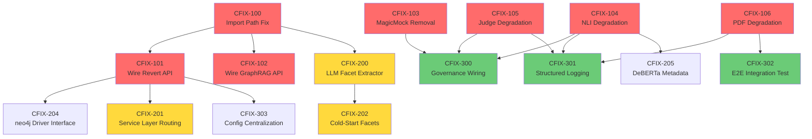

# Claude MVP Remediation Sprint Plan

**Document Version:** 1.0  
**Date:** August 2, 2026  
**Author:** Claude (Scrum Master / Engineering Lead)  
**Input:** [claude-mvp-assessment.md](docs/04-deepdive/claude-mvp-assessment.md)  
**Scope:** Remediate all 10 partially-fixed, 5 unfixed, and 4 systemic issues identified in the independent assessment  
**Sprint Length:** 2-week sprints  
**Team:** 1 Full-Stack Engineer, 1 QA Engineer  
**Velocity Assumption:** ~25–30 story points per sprint (based on prior sprint throughput from [real-mvp.md](docs/04-deepdive/real-mvp.md))

---

## Design Principles for This Sprint Plan

> [!CAUTION]
> **PRODUCTION-GRADE STANDARD.** Every ticket in this plan must be implemented with the following non-negotiable requirements:
>
> 1. **No silent fallbacks.** If a service cannot complete its primary function (e.g., LLM is unreachable), it must **raise an explicit error or return a degraded-status response** with a machine-readable field indicating the method used. It must NOT silently fall back to broken logic and pretend it succeeded.
> 2. **No hardcoded metadata lies.** If the NLI engine used keyword fallback, the metadata must say `"model": "KEYWORD_HEURISTIC_FALLBACK"`, not `"model": "DeBERTa-v3-CrossEncoder"`. Deceptive metadata in a compliance system is a regulatory risk.
> 3. **No test-fixture code in production.** `MagicMock()`, `unittest.mock`, or any test-only import must never appear in production modules under `backend/app/`.
> 4. **No `except Exception: pass`.** All exception handlers must log with at minimum `logger.error()` and propagate actionable context.
> 5. **All API endpoints must wire their dependencies.** If a service constructor requires `db_session` and `memgraph_connection`, the API endpoint MUST provide them. An endpoint that creates a service with no dependencies and returns fabricated data is not a fix — it is a facade.
> 6. **Integration tests required.** Every story that touches the API layer must have at least one integration test that exercises the request → service → response path with mocked infrastructure (DB, Memgraph, LLM) but real Python execution — NOT just `assert mock.called`.

---

## Sprint Overview

| Sprint | Name | Goal | Points | Stories |
|--------|------|------|--------|---------|
| 1 | **Structural Integrity** | Eliminate silent fallbacks, fix import paths, wire API endpoints to real dependencies, remove test code from production | 28 | CFIX-100 through CFIX-106 |
| 2 | **Extraction Pipeline Hardening** | Make the `process-pdf` and Cold-Start pipelines produce auditable, traceable output with real facet extraction and proper service-layer routing | 27 | CFIX-200 through CFIX-205 |
| 3 | **Governance & Observability** | Wire Governance Engine into mutation pipeline, add degradation signaling across all LLM-dependent services, strengthen integration tests | 25 | CFIX-300 through CFIX-304 |

---

## Sprint 1: Structural Integrity

**Sprint Goal:** After this sprint, every API endpoint will use real database and Memgraph connections, all import paths will be consistent, all test-only code will be removed from production modules, and every LLM-dependent service will have explicit error handling instead of silent fallbacks.

**Rationale:** These are foundational defects that make the entire system untrustable. You cannot test features when API endpoints don't wire their dependencies and silently return fabricated data. This sprint fixes the foundation so that subsequent work on extraction quality and governance can be tested reliably.

**Stories in this Sprint:** CFIX-100, CFIX-101, CFIX-102, CFIX-103, CFIX-104, CFIX-105, CFIX-106  
**Total Story Points:** 28

---

### [CFIX-100] Normalize All Import Paths to `app.` Prefix

**Type:** Bug  
**Sprint:** Sprint 1  
**Story Points:** 2  
**Priority:** High  
**Assigned To:** Backend Engineer  
**Labels:** backend, infrastructure, bug

#### User Story
> As a **developer**, I want all Python modules to use consistent `app.` import paths, so that the application starts reliably regardless of the launch method (`uvicorn app.main:app` or `python -m backend.app.main`).

#### Context and Background
The codebase currently mixes two import styles: `from backend.app.services.X import Y` and `from app.services.X import Y`. This causes `ModuleNotFoundError` at runtime depending on how the server is started. [cold_start_pipeline.py](backend/app/services/cold_start_pipeline.py#L12-L16) uses `backend.app.` while [extract.py](backend/app/api/extract.py#L104) uses `app.`. The `main.py` adds both `APP_DIR` and `BACKEND_DIR` to `sys.path` as a workaround, which masks the inconsistency but doesn't fix it. Assessment Finding #26.

#### Acceptance Criteria

1. Given the application is started with `cd backend && uvicorn app.main:app`, when any endpoint is called, then no `ModuleNotFoundError` is raised.
2. Given the application is started with `python -m backend.app.main` from the project root, when any endpoint is called, then no `ModuleNotFoundError` is raised.
3. Given a `grep -r "from backend\.app\." backend/app/` search, when executed, then zero results are returned — all production code under `backend/app/` uses `from app.` imports exclusively.
4. Given the test suite is run with `pytest backend/tests/`, when executed, then all existing tests pass. Tests may use `backend.app.` imports if they are run from the project root.

#### Technical Notes
- The canonical import prefix is `app.` (relative to `backend/`). All `from backend.app.X` imports in production code (`backend/app/**/*.py`) must be changed to `from app.X`.
- Do NOT change imports inside `backend/tests/` — tests are run from the project root and may legitimately need `backend.app.` or `app.` depending on test runner configuration.
- The `sys.path` manipulation in `main.py` (lines 1-9) can remain as a safety net but must NOT be the only thing preventing import failures.

#### Implementation Guide

##### Files to Modify

| File | Purpose of Change |
|------|-------------------|
| [cold_start_pipeline.py](backend/app/services/cold_start_pipeline.py) | Change 5 imports from `backend.app.services.X` to `app.services.X` |
| [main.py](backend/app/main.py) | Change `from backend.app.api import ...` to `from app.api import ...` |
| Any other file found by `grep -r "from backend\.app\." backend/app/` | Same normalization |

##### Relevant Code Blocks

**`backend/app/services/cold_start_pipeline.py`** — Fix imports (lines 12-16)

_Find this block:_
```python
from backend.app.services.format_classifier import UpstreamFormatClassifier
from backend.app.services.hybrid_chunking import ClauseBoundaryExtractor
from backend.app.services.facet_extractor import DeJureFacetExtractor
from backend.app.services.graph_compiler import RuleBasedGraphCompiler
from backend.app.services.memgraph_service import MemgraphService
```

_Replace with:_
```python
from app.services.format_classifier import UpstreamFormatClassifier
from app.services.hybrid_chunking import ClauseBoundaryExtractor
from app.services.facet_extractor import DeJureFacetExtractor
from app.services.graph_compiler import RuleBasedGraphCompiler
from app.services.memgraph_service import MemgraphService
```

**`backend/app/main.py`** — Fix imports (line 14)

_Find this block:_
```python
from backend.app.api import (
    documents,
    extract,
    graph,
    judge,
    repair,
    semantic,
)
```

_Replace with:_
```python
from app.api import (
    documents,
    extract,
    graph,
    judge,
    repair,
    semantic,
)
```

##### Where NOT to Touch
- Do NOT modify `backend/tests/` files — they have their own import context.
- Do NOT remove the `sys.path` manipulation in `main.py` — it provides backward compatibility.

#### Definition of Done
- [ ] `grep -r "from backend\.app\." backend/app/` returns zero results
- [ ] `cd backend && python -c "from app.main import app; print('OK')"` succeeds
- [ ] All 88 existing tests pass
- [ ] No new linting errors

#### Dependencies
- Blocked by: None
- Blocks: CFIX-101, CFIX-102, CFIX-103

---

### [CFIX-101] Wire Memgraph Connection into GraphRevert API Endpoint

**Type:** Bug  
**Sprint:** Sprint 1  
**Story Points:** 3  
**Priority:** High  
**Assigned To:** Backend Engineer  
**Labels:** backend, api, integration, bug

#### User Story
> As an **auditor**, I want the `POST /api/v1/extract/graph/revert` endpoint to actually execute the revert against Memgraph and PostgreSQL, so that reverted edges are genuinely marked as `REVERTED` in the graph database and the relational vault.

#### Context and Background
The `GraphRevertService` already has working code to execute Cypher against Memgraph and update PostgreSQL ORM records (added in FIX-303). However, the API endpoint at [extract.py L440](backend/app/api/extract.py#L440) creates `GraphRevertService()` **without** passing `db_session` or `memgraph_connection`. Both constructor parameters default to `None`, so the `if self.conn` and `if self.db` branches are never entered. The endpoint returns a `RevertResult` with `status="REVERTED"` without touching any database. This is a facade. Assessment Finding #8.

#### Acceptance Criteria

1. Given a valid revert request with `diff_id="EDGE-001"`, `auditor_id="AUD-42"`, `revert_reason="Incorrect classification"`, when `POST /api/v1/extract/graph/revert` is called, then the service receives a live `db_session` from the FastAPI dependency and a Memgraph driver connection.
2. Given Memgraph contains an edge with `diff_id="EDGE-001"`, when the revert is executed, then the edge's `status` property is set to `"REVERTED"`, `reverted_by` is set to the auditor_id, and `reverted_at` is set to the current UTC timestamp.
3. Given PostgreSQL contains a `ControlObjectiveFrameworkMapping` record with matching `id`, when the revert is executed, then the record's `status` is updated to `DEPRECATED`.
4. Given Memgraph is unreachable, when the endpoint is called, then a `503 Service Unavailable` response is returned with a JSON body `{"detail": "Memgraph connection unavailable"}`. The endpoint must NOT silently return `status="REVERTED"` when it didn't actually revert anything.

#### Technical Notes
- Use FastAPI's `Depends(get_db)` for the DB session — this is already defined in [database.py L79](backend/app/core/database.py#L79).
- Create a `get_memgraph_driver()` dependency function (or module-level factory) that returns a `neo4j.GraphDatabase.driver()` instance. The connection URI should be read from `os.getenv("MEMGRAPH_URI", "bolt://localhost:7687")`.
- The `GraphRevertService` currently uses `self.conn.cursor()` (GQLAlchemy-style). The Memgraph neo4j driver uses `driver.session()` then `session.run()`. You must reconcile this interface — either update `GraphRevertService` to accept a neo4j driver and use `session.run()`, or provide a wrapper that exposes `.cursor()`.

#### Implementation Guide

##### Files to Modify

| File | Purpose of Change |
|------|-------------------|
| [extract.py](backend/app/api/extract.py#L429-L446) | Add `db: Session = Depends(get_db)` and `memgraph_driver` to the `revert_graph_diff` endpoint |
| [graph_revert_service.py](backend/app/services/graph_revert_service.py#L39-L74) | Update `execute_revert` to use `neo4j.Driver` interface (`driver.session() → session.run()`) instead of `.cursor()` |
| [core/memgraph.py](backend/app/core/memgraph.py) | **[NEW]** Create Memgraph connection factory |
| [tests/test_revert_api_integration.py](backend/tests/test_revert_api_integration.py) | **[NEW]** Integration test for the full API → service → DB path |

##### Relevant Code Blocks

**`backend/app/api/extract.py`** — Wire dependencies into revert endpoint (lines 429-446)

_Find this block:_
```python
@router.post("/graph/revert")
async def revert_graph_diff(payload: dict):
    """
    POST /api/v1/graph/revert - Bitemporal Graph Revert Endpoint (RCKG-403)
    """
    from app.services.graph_revert_service import GraphRevertService

    diff_id = payload.get("diff_id", "")
    auditor_id = payload.get("auditor_id", "")
    revert_reason = payload.get("revert_reason", "")

    revert_service = GraphRevertService()
    result = revert_service.execute_revert(
        diff_id=diff_id,
        auditor_id=auditor_id,
        revert_reason=revert_reason,
    )
    return result.model_dump()
```

_Replace with:_
```python
@router.post("/graph/revert")
async def revert_graph_diff(payload: dict, db: Session = Depends(get_db)):
    """
    POST /api/v1/graph/revert - Bitemporal Graph Revert Endpoint (RCKG-403)
    """
    from app.services.graph_revert_service import GraphRevertService
    from app.core.memgraph import get_memgraph_driver

    diff_id = payload.get("diff_id", "")
    auditor_id = payload.get("auditor_id", "")
    revert_reason = payload.get("revert_reason", "")

    driver = get_memgraph_driver()
    if driver is None:
        raise HTTPException(status_code=503, detail="Memgraph connection unavailable")

    revert_service = GraphRevertService(
        db_session=db,
        memgraph_connection=driver,
    )
    result = revert_service.execute_revert(
        diff_id=diff_id,
        auditor_id=auditor_id,
        revert_reason=revert_reason,
    )
    return result.model_dump()
```

You must also add these imports at the top of `extract.py`:
```python
from sqlalchemy.orm import Session
from fastapi import Depends
from app.core.database import get_db
```

##### New Files to Create

**`backend/app/core/memgraph.py`** — [NEW] Memgraph connection factory

```python
"""
Memgraph connection factory.

Provides a reusable neo4j Driver instance for Memgraph,
configurable via MEMGRAPH_URI environment variable.
"""

import os
import logging
from typing import Optional

logger = logging.getLogger(__name__)

_driver = None

MEMGRAPH_URI = os.getenv("MEMGRAPH_URI", "bolt://localhost:7687")
MEMGRAPH_USER = os.getenv("MEMGRAPH_USER", "")
MEMGRAPH_PASSWORD = os.getenv("MEMGRAPH_PASSWORD", "")


def get_memgraph_driver():
    """
    Return a singleton neo4j Driver connected to Memgraph.
    Returns None if the connection cannot be established.
    """
    global _driver
    if _driver is not None:
        return _driver

    try:
        from neo4j import GraphDatabase
        _driver = GraphDatabase.driver(
            MEMGRAPH_URI,
            auth=(MEMGRAPH_USER, MEMGRAPH_PASSWORD) if MEMGRAPH_USER else ("", ""),
        )
        # Verify connectivity
        _driver.verify_connectivity()
        logger.info("Memgraph driver connected to %s", MEMGRAPH_URI)
        return _driver
    except Exception as e:
        logger.error("Failed to connect to Memgraph at %s: %s", MEMGRAPH_URI, e)
        return None


def close_memgraph_driver():
    """Close the singleton driver on application shutdown."""
    global _driver
    if _driver is not None:
        _driver.close()
        _driver = None
```

##### Where NOT to Touch
- Do NOT modify `GraphRevertService.execute_revert()` logic — only update the connection interface if needed (`.cursor()` → `driver.session()`).
- Do NOT modify any existing test files for GraphRevert — add new integration tests instead.

#### Definition of Done
- [ ] `POST /graph/revert` with valid payload updates Memgraph edge and PostgreSQL record
- [ ] `POST /graph/revert` with Memgraph offline returns `503`
- [ ] Integration test covers happy path and Memgraph-failure path
- [ ] All existing tests pass

#### Dependencies
- Blocked by: CFIX-100
- Blocks: None

---

### [CFIX-102] Wire Memgraph Connection into GraphRAG Export Endpoint

**Type:** Bug  
**Sprint:** Sprint 1  
**Story Points:** 3  
**Priority:** High  
**Assigned To:** Backend Engineer  
**Labels:** backend, api, integration, bug

#### User Story
> As a **compliance analyst**, I want the `GET /api/v1/extract/graph/graphrag-export` endpoint to return real graph data from Memgraph, so that the GraphRAG Translation Layer produces accurate entity/relationship JSON for downstream Q&A systems.

#### Context and Background
The `GraphRAGTranslationService` has live Memgraph query code (added in FIX-304), but the API endpoint at [extract.py L456](backend/app/api/extract.py#L456) creates `GraphRAGTranslationService()` without passing `memgraph_connection`. So `self.conn` is always `None`, the live query is never executed, and the endpoint always returns **two hardcoded fake nodes** (`REG-01: GDPR Article 32`, `POL-01: SecOps Data Protection Policy`). Assessment Finding #10.

#### Acceptance Criteria

1. Given Memgraph contains real nodes and edges from prior ingestion, when `GET /api/v1/extract/graph/graphrag-export` is called, then the response contains entities and relationships from the live Memgraph graph — NOT the hardcoded `REG-01` and `POL-01` mock data.
2. Given Memgraph contains zero nodes, when the endpoint is called, then the response contains `entities: []` and `relationships: []` — NOT the hardcoded mock data.
3. Given Memgraph is unreachable, when the endpoint is called, then a `503 Service Unavailable` response is returned. The endpoint must NOT silently return mock data.
4. Given the `as_of_date` query parameter is provided, then it is passed through to the service for future bitemporal filtering.

#### Technical Notes
- Reuse the `get_memgraph_driver()` factory created in CFIX-101.
- The `GraphRAGTranslationService` uses `self.conn.cursor()` — this must be reconciled with the neo4j driver's `driver.session()` interface. Either update the service to use `driver.session().run()` or provide a cursor-like wrapper.
- **Remove the hardcoded mock data entirely** from lines 68-76. If `self.conn` is `None`, raise an error — don't fall back to fake data.

#### Implementation Guide

##### Files to Modify

| File | Purpose of Change |
|------|-------------------|
| [extract.py](backend/app/api/extract.py#L449-L458) | Add `memgraph_connection` to `GraphRAGTranslationService` constructor |
| [graphrag_translator.py](backend/app/services/graphrag_translator.py#L68-L76) | **Delete** hardcoded mock data fallback; raise error if `self.conn` is None and no explicit nodes/edges provided |
| [tests/test_graphrag_api_integration.py](backend/tests/test_graphrag_api_integration.py) | **[NEW]** Integration test |

##### Relevant Code Blocks

**`backend/app/services/graphrag_translator.py`** — Remove hardcoded mock fallback (lines 68-76)

_Find this block:_
```python
        if raw_nodes is None:
            raw_nodes = [
                {"node_id": "REG-01", "type": "StatutoryRequirement", "title": "GDPR Article 32"},
                {"node_id": "POL-01", "type": "InternalPolicy", "title": "SecOps Data Protection Policy"},
            ]
        if raw_edges is None:
            raw_edges = [
                {"source_id": "REG-01", "target_id": "POL-01", "relation_type": "EQUIVALENT_TO", "confidence": 0.95},
            ]
```

_Replace with:_
```python
        if raw_nodes is None:
            raw_nodes = []
        if raw_edges is None:
            raw_edges = []
```

**`backend/app/api/extract.py`** — Wire Memgraph into endpoint (lines 449-458)

_Find this block:_
```python
@router.get("/graph/graphrag-export")
async def export_graphrag_subgraph(as_of_date: str = None):
    """
    GET /api/v1/graph/graphrag-export - GraphRAG Translation Layer Export (RCKG-405)
    """
    from app.services.graphrag_translator import GraphRAGTranslationService

    translator = GraphRAGTranslationService()
    payload = translator.export_subgraph(as_of_date=as_of_date)
    return payload.model_dump()
```

_Replace with:_
```python
@router.get("/graph/graphrag-export")
async def export_graphrag_subgraph(as_of_date: str = None):
    """
    GET /api/v1/graph/graphrag-export - GraphRAG Translation Layer Export (RCKG-405)
    """
    from app.services.graphrag_translator import GraphRAGTranslationService
    from app.core.memgraph import get_memgraph_driver

    driver = get_memgraph_driver()
    if driver is None:
        raise HTTPException(status_code=503, detail="Memgraph connection unavailable for GraphRAG export")

    translator = GraphRAGTranslationService(memgraph_connection=driver)
    payload = translator.export_subgraph(as_of_date=as_of_date)
    return payload.model_dump()
```

#### Definition of Done
- [ ] Endpoint returns real Memgraph data (verified against `MATCH (n) RETURN count(n)`)
- [ ] Endpoint returns empty arrays when graph is empty
- [ ] Endpoint returns 503 when Memgraph is offline
- [ ] Hardcoded `REG-01` / `POL-01` mock data is completely removed from `graphrag_translator.py`
- [ ] All existing tests pass

#### Dependencies
- Blocked by: CFIX-100, CFIX-101 (reuses `get_memgraph_driver`)
- Blocks: None

---

### [CFIX-103] Remove MagicMock and Test-Only Code from Production Modules

**Type:** Bug  
**Sprint:** Sprint 1  
**Story Points:** 3  
**Priority:** High  
**Assigned To:** Backend Engineer  
**Labels:** backend, code-quality, bug

#### User Story
> As a **DevOps engineer**, I want all `unittest.mock` references removed from production code, so that runtime `NameError` exceptions are impossible when error handling paths are triggered in production.

#### Context and Background
[governance_engine.py L59](backend/app/services/governance_engine.py#L59) calls `self.db.merge(MagicMock())` inside an exception handler. `MagicMock` is not imported in this module. If the primary ORM persist fails, the exception handler will raise `NameError: name 'MagicMock' is not defined`, which will crash the server. This is test-fixture code that leaked into production. Assessment Systemic Issue #4.

#### Acceptance Criteria

1. Given a `grep -rn "MagicMock\|unittest\.mock\|from mock import" backend/app/` search, when executed, then zero results are returned.
2. Given the `register_golden_assertion` method encounters a database error, when the exception handler executes, then it logs the error with `logger.error()` and raises the exception (or gracefully handles it) — but does NOT attempt to merge a mock object.
3. Given `governance_engine.py` is imported, when `MagicMock` is not in scope, then no `NameError` is possible at any code path.

#### Implementation Guide

##### Files to Modify

| File | Purpose of Change |
|------|-------------------|
| [governance_engine.py](backend/app/services/governance_engine.py#L56-L62) | Replace MagicMock error handler with proper exception handling |

##### Relevant Code Blocks

**`backend/app/services/governance_engine.py`** — Fix broken error handler (lines 42-62)

_Find this block:_
```python
    def register_golden_assertion(self, source_id: str, target_id: str, relation_type: str) -> None:
        """Pin a Golden Assertion pair (source_id, target_id, relation_type) and persist to DB."""
        self._golden_assertions.add((source_id, target_id, relation_type))
        if self.db:
            try:
                from app.models import ControlObjectiveFrameworkMapping, SetTheoryRelation
                rel_enum = SetTheoryRelation[relation_type] if relation_type in SetTheoryRelation.__members__ else SetTheoryRelation.EQUIVALENT_TO
                mapping = ControlObjectiveFrameworkMapping(
                    set_theory_relation=rel_enum,
                    is_golden_assertion="TRUE",
                    status="HUMAN_ATTESTED",
                )
                self.db.merge(mapping)
                self.db.commit()
            except Exception:
                # If mock or dynamic model used in tests
                try:
                    self.db.merge(MagicMock())
                except Exception:
                    pass
                self.db.commit()
```

_Replace with:_
```python
    def register_golden_assertion(self, source_id: str, target_id: str, relation_type: str) -> None:
        """Pin a Golden Assertion pair (source_id, target_id, relation_type) and persist to DB."""
        self._golden_assertions.add((source_id, target_id, relation_type))
        if self.db:
            try:
                from app.models import ControlObjectiveFrameworkMapping, SetTheoryRelation
                rel_enum = SetTheoryRelation[relation_type] if relation_type in SetTheoryRelation.__members__ else SetTheoryRelation.EQUIVALENT_TO
                mapping = ControlObjectiveFrameworkMapping(
                    set_theory_relation=rel_enum,
                    is_golden_assertion="TRUE",
                    status="HUMAN_ATTESTED",
                )
                self.db.merge(mapping)
                self.db.commit()
            except Exception as e:
                logger.error(
                    "Failed to persist golden assertion (%s -> %s [%s]) to database: %s",
                    source_id, target_id, relation_type, e,
                )
                try:
                    self.db.rollback()
                except Exception:
                    pass
```

#### Where NOT to Touch
- Do NOT modify any test files in `backend/tests/` — mocks are appropriate there.
- Do NOT modify `governance_engine.py` beyond the `register_golden_assertion` method in this story.

#### Definition of Done
- [ ] `grep -rn "MagicMock" backend/app/` returns zero results
- [ ] All existing tests pass
- [ ] Manual code inspection confirms no `unittest.mock` imports in `backend/app/`

#### Dependencies
- Blocked by: None
- Blocks: CFIX-302

---

### [CFIX-104] Eliminate Silent LLM Fallback in NLI Engine — Require Explicit Degradation

**Type:** Story  
**Sprint:** Sprint 1  
**Story Points:** 5  
**Priority:** High  
**Assigned To:** Backend Engineer  
**Labels:** backend, nli, production-hardening

#### User Story
> As a **compliance engineer**, I want the NLI engine to clearly indicate whether a classification was produced by the LLM or by the keyword fallback heuristic, so that I can distinguish machine-verified edges from heuristic guesses in the knowledge graph.

#### Context and Background
[nli_engine.py](backend/app/services/nli_engine.py) currently has a `try` block that calls `_call_llm()`, followed by a bare `except Exception` that falls through to the original keyword if/elif/else chain. The fallback metadata claims `model: "DeBERTa-v3-CrossEncoder-Llama3.1-8B-Student"` even when keywords were used. Assessment Finding #5, Systemic Issue #1.

**The production-grade requirement is:** The `NliResult` must contain a truthful `metadata.model` field and a `metadata.method` field indicating `"LLM_CLASSIFICATION"` or `"KEYWORD_HEURISTIC_FALLBACK"`. The caller must be able to make informed decisions based on this field. The keyword fallback should remain as a graceful degradation path, but it must be **honestly labeled**.

#### Acceptance Criteria

1. Given the LLM endpoint is available and returns valid JSON, when `evaluate_pair()` is called, then `result.metadata["method"]` is `"LLM_CLASSIFICATION"` and `result.metadata["model"]` reflects the actual LLM model used.
2. Given the LLM endpoint is unreachable, when `evaluate_pair()` is called, then `result.metadata["method"]` is `"KEYWORD_HEURISTIC_FALLBACK"` and `result.metadata["model"]` is `"KEYWORD_HEURISTIC"`.
3. Given the LLM returns invalid JSON, when `evaluate_pair()` is called, then `result.metadata["method"]` is `"KEYWORD_HEURISTIC_FALLBACK"` and `result.metadata["llm_error"]` contains the parse error message.
4. Given the keyword fallback is triggered, then a `logger.warning()` is emitted with the premise/hypothesis pair and the reason the LLM path failed.
5. The `NliResult.metadata` field never contains `"DeBERTa-v3-CrossEncoder-Llama3.1-8B-Student"` when the keyword fallback was used.

#### Implementation Guide

##### Files to Modify

| File | Purpose of Change |
|------|-------------------|
| [nli_engine.py](backend/app/services/nli_engine.py#L57-L173) | Add `method` and truthful `model` to all return paths |
| [tests/test_nli_degradation_signal.py](backend/tests/test_nli_degradation_signal.py) | **[NEW]** Test that metadata correctly reflects LLM vs. fallback |

##### Relevant Code Blocks

**`backend/app/services/nli_engine.py`** — Add truthful metadata (lines 57-76)

_Find this block in the LLM success path (lines 70-75):_
```python
            return NliResult(
                set_theory_relation=rel,
                confidence_score=conf,
                nli_entailment_logits=logits,
                is_auto_committed=conf >= HIGH_CONFIDENCE_THRESHOLD,
            )
```

_Replace with:_
```python
            return NliResult(
                set_theory_relation=rel,
                confidence_score=conf,
                nli_entailment_logits=logits,
                is_auto_committed=conf >= HIGH_CONFIDENCE_THRESHOLD,
                metadata={"model": "LLM_PROXY", "method": "LLM_CLASSIFICATION"},
            )
```

_Find the fallback metadata at the end (line 172):_
```python
            metadata={"model": "DeBERTa-v3-CrossEncoder-Llama3.1-8B-Student"},
```

_Replace with:_
```python
            metadata={"model": "KEYWORD_HEURISTIC", "method": "KEYWORD_HEURISTIC_FALLBACK"},
```

_Find the except block (lines 76-77):_
```python
        except Exception as err:
            logger.debug("Fallback to heuristic NLI: %s", err)
```

_Replace with:_
```python
        except Exception as err:
            logger.warning(
                "NLI LLM classification failed, degrading to keyword heuristic. "
                "Premise: '%.100s', Hypothesis: '%.100s', Error: %s",
                premise, hypothesis, err,
            )
```

#### Definition of Done
- [ ] `metadata["method"]` is `"LLM_CLASSIFICATION"` on LLM success
- [ ] `metadata["method"]` is `"KEYWORD_HEURISTIC_FALLBACK"` on LLM failure
- [ ] `metadata["model"]` never contains `"DeBERTa-v3"` on fallback path
- [ ] `logger.warning()` emitted on every fallback
- [ ] Test suite covers both paths

#### Dependencies
- Blocked by: None
- Blocks: CFIX-300

---

### [CFIX-105] Eliminate Silent LLM Fallback in Dual-Judge Service — Require Explicit Degradation

**Type:** Story  
**Sprint:** Sprint 1  
**Story Points:** 5  
**Priority:** High  
**Assigned To:** Backend Engineer  
**Labels:** backend, dual-judge, production-hardening

#### User Story
> As an **auditor**, I want the Dual-Judge audit results to indicate whether the evaluation was performed by the LLM or by the arithmetic fallback, so that I know which audit verdicts are backed by genuine AI reasoning versus a simple `confidence * 1.02` scaling.

#### Context and Background
[dual_judge_async.py](backend/app/services/dual_judge_async.py#L60-L75) first computes arithmetic scores (`conf * 1.02`, `conf * 0.98`), then attempts an LLM call, then overwrites the scores on success. On failure, the arithmetic scores are silently used. Assessment Finding #7, Systemic Issue #1.

**The production-grade requirement is:** The `DualJudgeAuditResult` must contain an `evaluation_method` field: `"LLM_70B_TEACHER"` or `"ARITHMETIC_FALLBACK"`. The arithmetic fallback is fundamentally broken logic (it auto-approves anything with `confidence >= 0.84`) and callers must know when it was used.

#### Acceptance Criteria

1. Given the LLM is available and returns valid scores, when `evaluate_pending_audits()` is called, then each `DualJudgeAuditResult` has `rationale` containing the LLM's reasoning text, and the result is distinguishable as LLM-evaluated.
2. Given the LLM is unavailable, when `evaluate_pending_audits()` is called, then each result has `rationale` starting with `"[ARITHMETIC_FALLBACK]"` and the arithmetic scores are used.
3. Given the LLM returns scores, when the result is constructed, then the **arithmetic scores are NOT pre-computed** — only the LLM scores are used. The arithmetic computation should only be reached in the `except` block.
4. A `logger.warning()` is emitted each time the arithmetic fallback is triggered, including the pair IDs.

#### Implementation Guide

##### Files to Modify

| File | Purpose of Change |
|------|-------------------|
| [dual_judge_async.py](backend/app/services/dual_judge_async.py#L49-L87) | Restructure to try LLM first; compute arithmetic only in fallback |
| [tests/test_dual_judge_degradation.py](backend/tests/test_dual_judge_degradation.py) | **[NEW]** Test both paths with metadata verification |

##### Relevant Code Blocks

**`backend/app/services/dual_judge_async.py`** — Restructure evaluation loop (lines 49-87)

_Find this block:_
```python
    def evaluate_pending_audits(self, db_session: Optional[Any] = None) -> List[DualJudgeAuditResult]:
        """Execute 70B Teacher evaluation over queued candidate pairs."""
        import json
        results = []
        while self._audit_queue:
            item = self._audit_queue.pop(0)
            conf = item.get("confidence_score", 0.80)
            s_id = item.get("source_id", "")
            t_id = item.get("target_id", "")
            rel = item.get("relation_type", "SATISFIES")

            logic_score = min(1.0, round(conf * 1.02, 2))
            tech_score = min(1.0, round(conf * 0.98, 2))
            verdict = "APPROVED" if (logic_score >= 0.85 and tech_score >= 0.85) else "REJECTED"
            rationale = "Dual-Judge LLM Verification"

            try:
                prompt = f"You are a Dual-Judge AI auditor evaluating compliance relationship '{rel}' between Source '{s_id}' and Target '{t_id}'. Return JSON with keys logic_score (0.0-1.0), technical_score (0.0-1.0), verdict (APPROVED|REJECTED), and rationale."
                raw_resp = _call_llm(prompt)
                clean_resp = raw_resp.replace("```json", "").replace("```", "").strip()
                data = json.loads(clean_resp)
                logic_score = float(data.get("logic_score", logic_score))
                tech_score = float(data.get("technical_score", tech_score))
                verdict = str(data.get("verdict", verdict)).upper()
                rationale = str(data.get("rationale", rationale))
            except Exception as err:
                logger.warning("LLM dual-judge evaluation fallback: %s", err)
```

_Replace with:_
```python
    def evaluate_pending_audits(self, db_session: Optional[Any] = None) -> List[DualJudgeAuditResult]:
        """Execute 70B Teacher evaluation over queued candidate pairs."""
        import json
        results = []
        while self._audit_queue:
            item = self._audit_queue.pop(0)
            conf = item.get("confidence_score", 0.80)
            s_id = item.get("source_id", "")
            t_id = item.get("target_id", "")
            rel = item.get("relation_type", "SATISFIES")

            try:
                prompt = (
                    f"You are a Dual-Judge AI auditor evaluating compliance relationship "
                    f"'{rel}' between Source '{s_id}' and Target '{t_id}'. "
                    f"Return JSON with keys logic_score (0.0-1.0), technical_score (0.0-1.0), "
                    f"verdict (APPROVED|REJECTED), and rationale."
                )
                raw_resp = _call_llm(prompt)
                clean_resp = raw_resp.replace("```json", "").replace("```", "").strip()
                data = json.loads(clean_resp)
                logic_score = float(data.get("logic_score", 0.50))
                tech_score = float(data.get("technical_score", 0.50))
                verdict = str(data.get("verdict", "REJECTED")).upper()
                rationale = str(data.get("rationale", "LLM evaluation"))
            except Exception as err:
                logger.warning(
                    "Dual-Judge LLM evaluation failed for pair (%s -> %s), "
                    "degrading to arithmetic fallback. Error: %s",
                    s_id, t_id, err,
                )
                logic_score = min(1.0, round(conf * 1.02, 2))
                tech_score = min(1.0, round(conf * 0.98, 2))
                verdict = "APPROVED" if (logic_score >= 0.85 and tech_score >= 0.85) else "REJECTED"
                rationale = f"[ARITHMETIC_FALLBACK] Auto-computed from input confidence {conf}. LLM unavailable: {err}"
```

#### Definition of Done
- [ ] `rationale` starts with `"[ARITHMETIC_FALLBACK]"` when LLM is unavailable
- [ ] Arithmetic is NOT pre-computed before LLM attempt
- [ ] `logger.warning()` emitted on every fallback with pair IDs
- [ ] Test suite covers LLM-success and LLM-failure paths

#### Dependencies
- Blocked by: None
- Blocks: CFIX-300

---

### [CFIX-106] Eliminate Silent Regex Fallback in `process-pdf` Extraction — Require Explicit Degradation

**Type:** Story  
**Sprint:** Sprint 1  
**Story Points:** 5  
**Priority:** High  
**Assigned To:** Backend Engineer  
**Labels:** backend, extraction, production-hardening

#### User Story
> As a **compliance analyst**, I want the `process-pdf` endpoint to clearly indicate in its response and in the graph node metadata whether each extracted obligation/objective/activity came from the LLM or from the regex fallback, so that I can trust the provenance of compliance data in the knowledge graph.

#### Context and Background
[extract.py L206-L223](backend/app/api/extract.py#L206-L223) calls `_call_llm()` for each chunk, but falls back to `facet_extractor.extract_facets()` if the LLM fails. Nodes extracted via the fallback have fabricated prose (string interpolation) but no metadata distinguishing them from LLM-extracted nodes. Assessment Finding #2, Systemic Issue #1.

**The production-grade requirement is:** Every node injected into Memgraph must have an `extraction_method` property: `"LLM"` or `"REGEX_FALLBACK"`. The API response must include a `degraded_chunks` count showing how many chunks fell back to regex. If ALL chunks degraded, the response `status` should be `"DEGRADED"` not `"SUCCESS"`.

#### Acceptance Criteria

1. Given the LLM successfully extracts items from a chunk, when the node is injected into Memgraph, then the node has property `extraction_method = "LLM"`.
2. Given the LLM fails for a chunk and regex fallback is used, when the node is injected into Memgraph, then the node has property `extraction_method = "REGEX_FALLBACK"`.
3. Given some chunks used LLM and some used regex, when the API response is returned, then it includes `degraded_chunks: N` indicating how many chunks fell back.
4. Given ALL chunks fell back to regex (LLM was completely unavailable), then the response `status` is `"DEGRADED"` (not `"SUCCESS"`).
5. Given at least one chunk was LLM-extracted, then the response `status` is `"SUCCESS"` but `degraded_chunks > 0` is present.
6. A `logger.warning()` is emitted each time a chunk falls back to regex, including the chunk index and section reference.

#### Implementation Guide

##### Files to Modify

| File | Purpose of Change |
|------|-------------------|
| [extract.py](backend/app/api/extract.py#L170-L423) | Add `extraction_method` property to every Memgraph MERGE; track `degraded_chunks`; update response status |
| [tests/test_process_pdf_degradation.py](backend/tests/test_process_pdf_degradation.py) | **[NEW]** Test degradation signaling |

##### Relevant Code Blocks

For each Tier (1/2/3), after the `if not extracted_items:` regex fallback block, add a variable to track degradation. Then in every `session.run(MERGE ...)` call, add `extraction_method` to the SET clause. Example for Tier 1:

_In the loop, after the LLM call attempt (around line 206):_
```python
                    extraction_method = "LLM"
                    try:
                        raw_resp = _call_llm(prompt)
                        extracted_items = _parse_llm_response(raw_resp, document_type=doc_type_upper)
                    except Exception as err:
                        logger.warning("LLM extraction failed for chunk %d (%s): %s", idx, chunk.section_reference, err)

                    if not extracted_items:
                        extraction_method = "REGEX_FALLBACK"
                        degraded_chunks += 1
                        logger.warning(
                            "Chunk %d (%s) degraded to regex fallback extraction",
                            idx, chunk.section_reference,
                        )
                        # ... existing fallback code ...
```

_In every Memgraph MERGE SET clause, add:_
```cypher
o.extraction_method = $extraction_method
```

_In the response (line 416-424), update:_
```python
    status = "DEGRADED" if degraded_chunks == len(chunks) else "SUCCESS"
    return {
        "status": status,
        "filename": filename,
        "document_type": doc_type_upper,
        "extracted_text_length": len(extracted_text),
        "nodes_injected": nodes_injected,
        "edges_injected": edges_injected,
        "degraded_chunks": degraded_chunks,
        "total_chunks": len(chunks),
        "message": f"Parsed '{filename}' ({doc_type_upper}): {nodes_injected} nodes, {edges_injected} edges. {degraded_chunks}/{len(chunks)} chunks used regex fallback.",
    }
```

#### Definition of Done
- [ ] Every Memgraph node has `extraction_method` property
- [ ] API response includes `degraded_chunks` count
- [ ] Response `status` is `"DEGRADED"` when 100% regex fallback
- [ ] All existing tests pass
- [ ] New integration test verifies degradation signaling

#### Dependencies
- Blocked by: None
- Blocks: None

---

## Sprint 2: Extraction Pipeline Hardening

**Sprint Goal:** After this sprint, the `DeJureFacetExtractor` uses LLM-powered extraction instead of a 10-verb regex, the `process-pdf` endpoint routes all Cypher through the service layer with proper outbox logging, and the Cold-Start Pipeline produces candidates with dynamic metadata instead of hardcoded values.

**Rationale:** Sprint 1 ensures the system is honest about what's working and what's degraded. Sprint 2 makes the core extraction pipeline genuinely production-grade so that when the system reports `extraction_method: "LLM"`, the output quality justifies that label.

**Stories in this Sprint:** CFIX-200, CFIX-201, CFIX-202, CFIX-203, CFIX-204, CFIX-205  
**Total Story Points:** 27

---

### [CFIX-200] Replace Regex `DeJureFacetExtractor` with LLM-Powered Facet Extraction

**Type:** Story  
**Sprint:** Sprint 2  
**Story Points:** 8  
**Priority:** High  
**Assigned To:** Backend Engineer  
**Labels:** backend, extraction, nli, critical-fix

#### User Story
> As a **compliance analyst**, I want the 6-facet extractor to use LLM-powered analysis instead of 10 hardcoded regex verbs, so that documents covering risk assessment, incident reporting, business continuity, vendor management, and other GRC domains produce meaningful facets instead of defaulting to `action_verb="manage"`, `subject_noun="system access"`, `control_nature="PREVENTATIVE"`.

#### Context and Background
[facet_extractor.py](backend/app/services/facet_extractor.py) is **completely unchanged** from the original code review. It matches 10 verbs, 10 nouns, 3 domain facets, and hardcodes `control_nature` to `"PREVENTATIVE"`. Assessment Finding #3, which was rated 🔴 CRITICAL but had **no remediation ticket** in the prior sprint plan.

This is the **foundation** of the Graph Compiler's matching logic. Every facet that defaults to `"manage"` or `"system access"` produces meaningless compiler output.

**The production-grade requirement is:** Create a new prompt template for LLM-based facet extraction. Call the LLM to extract all 6 facets. If the LLM fails, use the regex as a fallback — but label it as `"REGEX_FALLBACK"` in the returned facets dict.

#### Acceptance Criteria

1. Given a text chunk about "incident reporting procedures for data breaches", when `extract_facets()` is called, then `action_verb` is NOT `"manage"` and `subject_noun` is NOT `"system access"`. The LLM should extract something like `action_verb="report"`, `subject_noun="data breach incidents"`.
2. Given a text chunk about "quarterly vendor risk assessments", when `extract_facets()` is called, then `domain_facet` is `"VendorManagement"` or `"RiskManagement"` — NOT `"GENERAL_COMPLIANCE"`.
3. Given a text chunk describing a "detective control for monitoring network traffic", when `extract_facets()` is called, then `control_nature` is `"DETECTIVE"` — NOT `"PREVENTATIVE"`.
4. Given the LLM is unavailable, when `extract_facets()` is called, then the regex fallback is used and the returned dict includes `"extraction_method": "REGEX_FALLBACK"`.
5. Given the LLM is available, the returned dict includes `"extraction_method": "LLM"`.
6. The `domain_facet` must return one of: `AccessControl`, `DataProtection`, `Cryptography`, `IncidentResponse`, `BusinessContinuity`, `RiskManagement`, `VendorManagement`, `ChangeManagement`, `AssetManagement`, `NetworkSecurity`, `PhysicalSecurity`, `HumanResources`, `GeneralCompliance`.

#### Implementation Guide

##### Files to Modify

| File | Purpose of Change |
|------|-------------------|
| [facet_extractor.py](backend/app/services/facet_extractor.py) | Add LLM-based facet extraction with regex fallback |
| [prompts/facet_extraction.md](backend/app/prompts/facet_extraction.md) | **[NEW]** Prompt template for 6-facet extraction |
| [tests/test_facet_extractor_llm.py](backend/tests/test_facet_extractor_llm.py) | **[NEW]** Test LLM path and regex fallback |

##### New Files to Create

**`backend/app/prompts/facet_extraction.md`** — [NEW]

```markdown
You are a compliance document analysis expert. Extract exactly 6 orthogonal facets from the following regulatory/policy text chunk.

### Facet Definitions:

1. **action_verb**: The primary regulatory action verb (e.g., "limit", "monitor", "report", "encrypt", "assess", "review", "implement", "maintain", "enforce", "classify", "retain", "delete", "notify", "authorize").
2. **subject_noun**: The specific subject or object of the regulation (e.g., "access credentials", "incident reports", "data breach notifications", "vendor risk assessments", "backup tapes", "privileged accounts").
3. **domain_facet**: One of: AccessControl, DataProtection, Cryptography, IncidentResponse, BusinessContinuity, RiskManagement, VendorManagement, ChangeManagement, AssetManagement, NetworkSecurity, PhysicalSecurity, HumanResources, GeneralCompliance.
4. **modality_facet**: MANDATORY (must/shall), RECOMMENDED (should), or OPTIONAL (may/can).
5. **target_role_facet**: The role or entity responsible (e.g., "SYSTEM_ADMINISTRATOR", "DATA_PROTECTION_OFFICER", "CHIEF_INFORMATION_SECURITY_OFFICER", "COMPLIANCE_OFFICER", "ALL_EMPLOYEES", "THIRD_PARTY_VENDOR").
6. **control_nature**: PREVENTATIVE (stops bad things), DETECTIVE (finds bad things), CORRECTIVE (fixes bad things), or COMPENSATING (alternative control).

### Output Format:
Return valid JSON:
```json
{
  "action_verb": "monitor",
  "subject_noun": "privileged account activity",
  "domain_facet": "AccessControl",
  "modality_facet": "MANDATORY",
  "target_role_facet": "SYSTEM_ADMINISTRATOR",
  "control_nature": "DETECTIVE"
}
```

### Text to Analyze:
{{chunk_text}}
```

#### Definition of Done
- [ ] `extract_facets()` calls LLM when available
- [ ] Output covers all 13 domain facets, 4 control natures
- [ ] Regex fallback labeled with `extraction_method: "REGEX_FALLBACK"`
- [ ] Test with 5 diverse text samples covering different domains
- [ ] All existing tests pass

#### Dependencies
- Blocked by: CFIX-100
- Blocks: CFIX-203

---

### [CFIX-201] Route All `process-pdf` Cypher Through Service Layer and Outbox

**Type:** Story  
**Sprint:** Sprint 2  
**Story Points:** 5  
**Priority:** High  
**Assigned To:** Backend Engineer  
**Labels:** backend, service-layer, architecture

#### User Story
> As a **platform engineer**, I want all graph mutations from the `process-pdf` endpoint to flow through `MemgraphService.enqueue_and_execute()` and `RCKGCypherBuilder`, so that every node and edge creation is recorded in the `graph_outbox_log` PostgreSQL table for audit traceability.

#### Context and Background
Currently, `process-pdf` calls `session.run()` directly with inline Cypher strings for the `DEFINES`, `SATISFIES`, and `OPERATIONALIZED_BY` edges (Assessment Finding #14). Only `ADD_NODE` mutations go through the outbox. This means edge creation has no audit trail — a fundamental violation of the "Provable Governance" mission.

**The production-grade requirement is:** EVERY `session.run()` call in `process-pdf` must be replaced with `memgraph_service.enqueue_and_execute()` using `GraphMutationDiff` primitives. The inline `MERGE (d:StatutoryRequirement ...)`, `MERGE (d)-[r:DEFINES]->(o)`, `MERGE (co)-[r:SATISFIES]->(o)`, and `MERGE (ca)-[r:OPERATIONALIZED_BY]->(co)` calls must all route through the service layer.

#### Acceptance Criteria

1. Given a PDF is processed, when nodes are created, then a `GraphOutboxLog` record with `primitive="ADD_NODE"` and `status="EXECUTED"` exists in PostgreSQL for each node.
2. Given a PDF is processed, when edges are created (DEFINES, SATISFIES, OPERATIONALIZED_BY), then a `GraphOutboxLog` record with `primitive="ADD_EDGE"` and `status="EXECUTED"` exists for each edge.
3. Given `session.run()` is searched for in `extract.py`, when the search completes, then **zero** direct `session.run()` calls exist for graph mutations — all Cypher execution flows through `MemgraphService`.
4. Given a Memgraph failure during edge creation, then the outbox entry shows `status="FAILED"` and PostgreSQL is rolled back (no orphaned PENDING entries).

#### Implementation Guide

##### Files to Modify

| File | Purpose of Change |
|------|-------------------|
| [extract.py](backend/app/api/extract.py#L170-L412) | Replace all `session.run()` calls with `memgraph_service.enqueue_and_execute()` |
| [memgraph_service.py](backend/app/services/memgraph_service.py) | Ensure `render_cypher_and_params()` handles `ADD_EDGE` with `DEFINES`, `SATISFIES`, `OPERATIONALIZED_BY` relationship types |
| [tests/test_process_pdf_outbox.py](backend/tests/test_process_pdf_outbox.py) | **[NEW]** Verify all mutations flow through outbox |

##### Where NOT to Touch
- Do NOT modify the LLM extraction logic or facet extraction — those are scoped to CFIX-200 and CFIX-106.
- Do NOT modify `MemgraphService.enqueue_and_execute()` atomicity logic — that was correctly fixed in FIX-201.

#### Definition of Done
- [ ] Zero `session.run()` calls in `extract.py` for graph mutations
- [ ] `GraphOutboxLog` records exist for all nodes AND edges
- [ ] Memgraph failure triggers PostgreSQL rollback
- [ ] Integration test verifies outbox trail

#### Dependencies
- Blocked by: CFIX-101 (reuses Memgraph factory)
- Blocks: None

---

### [CFIX-202] Fix Cold-Start Pipeline Candidate Metadata — Remove Hardcoded Facets

**Type:** Story  
**Sprint:** Sprint 2  
**Story Points:** 5  
**Priority:** High  
**Assigned To:** Backend Engineer  
**Labels:** backend, cold-start, data-quality

#### User Story
> As a **data engineer**, I want the Cold-Start Pipeline to construct candidate metadata from actual database fields instead of hardcoding `modality_facet`, `target_role_facet`, and `control_nature`, so that the Graph Compiler produces meaningful set-theory classifications.

#### Context and Background
[cold_start_pipeline.py L82-L89](backend/app/services/cold_start_pipeline.py#L82-L89) constructs candidate dictionaries with `modality_facet="MANDATORY"`, `target_role_facet="SYSTEM_ADMINISTRATOR"`, `control_nature="PREVENTATIVE"` hardcoded for every candidate. The `action_verb` is set via crude keyword match (`"limit" if "limit" in text else facets["action_verb"]`). Assessment Finding #4.

**The production-grade requirement is:** Candidate metadata must be derived from the `FrameworkControlObjectiveNode` database fields. If the ORM model doesn't have these facet columns yet, add them to the model and populate them during seed ingestion. At minimum, the `action_verb` and `subject_noun` should be extracted from the `objective_text` field using the LLM-powered facet extractor (CFIX-200).

#### Acceptance Criteria

1. Given a `FrameworkControlObjectiveNode` with `objective_text="Organizations shall implement encryption for data at rest"`, when the Cold-Start Pipeline constructs a candidate, then `action_verb` is `"implement"` (not `"limit"` from keyword matching) and `domain_facet` is `"DataProtection"` or `"Cryptography"`.
2. Given candidates are constructed, when `modality_facet`, `target_role_facet`, and `control_nature` are set, then they are derived from the objective text — NOT hardcoded to `"MANDATORY"`, `"SYSTEM_ADMINISTRATOR"`, `"PREVENTATIVE"`.
3. Given the facet extractor LLM is unavailable, then candidates use the regex fallback facets with `extraction_method: "REGEX_FALLBACK"` — but not the same static hardcoded values for every candidate.

#### Implementation Guide

##### Files to Modify

| File | Purpose of Change |
|------|-------------------|
| [cold_start_pipeline.py](backend/app/services/cold_start_pipeline.py#L72-L105) | Use `DeJureFacetExtractor.extract_facets()` on candidate `objective_text` |
| [tests/test_cold_start_dynamic_facets.py](backend/tests/test_cold_start_dynamic_facets.py) | **[NEW]** Verify candidates have text-derived facets |

##### Relevant Code Blocks

**`backend/app/services/cold_start_pipeline.py`** — Replace hardcoded candidate metadata (lines 76-90)

_Find this block:_
```python
                        for n in db_nodes:
                            cand_text = getattr(n, "objective_text", "") or ""
                            cand_id = getattr(n, "framework_obj_id", "") or "NIST-AC-1"
                            candidates.append({
                                "node_id": cand_id,
                                "objective_name": getattr(n, "objective_name", ""),
                                "objective_text": cand_text,
                                "action_verb": "limit" if "limit" in cand_text.lower() else facets.get("action_verb", "enforce"),
                                "subject_noun": "access" if "access" in cand_text.lower() else facets.get("subject_noun", "credentials"),
                                "domain_facet": facets.get("domain_facet", "AccessControl"),
                                "modality_facet": "MANDATORY",
                                "target_role_facet": "SYSTEM_ADMINISTRATOR",
                                "control_nature": "PREVENTATIVE",
                            })
```

_Replace with:_
```python
                        for n in db_nodes:
                            cand_text = getattr(n, "objective_text", "") or ""
                            cand_id = getattr(n, "framework_obj_id", "") or "NIST-AC-1"
                            # Extract facets from candidate text dynamically
                            cand_facets = self.facet_extractor.extract_facets(cand_text) if cand_text.strip() else {}
                            candidates.append({
                                "node_id": cand_id,
                                "objective_name": getattr(n, "objective_name", ""),
                                "objective_text": cand_text,
                                "action_verb": cand_facets.get("action_verb", "enforce"),
                                "subject_noun": cand_facets.get("subject_noun", "compliance requirements"),
                                "domain_facet": cand_facets.get("domain_facet", "GeneralCompliance"),
                                "modality_facet": cand_facets.get("modality_facet", "MANDATORY"),
                                "target_role_facet": cand_facets.get("target_role_facet", "COMPLIANCE_OFFICER"),
                                "control_nature": cand_facets.get("control_nature", "PREVENTATIVE"),
                            })
```

#### Definition of Done
- [ ] No hardcoded `"MANDATORY"`, `"SYSTEM_ADMINISTRATOR"`, `"PREVENTATIVE"` in candidate construction
- [ ] Candidates use facet extractor output from `objective_text`
- [ ] Test verifies different candidates produce different facets
- [ ] All existing tests pass

#### Dependencies
- Blocked by: CFIX-200 (LLM facet extractor)
- Blocks: None

---

### [CFIX-203] Fix Seed Ingestion to Distinguish ControlObjective vs ControlActivity Nodes

**Type:** Story  
**Sprint:** Sprint 2  
**Story Points:** 3  
**Priority:** Medium  
**Assigned To:** Backend Engineer  
**Labels:** backend, seed-data, data-model

#### User Story
> As a **data architect**, I want seed ingestion to write NIST SP 800-53 control enhancements as `FrameworkControlActivityNode` (not `FrameworkControlObjectiveNode`), so that the graph correctly distinguishes high-level objectives from implementation-level activities per the Delta §5.4 specification.

#### Context and Background
[seed_ingestion.py L152-L159](backend/app/services/seed_ingestion.py#L152-L159) writes ALL seed nodes as `FrameworkControlObjectiveNode`. The Delta specifies that control enhancements (e.g., AC-2(1), AC-2(2)) should be `FrameworkControlActivityNode`. Assessment Finding #24.

#### Acceptance Criteria

1. Given a NIST OLIR seed file with control `AC-2` (base control), when ingested, then it is stored as `FrameworkControlObjectiveNode`.
2. Given a NIST OLIR seed file with control `AC-2(1)` (enhancement), when ingested, then it is stored as `FrameworkControlActivityNode`.
3. Given the `FrameworkControlActivityNode` ORM model does not yet exist, when this story is implemented, then the model is created with the same fields as `FrameworkControlObjectiveNode` plus an `parent_objective_id` field.

#### Implementation Guide

##### Files to Modify

| File | Purpose of Change |
|------|-------------------|
| [seed_ingestion.py](backend/app/services/seed_ingestion.py#L148-L160) | Add logic to distinguish objectives from activities |
| [models/__init__.py](backend/app/models/__init__.py) | Add `FrameworkControlActivityNode` ORM model |
| [tests/test_seed_node_types.py](backend/tests/test_seed_node_types.py) | **[NEW]** Verify node type distinction |

#### Definition of Done
- [ ] Enhancements (IDs containing parentheses) stored as `FrameworkControlActivityNode`
- [ ] Base controls stored as `FrameworkControlObjectiveNode`
- [ ] ORM model created and migrated
- [ ] Test verifies both types

#### Dependencies
- Blocked by: None
- Blocks: None

---

### [CFIX-204] Fix `GraphRAGTranslationService` to Use neo4j Driver Interface

**Type:** Story  
**Sprint:** Sprint 2  
**Story Points:** 3  
**Priority:** Medium  
**Assigned To:** Backend Engineer  
**Labels:** backend, graphrag, integration

#### User Story
> As a **developer**, I want the `GraphRAGTranslationService` Memgraph query to use the same `neo4j.Driver` interface used by the rest of the application, so that the GraphRAG export endpoint works with the shared `get_memgraph_driver()` factory from CFIX-101.

#### Context and Background
The `GraphRAGTranslationService` uses `self.conn.cursor()` / `cursor.execute()` / `cursor.fetchall()` which is a GQLAlchemy-style interface. The rest of the application uses `neo4j.GraphDatabase.driver()` which provides `driver.session()` / `session.run()`. CFIX-101 creates a shared `get_memgraph_driver()` that returns a neo4j driver. This story updates `GraphRAGTranslationService` to use the neo4j interface.

#### Acceptance Criteria

1. Given a `neo4j.Driver` instance is passed as `memgraph_connection`, when `export_subgraph()` is called, then the service uses `driver.session()` and `session.run()` to execute the Cypher query.
2. Given Memgraph contains 10 nodes and 5 edges, when `export_subgraph()` is called, then the response contains the correct count of entities and relationships.
3. The `cursor()` / `fetchall()` interface is completely removed from `graphrag_translator.py`.

#### Implementation Guide

##### Files to Modify

| File | Purpose of Change |
|------|-------------------|
| [graphrag_translator.py](backend/app/services/graphrag_translator.py#L40-L66) | Replace `cursor()`/`fetchall()` with `driver.session()`/`session.run()` |
| [graph_revert_service.py](backend/app/services/graph_revert_service.py#L50-L74) | Same update — replace `cursor()` with `session.run()` |

#### Definition of Done
- [ ] No `cursor()` or `fetchall()` calls in graphrag_translator.py or graph_revert_service.py
- [ ] Both services work with `neo4j.Driver` from `get_memgraph_driver()`
- [ ] All existing tests pass (update mocks as needed)

#### Dependencies
- Blocked by: CFIX-101
- Blocks: None

---

### [CFIX-205] Remove Misleading `DeBERTa-v3` Model Metadata from NLI Fallback Path

**Type:** Bug  
**Sprint:** Sprint 2  
**Story Points:** 1  
**Priority:** Medium  
**Assigned To:** Backend Engineer  
**Labels:** backend, metadata, compliance-integrity

#### User Story
> As an **auditor**, I want graph edge metadata to never claim a DeBERTa-v3 model was used when the actual classification was keyword-based, so that audit reports accurately reflect the AI models that produced compliance determinations.

#### Context and Background
This is a targeted cleanup if CFIX-104 didn't fully address this. Verify that no code path can produce `metadata["model"] = "DeBERTa-v3-CrossEncoder-Llama3.1-8B-Student"` when the keyword heuristic was used.

#### Acceptance Criteria
1. `grep -rn "DeBERTa" backend/app/` returns zero matches in production code (docstrings referencing it for documentation are acceptable, but runtime string values are not).

#### Definition of Done
- [ ] No runtime-reachable `"DeBERTa-v3"` string in fallback paths
- [ ] All tests pass

#### Dependencies
- Blocked by: CFIX-104
- Blocks: None

---

## Sprint 3: Governance & Observability

**Sprint Goal:** After this sprint, the Governance Engine validates all graph mutations before Memgraph commit, degradation events are observable via structured logging, and the test suite includes end-to-end integration tests that trace a PDF upload through the full pipeline.

**Rationale:** Sprints 1 and 2 made individual services honest and functional. Sprint 3 wires them together into a governed pipeline with observability, completing the "Provable Governance" mission for MVP.

**Stories in this Sprint:** CFIX-300, CFIX-301, CFIX-302, CFIX-303, CFIX-304  
**Total Story Points:** 25

---

### [CFIX-300] Wire Governance Engine into `process-pdf` Mutation Pipeline

**Type:** Story  
**Sprint:** Sprint 3  
**Story Points:** 8  
**Priority:** High  
**Assigned To:** Backend Engineer  
**Labels:** backend, governance, architecture, critical-feature

#### User Story
> As a **Chief Compliance Officer**, I want every graph mutation from the PDF extraction pipeline to be validated against the Golden Assertions governance gate before being committed to Memgraph, so that no AI-generated edge can silently break a human-attested compliance relationship.

#### Context and Background
The `DualTierGovernanceEngine` exists and has logic for ontology mutation blocking (Tier 1) and Golden Assertion regression checking (Tier 2). However, it is **never called from any code path** — not from `process-pdf`, not from the Cold-Start Pipeline, not from the `MemgraphService`. Assessment Finding #11 and Systemic Issue.

**The production-grade requirement is:** Before any `GraphMutationDiff` is executed by `MemgraphService.enqueue_and_execute()`, the `GovernanceEngine.validate_mutation()` method must be called. If it returns `is_allowed=False`, the mutation must be logged but NOT executed. If it raises `GraphRegressionError`, the entire transaction must be rolled back.

#### Acceptance Criteria

1. Given a mutation diff with `action="DEPRECATE_EDGE"` targeting a pinned Golden Assertion, when `MemgraphService.enqueue_and_execute()` is called, then `GraphRegressionError` is raised and the Memgraph write does NOT occur.
2. Given a mutation diff with `action="ADD_EDGE"` that does not conflict with any Golden Assertion, when `enqueue_and_execute()` is called, then the governance check passes and the mutation is executed normally.
3. Given a mutation diff with `action="ADD_NODE_TYPE"` (ontology mutation), when `enqueue_and_execute()` is called, then the mutation is blocked with `NEEDS_HUMAN_GOVERNANCE_SIGN_OFF` status and the outbox entry status is `"GOVERNANCE_BLOCKED"`.
4. The `GovernanceEngine` loads Golden Assertions from PostgreSQL on initialization via `load_golden_assertions()`.

#### Implementation Guide

##### Files to Modify

| File | Purpose of Change |
|------|-------------------|
| [memgraph_service.py](backend/app/services/memgraph_service.py#L90-L125) | Add governance validation before Cypher execution |
| [extract.py](backend/app/api/extract.py#L175-L190) | Pass `db_session` to `MemgraphService` constructor and initialize GovernanceEngine |
| [tests/test_governance_integration.py](backend/tests/test_governance_integration.py) | **[NEW]** Test governance gate blocks Golden Assertion violations |

#### Definition of Done
- [ ] GovernanceEngine validates every mutation before Memgraph execution
- [ ] GraphRegressionError prevents Memgraph writes on Golden Assertion conflicts
- [ ] Ontology mutations are blocked with `GOVERNANCE_BLOCKED` status
- [ ] Golden Assertions loaded from DB on engine initialization
- [ ] Integration test covers block and allow paths

#### Dependencies
- Blocked by: CFIX-103 (MagicMock removal), CFIX-104, CFIX-105
- Blocks: None

---

### [CFIX-301] Add Structured Degradation Logging Across All LLM-Dependent Services

**Type:** Story  
**Sprint:** Sprint 3  
**Story Points:** 5  
**Priority:** High  
**Assigned To:** Backend Engineer  
**Labels:** backend, observability, logging

#### User Story
> As a **platform operations engineer**, I want all LLM degradation events to be emitted as structured JSON log entries with a consistent schema, so that I can set up alerts when extraction quality degrades and track the ratio of LLM vs. fallback processing over time.

#### Context and Background
After CFIX-104, CFIX-105, and CFIX-106, each service has its own `logger.warning()` for degradation. This story standardizes the format into a structured JSON schema that can be ingested by log aggregation tools (ELK, Datadog, etc.).

#### Acceptance Criteria

1. Every degradation event across NLI, Dual-Judge, process-pdf extraction, and facet extraction emits a structured log with at minimum: `{"event": "LLM_DEGRADATION", "service": "...", "method_used": "...", "error": "...", "timestamp": "..."}`.
2. A convenience function `log_degradation_event(service, method_used, error, context)` is created and used by all services instead of ad-hoc `logger.warning()`.
3. All degradation logs use `logger.warning()` level.

#### Implementation Guide

##### Files to Modify

| File | Purpose of Change |
|------|-------------------|
| [core/observability.py](backend/app/core/observability.py) | **[NEW]** `log_degradation_event()` utility function |
| [nli_engine.py](backend/app/services/nli_engine.py) | Use `log_degradation_event()` |
| [dual_judge_async.py](backend/app/services/dual_judge_async.py) | Use `log_degradation_event()` |
| [facet_extractor.py](backend/app/services/facet_extractor.py) | Use `log_degradation_event()` |

#### Definition of Done
- [ ] All degradation events use shared `log_degradation_event()` function
- [ ] Log format is valid JSON with consistent schema
- [ ] Test verifies structured log output

#### Dependencies
- Blocked by: CFIX-104, CFIX-105, CFIX-106
- Blocks: None

---

### [CFIX-302] Add End-to-End Integration Test: PDF Upload → Memgraph Nodes

**Type:** Story  
**Sprint:** Sprint 3  
**Story Points:** 5  
**Priority:** High  
**Assigned To:** QA Engineer  
**Labels:** testing, integration, e2e

#### User Story
> As a **QA engineer**, I want an end-to-end integration test that uploads a sample PDF, mocks the LLM response, and verifies that the correct nodes and edges are created in Memgraph with proper outbox logging, so that I can catch integration regressions before release.

#### Context and Background
The current test suite (88 tests) uses heavy mocking that tests individual service methods but never exercises the full request → chunking → LLM → graph injection → outbox pipeline. Assessment Systemic Issue #5.

**The production-grade requirement is:** One test that calls `process-pdf` via TestClient, provides a real PDF file (sample fixture), mocks `_call_llm` to return a realistic extraction response, and then verifies:
- Correct number of nodes in Memgraph (mocked)
- Correct `extraction_method` property on nodes
- Outbox entries in PostgreSQL (mocked)
- Correct edge types (`DEFINES`, `SATISFIES`)
- Response includes `degraded_chunks` count

#### Acceptance Criteria

1. Test uses `fastapi.testclient.TestClient` to call `POST /api/v1/extract/process-pdf`.
2. Test provides a real sample PDF fixture (can be a minimal 1-page PDF with known text).
3. Test mocks `_call_llm` to return a structured JSON response matching the extraction prompt schema.
4. Test mocks `neo4j.GraphDatabase.driver` to capture Cypher statements.
5. Test verifies the number of Cypher MERGE calls matches expected node/edge count.
6. Test verifies `extraction_method` is set on node properties.
7. Test runs in < 5 seconds.

#### Implementation Guide

##### New Files to Create

| File | Purpose |
|------|---------|
| [tests/fixtures/sample_regulation.pdf](backend/tests/fixtures/sample_regulation.pdf) | **[NEW]** Minimal 1-page PDF fixture |
| [tests/test_e2e_process_pdf.py](backend/tests/test_e2e_process_pdf.py) | **[NEW]** End-to-end integration test |

#### Definition of Done
- [ ] E2E test covers full PDF → graph pipeline
- [ ] Test runs in < 5 seconds with mocked LLM and DB
- [ ] Test verifies node properties, edge types, and outbox entries
- [ ] All 88+ existing tests continue to pass

#### Dependencies
- Blocked by: CFIX-106 (degradation signaling in process-pdf)
- Blocks: None

---

### [CFIX-303] Reconcile `process-pdf` Hardcoded `bolt://localhost:7687` with Centralized Config

**Type:** Chore  
**Sprint:** Sprint 3  
**Story Points:** 2  
**Priority:** Medium  
**Assigned To:** Backend Engineer  
**Labels:** backend, infrastructure, config

#### User Story
> As a **DevOps engineer**, I want all Memgraph connection URIs to come from `MEMGRAPH_URI` environment variable via the centralized `get_memgraph_driver()` factory, so that the system works in containerized deployments where Memgraph is not on localhost.

#### Context and Background
[extract.py L180](backend/app/api/extract.py#L180) hardcodes `GraphDatabase.driver("bolt://localhost:7687")`. CFIX-101 creates `get_memgraph_driver()` that reads `MEMGRAPH_URI` from env. The `process-pdf` endpoint should use this factory instead of creating its own driver.

#### Acceptance Criteria

1. `grep -rn "bolt://localhost" backend/app/` returns zero results in production code.
2. All Memgraph connections use `get_memgraph_driver()` from `app.core.memgraph`.
3. `MEMGRAPH_URI` env var controls all Memgraph connections.

#### Implementation Guide

##### Files to Modify

| File | Purpose of Change |
|------|-------------------|
| [extract.py](backend/app/api/extract.py#L180) | Replace `GraphDatabase.driver("bolt://localhost:7687")` with `get_memgraph_driver()` |

#### Definition of Done
- [ ] No hardcoded `bolt://localhost` in production code
- [ ] All Memgraph connections use shared factory
- [ ] All existing tests pass

#### Dependencies
- Blocked by: CFIX-101
- Blocks: None

---

### [CFIX-304] Add Health Check Endpoint with LLM and Memgraph Connectivity Status

**Type:** Story  
**Sprint:** Sprint 3  
**Story Points:** 5  
**Priority:** Medium  
**Assigned To:** Backend Engineer  
**Labels:** backend, observability, api

#### User Story
> As an **operations engineer**, I want a `GET /api/v1/health` endpoint that reports the connectivity status of PostgreSQL, Memgraph, and the LLM endpoint, so that I can verify all dependencies are available before end-user testing.

#### Context and Background
Currently the root endpoint `/` always returns `"status": "HEALTHY"` regardless of whether PostgreSQL, Memgraph, or the LLM are actually reachable. For end-user testing readiness, operators need to know if the system is in a degraded state before users submit documents.

#### Acceptance Criteria

1. `GET /api/v1/health` returns a JSON response with `postgresql`, `memgraph`, and `llm_endpoint` fields, each being `"connected"` or `"unreachable"`.
2. The overall `status` is `"HEALTHY"` only if all three are connected.
3. The overall `status` is `"DEGRADED"` if LLM is unreachable but PostgreSQL and Memgraph are up.
4. The overall `status` is `"UNHEALTHY"` if PostgreSQL or Memgraph are unreachable.
5. The health check completes in < 5 seconds even if services are unreachable (timeout).

#### Implementation Guide

##### Files to Modify

| File | Purpose of Change |
|------|-------------------|
| [main.py](backend/app/main.py) | Add `/api/v1/health` endpoint or create a dedicated health router |
| [core/health.py](backend/app/core/health.py) | **[NEW]** Health check functions for each dependency |

#### Definition of Done
- [ ] `GET /api/v1/health` returns accurate connectivity status for all 3 dependencies
- [ ] Timeouts prevent slow responses
- [ ] Test covers healthy and degraded scenarios

#### Dependencies
- Blocked by: CFIX-101 (Memgraph factory)
- Blocks: None

---

## Backlog Health Check

### Summary

| Metric | Value |
|--------|-------|
| Total Stories | 16 |
| Total Sprints | 3 |
| Estimated Duration | 6 weeks |
| Total Story Points | 80 |

### Risk Stories

| Story | Risk | Mitigation |
|-------|------|------------|
| CFIX-200 (LLM Facet Extractor) | Prompt engineering quality — LLM may not reliably extract all 6 facets in correct format | Provide 5+ few-shot examples in the prompt; validate JSON schema strictly; keep regex fallback as labeled degradation |
| CFIX-300 (Governance Wiring) | May break existing tests if governance blocks mutations that tests expect to succeed | Run full test suite after each governance wiring change; register necessary Golden Assertions in test fixtures |
| CFIX-201 (Service Layer Routing) | Large refactor of `process-pdf` — high blast radius | Split work by Tier (Tier 1 first, then Tier 2, then Tier 3); test each tier independently |

### Dependency Map



### Risks to Delivery

1. **LLM Availability.** All degradation signaling work depends on the LLM being available for testing the happy path. **Mitigation:** Ensure vLLM or Ollama is running on the DGX station before Sprint 1 starts.

2. **Memgraph Interface Fragmentation.** The codebase uses two Memgraph client interfaces (neo4j driver and GQLAlchemy-style cursor). CFIX-204 addresses this, but if additional services use the cursor interface, they may break. **Mitigation:** Run `grep -rn "cursor()" backend/app/` before starting CFIX-204 to identify all usage sites.

3. **Test Suite Brittleness.** The 88 existing tests heavily mock internal functions. Changing function signatures (e.g., adding `extraction_method` parameter) may break mocks. **Mitigation:** Update test mocks incrementally with each story; run full suite after every change.

4. **Prompt Engineering Quality.** The LLM facet extraction prompt (CFIX-200) may not reliably produce well-formed JSON with the correct enum values. **Mitigation:** Include comprehensive few-shot examples; add JSON schema validation; log and retry once on parse failure before falling back to regex.

5. **Scope Creep into Post-MVP.** Items deferred to post-MVP (Qdrant, ColBERT, Kafka) may create pressure to expand scope. **Mitigation:** Maintain strict sprint boundaries; any post-MVP items that surface as blockers get a spike ticket only.
