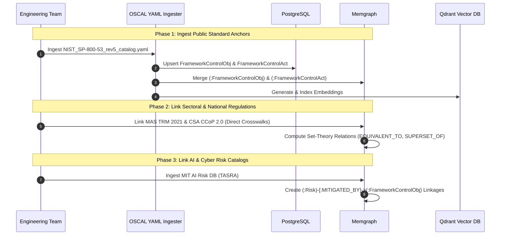

# RCKG Foundation Ingestion Architecture & System Improvement Blueprint

**Document Version**: 1.0.0  
**Target File**: `docs/07-update-parse/initial-setup.md`  
**Status**: Approved Architecture Baseline & Improvement Specification  
**Scope**: Public Baseline Cold-Start, Multi-Standard Parsing, OSCAL Integration, Risk Catalogs, and Graph Linkage Decoupling  

---

## 1. Executive Summary

This document aggregates the comprehensive architectural assessment, identified system gaps, and required technical improvements for bootstrapping the **Risk Control Knowledge Graph (RCKG)** from scratch using public data (NIST SP 800-53 OSCAL, MAS TRM Guidelines, CSA CCoP, CIS Controls v8, and the MIT AI Risk Database).

Before ingesting large-scale public catalogs, this blueprint outlines the **7 core technical enhancements** required to transition the pipeline from an MVP single-document prototype into a production-grade, multi-standard GRC Knowledge Graph engine.

---

## 2. Aggregated Improvement Points & Architecture Gaps

```
┌────────────────────────────────────────────────────────────────────────────────────────┐
│                   RCKG FOUNDATION GAP & IMPROVEMENT ARCHITECTURE                       │
├────────────────────────────────────────────────────────────────────────────────────────┤
│ 1. OSCAL YAML Ingestion      : Support NIST SP 800-53 v5.2 OSCAL YAML catalog (7.3MB)   │
│ 2. Excel & Matrix Adapters   : Dynamic column mapper for AICM, CIS, and Audit Toolkits │
│ 3. Pure Risk Ingestion Engine: Dedicated pathway for Threat/Risk DBs (MIT TASRA)       │
│ 4. Decoupled Public Baseline : Direct OBL ──> FCO & RISK ──> FCO (Bypass Client CO)    │
│ 5. Multi-Framework AST Depth : Dot-depth & Registry classifier (Replace '(' & ')')     │
│ 6. Dangling Reference Healing: Stub nodes (STUB_UNRESOLVED) with late-binding UPSERT   │
│ 7. Vector Candidate Pruning  : Qdrant Top-K filtering before NLI to prevent O(N*M)     │
└────────────────────────────────────────────────────────────────────────────────────────┘
```

---

### Gap 1: NIST SP 800-53 OSCAL YAML Ingestion
* **Current State**: The production API whitelist (`/documents/upload`) only accepts `application/pdf` and Word documents (HTTP 415 error on `.yaml`). `seed_ingestion.py` only implements an XML parser for NIST OLIR exports.
* **Impact**: The official 7.3 MB, 163,249-line `NIST_SP-800-53_rev5_catalog.yaml` cannot be ingested directly.
* **Required Improvement**:
  - Implement `OscalYamlCatalogParser` in `backend/app/services/parsers/oscal_parser.py`.
  - Traverse `catalog.groups[].controls[]` into `FrameworkControlObjectiveNode` (e.g. `AC-2`) and child `controls[].controls[]` or `parts[].props[]` into `FrameworkControlActivityNode` (e.g. `AC-2(1)`).
  - Add `POST /api/v1/documents/ingest-seed?source_type=NIST_OSCAL_YAML` endpoint.

---

### Gap 2: Configurable Tabular & Multi-Sheet Excel Adapters
* **Current State**: [`CcmExcelParser`](backend/app/services/seed_ingestion.py#L104) assumes a rigid 3-column layout (`row[0]=ctrl_id`, `row[1]=ctrl_title`, `row[2]=ctrl_text`) on `wb.active` starting from row 2.
* **Impact**:
  - `aicm.xlsx` has JSON banner metadata and 2 header rows before data.
  - `Artificial Intelligence Audit Toolkit_Workbook.xlsx` has 8 columns where `row[0]` is a numeric primary key (`1, 2, 3`), misidentifying it as the control ID.
  - `aivtf-excel.xlsx` has 11 separate domain sheets (`Transparency`, `Explainability`, `Safety`, etc.).
* **Required Improvement**:
  - Create `ConfigurableExcelParser` with parameterizable column mappings:
    ```python
    {
        "id_col": "Control ID",
        "title_col": "Control Name",
        "text_col": "Description",
        "header_row_offset": 2,
        "sheets": ["*"]  # Traverse all sheets
    }
    ```

---

### Gap 3: Pure Risk & Threat Database Recognition
* **Current State**: The extraction prompt (`extraction.md`) and 6-facet extractor ([`facet_extractor.py`](backend/app/services/facet_extractor.py)) are strictly tuned for compliance mandates (*who must do what*).
* **Impact**: Feeding `AI risk database.xlsx` (MIT TASRA / AI Risks) causes the LLM to hallucinate synthetic control mandates out of hazard events (e.g. converting a *"Model Inversion Attack"* hazard description into a pseudo-obligation).
* **Required Improvement**:
  - Implement a dedicated **`RiskCatalogAdapter`** that maps rows directly into [`RiskNode`](backend/app/models/rckg_nodes.py#L265) (`risks` PostgreSQL table and `:Risk` Memgraph label).
  - Add semantic edge builder for `(:Risk)-[:MITIGATED_BY]->(:FrameworkControlObj)`.

---

### Gap 4: Decoupling Public Knowledge Graph from Client Policy (`CO`)
* **Current State**: The 5 ORM linkage tables ([`rckg_nodes.py`](backend/app/models/rckg_nodes.py#L367-L530)) require `ControlObjectiveNode (CO)` as the mandatory central hub (`RISK -> CO`, `OBL -> CO`, `CO -> FCO`).
* **Impact**: When bootstrapping from public data without a client's internal policy, the graph forms 3 disconnected islands (`OBL`, `RISK`, `FCO`).
* **Required Improvement**:
  - Establish **Direct Public Baseline Linkages**:
    1. `(:Obligation)-[:CROSSWALKS_TO {set_theory_relation: 'EQUIVALENT_TO'}]->(:FrameworkControlObj)`
    2. `(:Risk)-[:MITIGATED_BY]->(:FrameworkControlObj)`
    3. `(:FrameworkControlObj)-[:CROSSWALKS_TO]->(:FrameworkControlObj)` (NIST $\longleftrightarrow$ ISO $\longleftrightarrow$ CIS)
  - Allow Client `CO` to act as an overlay (`CO -> FCO`), automatically inheriting all public crosswalks.

---

### Gap 5: Multi-Framework Objective vs. Activity Classification (Beyond Parentheses)
* **Current State**: Classification relies on a single heuristic: `if "(" in node_id and ")": FrameworkControlActivityNode`.
* **Impact**: Only works for NIST SP 800-53 (`AC-2(1)`). Completely fails for ISO 27001 (`A.5.15`), PCI-DSS (`8.3.1`), CIS Controls (`Safeguard 6.5`), and MAS TRM (`5.1.1`).
* **Required Improvement**:
  - Implement a **3-Tier Hierarchy Classifier**:
    1. **Tier 1 (Framework Regex Registry)**: Pattern mappings per framework (`NIST: r"\(\d+\)"`, `ISO: r"A\.\d+\.\d+"`, `CIS: "Safeguard"`, `PCI: r"\d+\.\d+\.\d+"`).
    2. **Tier 2 (AST Dot-Depth)**: Single dot (`5.1`) = Objective; Multi-dot (`5.1.1`) = Activity.
    3. **Tier 3 (6-Facet Context Disambiguation)**: Combine `action_verb` with `target_role` (e.g. `BOARD_OF_DIRECTORS` vs `SYSTEM_ADMINISTRATOR`) and `control_nature` (`GOVERNANCE` vs `PREVENTATIVE`) to disambiguate dual-use verbs like *"approve"*.

---

### Gap 6: Dangling References & Stub Node Self-Healing
* **Current State**: Ingesting a crosswalk document that references un-ingested target controls causes foreign key exceptions or dropped edges.
* **Impact**: Crosswalk topology is lost during out-of-order document uploads.
* **Required Improvement**:
  - Instantiate placeholder **`STUB_UNRESOLVED`** nodes in Memgraph and PostgreSQL when an un-ingested target standard is referenced.
  - When the actual standard document is uploaded later, execute a **`Cypher MERGE` / SQL `UPSERT`** that enriches the stub with full prose/facets and flips status to **`RESOLVED`**.

---

### Gap 7: Scalable Vector Candidate Pruning for Large Standards ($O(N \times M)$)
* **Current State**: `cold_start_pipeline.py` compares chunks using lexical word overlap and DB table scans.
* **Impact**: Comparing 1,000+ NIST controls against 1,000+ MAS/CCoP/ISO obligations would require $>1,000,000$ LLM/NLI pairwise evaluations, causing timeouts.
* **Required Improvement**:
  - Connect [`qdrant_service.py`](backend/app/services/qdrant_service.py) dense vector embeddings as the primary coarse filter.
  - Retrieve **Top-K ($K \le 5$)** candidates per clause before invoking NLI set-theory classification and Dual-Judge scoring.

---

## 3. Implementation Sequence & Next Steps



1. **Sprint Step 1**: Build `oscal_parser.py` and run initial ingestion of `NIST_SP-800-53_rev5_catalog.yaml`.
2. **Sprint Step 2**: Add direct public crosswalk schema support (`Obligation` $\rightarrow$ `FrameworkControlObj`).
3. **Sprint Step 3**: Connect Qdrant top-K retrieval to crosswalk MAS TRM against the loaded NIST catalog.
