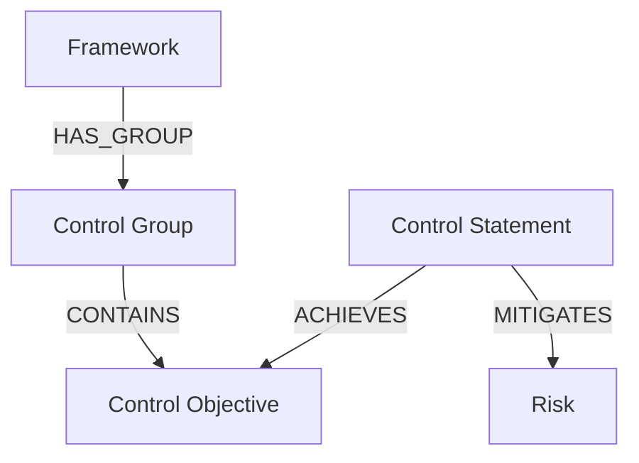

# RCKG Data Architecture & Schema

This document outlines the hybrid data architecture for the Risk Control Knowledge Graph (RCKG), aligning with the [NIST OSCAL](https://github.com/usnistgov/OSCAL) standard and the Unified Knowledge Stack strategy.

## 1. High-Level Architecture

The RCKG data pipeline moves data through three quality tiers, progressively enriching it with AI:

1.  **Bronze Layer (Raw)**: Raw text/JSON data parsed from sources (PDF, Excel). stored in `staging_controls` (as Raw Text).
2.  **Silver Layer (Semantic)**: AI-processed data where entities, properties, and relationships are extracted. Stored in `semantic_controls`.
3.  **Gold Layer (Validated)**: Human-verified data, ready for production use. Stored in `golden_controls`.

## 1.1 Hybrid Architecture Strategy (Local Dev)
To optimize for the NVIDIA 4070 Ti (12GB VRAM), we employ a **Hybrid Ops** model:
- **Database Layer**: Running in Docker (Postgres + Memgraph).
- **Compute Layer**: Running Locally (Python venv) to maximize GPU access for AI.
- **AI Engine**: `llama-cpp-python` using **Llama 3.2 3B** (Singleton Pattern) for high-speed extraction and conflict judging.

---

## 2. Memgraph Layer (The Logic Fabric)

The "Production" Graph Layer defines the knowledge topology, optimized for reasoning and traversing the "Why" (Objective) vs "What" (Statement).

### 2.1 Nodes (Entities)
| Label | Description | Props |
| :--- | :--- | :--- |
| **`Framework`** | The regulation authority (e.g., "NIST AI RMF"). | `name`, `version`, `status` |
| **`ControlGroup`** | High-level domain (e.g., "GOVERN"). | `id`, `name` |
| **`ControlObjective`** | The "Why". The anchor intent. | `id`, `text`, `impact_category` |
| **`ControlStatement`** | The "What". The actionable requirement. | `id`, `text`, `action_verb`, `subject_noun`, `gov_domain`, `legal_base` |
| **`Risk`** | The "Threat". | `name`, `type` |

### 2.2 Relationships
The graph logic flows as follows:

*   **Crosswalk Logic**: `(:ControlStatement)-[:SUBSET_OF | :EQUAL_TO]->(:ControlStatement)` (Added via analysis).

---

## 3. PostgreSQL Layer (Master Record)

### 3.1 Bronze Layer (Raw)
*   **Table**: `staging_controls`
*   **Purpose**: Stores raw ingestion output (PDF/Excel text).
*   **Fields**: `uuid`, `raw_text`, `source_metadata` (JSON).

### 3.2 Silver Layer (Semantic)
*   **Table**: `semantic_controls`
*   **Purpose**: AI Semantic Extraction. The AI "refines" Bronze data into this hierarchy.
*   **Key Fields**:
    *   **Framework**: `framework_name`, `version`.
    *   **Group**: `group_id`, `group_name`.
    *   **Objective**: `objective_id`, `objective_text`, `impact_category`.
    *   **Statement**: `statement_id`, `statement_text`, `action_verb`, `subject_noun`, `gov_domain`.
    *   **Risk**: `risk_name`, `risk_type`.

### 3.3 Gold Layer (Validated)
*   **Table**: `golden_controls`
*   **Purpose**: Production "Ground Truth".
*   **Structure**: Identical to Silver, but includes `validation_status` and `human_verifier_id`.
*   **Graph Sync**: Only Gold (and approved Silver) records are projected to Memgraph.

### 3.4 Audit Trails
- `id` (PK)
- `entity_uuid`: Target node UUID.
- `action`: "MAPPED", "EDITED", "INGESTED".
- `actor`: User or AI Agent ID.
- `timestamp`: UTC time.

---

## 4. Operational Logic

### 4.1 Ingestion Flow
1.  **Parse**: Extract full OSCAL structure or Raw content.
2.  **Archive**: Write full blobs to **PostgreSQL Layer 1** (if OSCAL) or parsed records to **Layer 2**.
3.  **Project**: Extract *only* the reasoning props (Group, Objective, Statement) and write to **Memgraph**.

### 4.2 RAG / Chat Flow
1.  **Search**: Vector/Keyword search in **Memgraph** to find relevant *Objectives*.
2.  **Reason**: Traverse graph to find linked *Risks* or *Obligations*.
3.  **Fetch Details**: Fetch `statement_text` or `full_statement_markdown` from **PostgreSQL**.
4.  **Synthesize**: LLM generates answer using Graph context + Postgres details.

---

## 5. Universal Ingestion Strategy (Non-OSCAL Data)

To support diverse formats (PDF, Excel, CSV, JSON) and map them to the OSCAL/RCKG structure, we employ an **AI-Guided Adapter Strategy**.

### Phase 1: Read & Norm (The "Universal Reader")
*Goal: Convert raw binary/text into a standardized intermediate dictionary.*
- **Detect Format**: Identify MIME type.
- **Extract Text**: Use libraries (Docling, pandas) to extract text and maintain structure.

### Phase 2: Schema Mapping (AI-Driven)
*Goal: Map source fields to RCKG Entities.*
- **Sniff Schema**: AI samples the data.
- **Map Fields**: Source fields mapped to `ControlStatement` and `ControlObjective`.

### Phase 3: Enrichment & Transformation
*Goal: Fill gaps and prepare for OSCAL compliance.*
- **Synthetic ID Generation**: If IDs are missing, generate deterministic UUIDs.
- **Objective Extraction**: If missing, use `ingest-extraction` prompt to generate it.

### Phase 4: OSCAL Conversion (Serialization)
*Goal: Finalize into the standard format.*
1.  **Construct Model**: Populate the internal `Catalog` object.
2.  **Serialize**: Export to valid OSCAL JSON (`catalog.json`).
3.  **Persist**: Follow standard flow.

---

## 6. Facet Layer (Multi-Dimensional Metadata)

Every Statement node in Memgraph is tagged with these facets to allow for granular filtering by "viewpoint".

### 6.1 Core Facets
*   **Control Function**: `Preventive`, `Detective`, `Corrective`, `Deterrent`, `Compensating`.
*   **Implementation Method**: `Automated`, `Manual`, `Hybrid`.
*   **Control Nature**: `Technical`, `Procedural`.
*   **Control Goals**:
    *   `Confidentiality`
    *   `Integrity`
    *   `Availability`
    *   `Efficiency`
    *   `Effectiveness`
    *   `Compliance`
*   **Governance Domain (COBIT)**:
    *   `EDM` (Evaluate, Direct, Monitor)
    *   `APO` (Align, Plan, Organize)
    *   `BAI` (Build, Acquire, Implement)
    *   `DSS` (Deliver, Service, Support)
    *   `MEA` (Monitor, Evaluate, Assess)

### 6.2 Asset Scope
Describes the detailed target of the control:
*   `Cloud Resource`
*   `Data`
*   `Model` (AI/ML)
*   `Operating System`
*   `Application`
*   `Database`
*   `Network`
*   `User/Identity`

### 6.3 Cross-Walk Strategy: Facets & Set Theory

To perform high-fidelity cross-walking between frameworks (e.g., NIST CSF vs. ISO 27001), we leverage **Facets** and **Set Theory** rather than simple text matching. This approach is inspired by mapping concepts found in [NIST.IR.8477](https://nvlpubs.nist.gov/nistpubs/ir/2024/NIST.IR.8477.pdf).

**Methodology**:
1.  **Facet Intersection**: Controls are treated as sets of facets (Function + Goal + Asset).
2.  **Set Theory Mapping**:
    *   **Equivalent ($A = B$)**: All mandatory facets match.
    *   **Subset ($A \subset B$)**: Control A has fewer constraints/facets than Control B.
    *   **Superset ($A \supset B$)**: Control A covers everything in B plus more.
    *   **Intersection ($A \cap B$)**: Partial overlap.
3.  **Validation**: AI verifies the mapping proposal by checking if the logical intent (Objective) aligns with the calculated set relationship.
